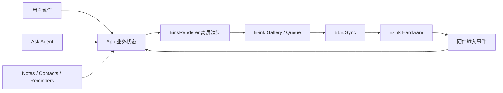
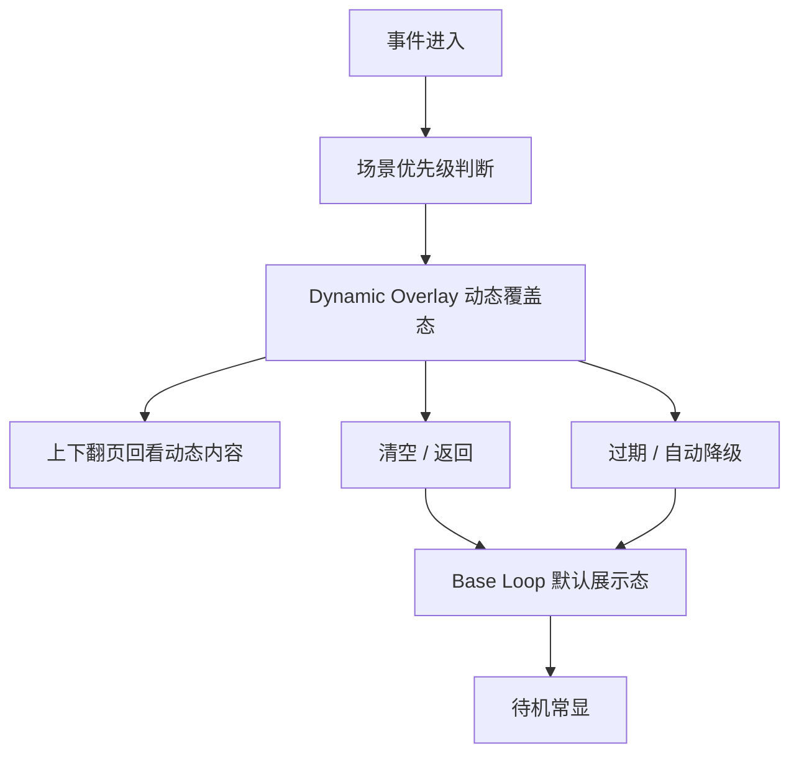
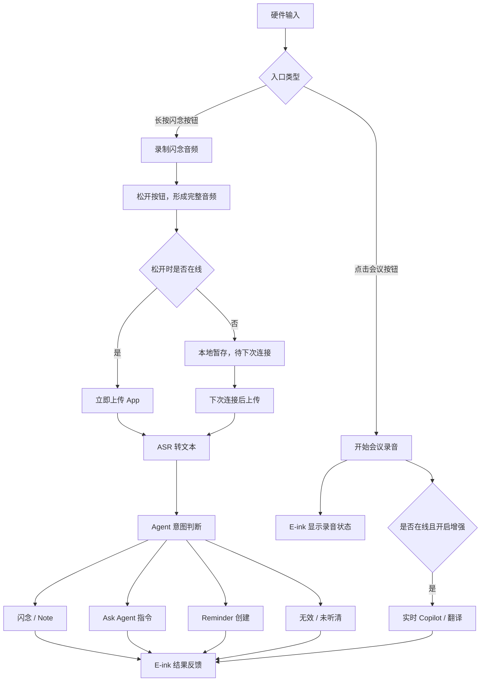

# 07 Eureka-3.0 E-ink 第二屏功能逻辑规划

> 当前文档作为 Eureka-3.0 硬件端 E-ink 功能逻辑的新事实源。旧版文档中的外形、推拉结构、超薄形态等内容仅作为历史参考；本阶段先围绕 E-ink 显示能力、硬件输入、App/Agent 协同与分期落地展开。

## 1. 核心定位

Eureka-3.0 的 E-ink 不应被定义为单纯的电子名片屏，也不应被定义为可独立运行复杂业务的智能终端。它更准确的定位是：

> **商务上下文第二屏。**

它平时负责低功耗、常显、可展示的商务内容；当录音、闪念、Ask Agent、会议 Copilot、Reminder、名片交换等事件发生时，临时切换成低打扰的反馈屏或提词屏。

这个定位带来三个设计原则：

1. **显示优先于计算**：硬件不负责复杂排版、字体、业务判断和 Agent 推理，只负责稳定展示 App 下发的像素内容。
2. **确定性优先于智能感**：首版屏幕变化必须可解释，先用清晰规则管理抢屏、回退、清空和缓存，再逐步引入 Agent 调度。
3. **硬件入口必须闭环**：用户从硬件发起录音、闪念或 Ask Agent 指令后，即使不掏手机，也必须在 E-ink 上看到状态或结果。

## 2. 总体架构：App 主控 + 硬件小缓存

E-ink 继续沿用 “App 离屏渲染 + BLE 位图下发” 的技术方向。App 是 E-ink 内容的唯一事实源，硬件只维护少量显示槽位和最近缓存。

### 2.1 App 负责什么

- 管理 E-ink 的 Base Loop、Dynamic Overlay、历史图库、内容删除和用户配置。
- 根据业务状态生成画面，包括名片、二维码、今日简报、录音状态、Agent 结果、Reminder、Copilot 提词等。
- 通过 `EinkRenderer` 将内容渲染成 E-ink 分辨率匹配的 1-bit 黑白位图。
- 通过 BLE 将图片、槽位、类型、优先级、过期策略和清空指令下发给硬件。
- 与 Ask Agent 的 `session/source/context` 规则对齐，让硬件入口产生的结果回到 App 内可追溯的会话与资产关系中。

### 2.2 硬件负责什么

- 常显当前 E-ink 画面。
- 本地缓存少量 Base 图片和最近 Dynamic 图片，支持弱连接或 App 不在前台时的基础翻页。
- 上报基础输入事件：触发、上下翻页、清空/返回。
- 上报基础设备状态：电量、BLE 连接、录音状态、缓存槽位状态、传输 ACK/错误码。
- 不理解 `Note`、`Contact`、`Reminder` 等业务对象，只理解图片槽位、显示层级和有限的控制指令。

### 2.3 Agent 负责什么

- 处理短语音输入后的意图判断：闪念、Ask Agent 指令、轻量操作或无效输入。
- 执行业务动作：创建 Note、创建 Reminder、查询 Contact、总结会议、生成 Copilot 提词等。
- 返回可渲染的结构化结果给 App，由 App 决定是否推送 E-ink。
- P2 阶段可参与内容调度建议，但不在首版直接成为屏幕唯一调度者。

### 2.4 在线 / 离线的定义

本文里的在线与离线，优先指 **卡片与 App 的 BLE 控制链路是否可用**：

| 状态 | 定义 | 能做什么 | 不能做什么 |
|------|------|----------|------------|
| 在线 | 卡片与 App BLE 已连接，App 可接收硬件事件并下发屏幕内容 | 实时上传输入、调用 App/Agent、下发最终 E-ink 反馈 | - |
| 离线 | 卡片与 App BLE 未连接，或 App 无法接收硬件事件 | 展示本地缓存、记录有限本地事件、暂存音频/输入 | 不能实时 ASR、不能实时 Ask Agent、不能下发新的 App 渲染结果 |
| 恢复在线 | 离线后重新建立 BLE 连接 | 同步离线队列、补跑 ASR/Agent、更新最终反馈 | 不应重复创建资产或重复执行指令 |

为了保持边界简单，首版只把“BLE 是否连接 App”作为硬件在线状态。手机 App 自身是否有网络、Agent 是否可用，属于 App 侧业务可用性，由 App 在结果反馈中处理。

## 3. 显示模型：Base Loop + Dynamic Overlay

E-ink 的显示系统分为两层：`Base Loop` 和 `Dynamic Overlay`。

### 3.1 Base Loop

`Base Loop` 是用户主动配置的默认展示态。它回答的问题是：**我希望这张设备在没有事件发生时展示什么？**

Base Loop 的典型内容包括：

| 内容 | 用途 | P 阶段 |
|------|------|--------|
| 我的名片 / Profile | 对外展示身份、职位、公司、联系方式摘要 | P0 |
| 二维码 | 微信、企业微信、个人主页、数字名片链接 | P0 |
| 今日简报 | 今天会议、关键待办、最近需要跟进的人 | P1 |
| 固定展示页 | 用户手动上传或选择的固定图片，例如活动页、付款码、临时展示页 | P1 |
| 联系人/场景页 | 针对某次会面或某个联系人临时设置的展示页 | P2 |

Base Loop 的规则：

1. App 侧提供配置入口，用户可选择、排序、删除 Base 内容。
2. 硬件可缓存少量 Base 图片，建议首版按 3-5 张规划。
3. 没有 Dynamic Overlay 时，上下翻页只在 Base Loop 内循环。
4. 默认回退页建议为“我的名片”或用户设定的第一张 Base 图。
5. Base 内容不是事件日志，不应被临时反馈无限挤占。

### 3.2 Dynamic Overlay

`Dynamic Overlay` 是系统临时推送的事件态。它回答的问题是：**刚刚发生了什么？现在我需要知道什么？**

Dynamic Overlay 的典型内容包括：

| 场景 | 屏幕内容 | P 阶段 |
|------|----------|--------|
| 录音状态 | 录音中、暂停、同步中、转写中、完成、异常中断 | P0 |
| 闪念反馈 | 已记录、摘要一句话、已保存到 Note、失败原因 | P0 |
| Ask Agent 结果 | 联系人查询、待办创建、Note 创建、执行成功/失败 | P0 |
| NFC 触发反馈 | NFC 已触发、已打开录音、门禁/车钥匙模式状态、触发失败 | P1 |
| 麦克风来源 | 当前使用环境麦、骨传导麦、耳机麦，或自动切换提示 | P1 |
| Reminder / 日程提醒 | 即将会议、跟进提醒、逾期提醒、下一步动作 | P1 |
| 会议 Copilot | 实时提词、客户背景、异议应对、下一步建议 | P1 |
| 名片交换反馈 | 交换成功、对方信息、保存状态、后续跟进建议 | P2 |

Dynamic Overlay 的规则：

1. Dynamic 内容到达后可临时抢屏。
2. 存在 Dynamic 内容时，上下翻页优先在 Dynamic 队列中回看。
3. 清空/返回键清掉当前 Dynamic 队列，回到 Base Loop。
4. Dynamic 内容有过期策略，过期后不继续占屏，但重要内容保留在 App 历史。
5. 硬件只缓存最近少量 Dynamic 图片，建议首版按 3-5 张规划。

### 3.3 常驻状态区 + 主内容区

当默认长显内容是用户 Profile、二维码或名片时，蓝牙、电量、同步、麦克风等硬件状态仍然需要可见。为避免每次状态变化都整屏覆盖名片页，E-ink 画面建议拆成两层视觉区域：

1. **常驻状态区**：用于展示少量硬件状态。
2. **主内容区**：用于展示 App 下发的业务内容，例如 Profile、二维码、Agent 结果、Copilot 提词。

状态区建议放在屏幕顶部，保持轻量，不抢主内容。比例不建议在产品文档中写死为固定三分之一；可以作为设计参考，后续根据屏幕尺寸和可读性决定。原则上：

- 默认展示 Profile 或二维码时，状态区应尽量小，只展示关键图标或短文案。
- 录音中、离线暂存、低电量、存储满等状态更重要时，状态区可以扩大，甚至临时切成整屏本地状态页。
- App 下发的主内容需要预留状态区，避免蓝牙、电量等信息遮挡名片或二维码。
- 如果状态变化很轻微，例如蓝牙已连接、电量正常，不应频繁刷新整屏。

常驻状态区建议展示：

| 状态 | 默认是否常驻 | 展示方式 |
|------|--------------|----------|
| BLE 连接 | 是 | 图标或短文案 |
| 电量 | 是 | 图标或百分比 |
| 同步中 / 待同步 | 有内容时显示 | 短文案或图标 |
| 录音中 | 录音时显示 | 明显文案、时长可选 |
| 当前麦克风 | 录音/闪念时显示 | 环境麦 / 骨传导 / 耳机麦 |
| NFC 模式 | 触发或切换时显示 | 短暂提示或图标 |

## 4. 场景优先级

Eureka-3.0 不采用简单的全局固定优先级，而采用“场景优先级”。也就是说，什么内容能抢屏，取决于用户当前处于什么业务上下文。

### 4.1 非录音 / 非会议中

优先级建议：

1. Ask Agent 执行结果和失败反馈。
2. 闪念保存反馈。
3. Reminder / 日程提醒。
4. 名片交换反馈。
5. 普通系统状态。

典型逻辑：

- 用户短语音问“查一下 Kevin 上次说了什么”，屏幕应显示 Ask Agent 结果摘要。
- 用户说了一段闪念，屏幕应显示“已记录”与一句摘要。
- Reminder 到达时可短暂抢屏，但不应长期覆盖用户的名片页。

### 4.2 录音 / 会议中

优先级建议：

1. 录音异常：中断、链路断开、存储不足、电量过低。
2. 录音状态：录音中、暂停、保存中、同步中。
3. 会议 Copilot：提词、联系人背景、异议应对。
4. 与当前会议相关的 Reminder。
5. 其他 Ask Agent 结果。

典型逻辑：

- 录音中如果链路异常，异常必须覆盖 Copilot 提词。
- Copilot 提词可以覆盖 Base Loop，但不能覆盖关键录音异常。
- 非当前会议相关的提醒应进入 App 通知或历史，不一定抢占 E-ink。

### 4.3 交换 / 展示中

优先级建议：

1. 当前交换动作结果：交换成功、失败、对方已保存、等待对方扫码。
2. 对方信息摘要：姓名、公司、职位。
3. 后续动作建议：添加备注、设置跟进 Reminder。
4. 回到原 Base 展示页。

典型逻辑：

- 用户正在展示二维码时，交换成功反馈可短暂抢屏。
- 交换完成后，屏幕应自动回到原二维码或默认名片页。
- 交换后的深度动作建议留在 App 内完成，E-ink 只做轻反馈。

### 4.4 异常状态

异常状态优先于普通业务内容，但需要区分是否可恢复：

| 异常 | 屏幕行为 | App 行为 |
|------|----------|----------|
| BLE 断开 | 硬件显示最后一张可用图或本地状态图 | App 重连并同步状态 |
| 位图传输失败 | 保持旧画面，提示传输失败或等待重试 | App 重试或提示用户 |
| 录音链路异常 | 抢屏显示异常状态 | App 记录中断原因并进入恢复流程 |
| 电量过低 | 可覆盖普通 Dynamic 内容 | App 提示充电与保存当前任务 |
| 缓存满 | 不抢屏，除非影响当前任务 | App 清理过期 Dynamic 或提示用户 |

## 5. 硬件动作与状态行为

当前不绑定具体外形，但按三类明确操作规划：触发输入、上下翻页、清空/返回。

### 5.1 触发输入

触发输入用于启动短语音、闪念或 Ask Agent 指令。首版采用“模式 + AI”：

1. **闪念入口**：物理按钮长按开始输入，松开结束。本次闪念只以松开后形成的完整音频为准，不做录制过程中的实时传输与实时 Agent 处理。
2. **会议入口**：物理按钮点击开启会议录音，再次点击关闭。会议录音是持续状态，在线时可叠加实时增强，离线时仍保持本地录音。
3. 短语音输入结束后进入 App/Agent，由 Agent 判断是闪念、Ask Agent 指令还是轻量操作。
4. 结果必须回传 E-ink，形成确定性反馈。

短语音输入示例：

| 用户说法 | Agent 判断 | E-ink 反馈 |
|----------|------------|------------|
| “记一下，明天找 Kevin 确认报价” | 闪念 + 可能提取 Reminder | 已记录，并提示可能的待办 |
| “查一下 Kevin 上次说了什么” | Ask Agent 查询 | 显示联系人相关摘要 |
| “帮我加一个明天下午两点跟进的提醒” | 创建 Reminder | 待办已加 |
| 空白/噪声 | 无效输入 | 未听清，请重试 |

### 5.2 上下翻页

上下翻页在不同状态下含义不同：

| 当前状态 | 上下翻页行为 |
|----------|--------------|
| 无 Dynamic 内容 | 在 Base Loop 内循环 |
| 有 Dynamic 内容 | 在 Dynamic 队列中循环 |
| 录音中 | 优先查看录音状态与当前会议相关动态 |
| 传输中 | 可禁用或延迟响应，避免状态不一致 |
| BLE 断开 | 在硬件本地缓存中翻页 |

### 5.3 清空 / 返回

清空/返回用于让用户快速恢复默认展示态：

1. 有 Dynamic 队列时，清空当前 Dynamic 队列。
2. 清空后回到 Base Loop，默认回到第一张或用户上次停留页。
3. 清空只影响硬件显示队列，不删除 App 中的历史记录。
4. 如果当前为关键异常或录音中断状态，清空只能关闭提示，不应抹掉 App 侧异常记录。

## 6. 输入路由：模式 + AI

旧文档曾讨论“纯 AI 意图识别”和“物理手势区分”。Eureka-3.0 首版建议采用折中方案：`模式 + AI`。

这里的“模式”首先来自入口形态：

- 闪念入口：长按录入，松开结束，结束后再处理。
- 会议入口：点击开始，再次点击结束，录音过程中可持续显示状态或在线增强内容。

### 6.1 为什么不完全依赖 AI 判断

- 会议/长录音是高成本动作，误判会造成用户不信任。
- 录音状态需要明确的开始、结束、保存和异常处理。
- 用户需要知道当前设备是在“录音模式”还是“短语音输入模式”。

### 6.2 为什么不完全依赖物理手势

- 硬件形态仍可能变化，过早绑定短按、长按、推拉等具体动作会限制设计。
- 闪念和 Ask Agent 指令在自然语言上有时边界模糊，Agent 判断更灵活。
- 用户可先用一个统一入口完成轻量输入，降低学习成本。

### 6.3 推荐路由

## 7. 连接状态与入口规则

BLE 连接会天然带来在线与离线两类状态。为了让边界最简单，首版不使用一套复杂的统一状态机，而是按入口拆开处理：**闪念入口是“结束后反馈”**，**会议入口是“录音持续 + 在线增强”**。

### 7.1 闪念入口规则

闪念入口是一个物理按钮：**长按开始输入，松开结束**。闪念是短输入，用户心智是“说完以后给我一个结果”。因此不考虑录制过程中的实时传输，也不按录制过程中连接状态变化拆分处理；只以松开按钮后形成的完整音频，以及松开时是否在线为准。

| 连接路径 | 处理规则 | E-ink 反馈 |
|----------|----------|------------|
| 松开时离线 | 硬件本地保存完整闪念音频；不做 ASR、不做 Agent、不创建 Note/Reminder | 结束后显示“已暂存，连接 App 后同步” |
| 松开时在线 | 立即上传完整音频给 App；App 进行 ASR 与 Agent 处理后返回结果 | 结束后先显示“处理中”，再显示“已记录 / 已创建待办 / 未听清”等结果 |
| 先在线后离线 | 如果松开时已经离线，按“松开时离线”处理；录制过程中不做实时传输和片段处理 | 结束后显示“已暂存，连接 App 后同步” |
| 先离线后在线 | 如果松开时已经在线，按“松开时在线”处理；录制过程中不切换成实时处理 | 结束后先显示“处理中”，再显示最终结果 |

闪念入口的边界：

1. 闪念不做实时传输，不做录制中的实时 ASR/Agent。
2. 闪念只处理松开按钮后的完整音频。
3. 松开时在线就立即上传处理；松开时离线就本地暂存，等下次连接 App 后上传处理。
4. 录制过程中连接状态发生变化时，不中断、不切换处理链路，只在松开时判断在线/离线。
5. 离线时不显示“已记录到 App”，只能显示“已暂存”。

### 7.2 会议入口规则

会议是长时间录音，用户心智是“录音不能断，在线时可以增强”。因此会议入口的基础能力是本地录音持续，在线能力只作为增强层。

| 连接路径 | 处理规则 | E-ink 显示 |
|----------|----------|------------|
| 一直离线 | 硬件本地持续录音；不做实时 Copilot、翻译或 Agent 处理 | 正常显示“录音中”、时长、电量等基础状态 |
| 一直在线 | 音频可实时传输给 App；App/Agent 可实时生成 Copilot 提词、翻译、会议提示；用户可选择不开启实时增强 | 展示录音状态，并可叠加 Copilot、实时翻译等动态内容 |
| 先在线后离线 | 断开前，展示实时传输内容被处理后的屏幕反馈；断开后实时增强停止，但硬件继续本地录音 | 断开后回到“录音中”基础状态，并提示实时增强已暂停 |
| 先离线后在线 | 离线阶段只本地录音；连接恢复后，后续音频可以开始实时传输给 App，并继续生成 Copilot/翻译等内容 | 连接后从“录音中”升级为“录音中 + 实时增强” |

会议入口的边界：

1. BLE 断开不应中断会议录音，除非底层录音链路本身依赖外部音频链路且已经不可用。
2. 实时 Copilot、实时翻译、会议提示都属于在线增强能力，不能作为会议录音成功的前置条件。
3. 在线增强断开后，不清空已展示过的有效提示；用户可通过 Dynamic Overlay 回看最近内容。
4. 会议结束后，无论过程中是否在线，完整音频都应在连接 App 后上传并进入常规转写、总结、Reminder 提取流程。

### 7.3 离线队列与容量

硬件只保留一个很小的离线队列，不承担长期数据仓库职责。

建议首版规则：

- 离线闪念：最多暂存最近 10 条，或按固件存储能力折算为固定音频时长。
- 离线会议录音：按录音文件能力单独管理，不与闪念队列混用。
- 离线 Dynamic 显示：最多保留最近 3-5 张本地状态卡。
- Base Loop 图片：仍按 3-5 张固定缓存，不受离线闪念队列影响。
- 未同步事件满了以后，不再继续静默录入；E-ink 必须提示“暂存已满，请连接 App”。
- 已同步且 App 确认成功的离线事件，可由 App 下发清理指令，硬件再释放空间。

### 7.4 恢复在线后的同步顺序

恢复在线后，App 和硬件按以下顺序同步。这里描述产品流程，不约束具体技术实现。

1. App 查询硬件状态：电量、缓存、当前屏幕、离线事件数量。
2. App 拉取离线输入列表，并识别哪些内容已经同步过，避免重复处理。
3. App 拉取未同步音频或输入数据。
4. App 显示“正在同步/处理中”，让用户知道离线内容已经开始处理。
5. App 执行 ASR / Agent / 保存或创建相关结果。
6. App 显示处理成功或失败。
7. App 下发最终 E-ink 反馈。
8. App 下发可清理事件列表，硬件释放已确认数据。

会议录音恢复在线后可分两类处理：

- **历史音频**：离线阶段产生的完整录音文件，按文件同步、转写、总结处理。
- **后续实时音频**：连接恢复后的新音频流，可进入实时 Copilot/翻译链路。

### 7.5 App 侧状态口径

App 中需要区分几类用户可见状态，避免把“暂存”误写成“完成”：

| 用户可见状态 | 含义 | 文案方向 |
|------------|------|----------|
| 待同步 | 内容还在硬件里，App 还没有拿到完整数据 | 设备中有待同步内容 |
| 处理中 | App 已拿到内容，正在识别或交给 Agent 处理 | 正在处理离线输入 |
| 已完成 | 已完成保存、创建或执行 | 已保存 / 已创建 / 已完成 |
| 失败待处理 | 同步、识别或处理失败，需要用户重试或查看原因 | 同步失败 / 识别失败 / 可重试 |

## 8. 扩展硬件能力与屏幕所有权

Eureka-3.0 不只有 E-ink 与录音入口，还会包含 NFC、不同麦克风来源和固件本地状态。这些能力都可能影响屏幕显示，因此需要先定义清楚：哪些是硬件能力，哪些是 App 配置，哪些可以触发 E-ink 反馈。

### 8.1 NFC 能力与触发规则

NFC 建议拆成两类能力处理：**NFC Profile** 和 **NFC Action**。

| 类型 | 说明 | App 负责 | 硬件负责 | E-ink 反馈 |
|------|------|----------|----------|------------|
| NFC Profile | 卡片可承载的 NFC 身份或数据，例如门禁卡、车钥匙、名片链接、个人主页 | 配置、选择当前 Profile、权限/安全提示 | 存储与响应当前 Profile | 切换成功、当前 NFC 模式、触发失败 |
| NFC Action | 通过 NFC 触发一个动作，例如打开 App 录音页、开始录音、打开名片页 | 定义动作、生成 deep link、处理 App 内动作 | 在可本地执行时触发动作，或提供 NFC 标签内容 | 已触发、已开始录音、请打开 App |

首版建议的边界：

1. **门禁卡 / 车钥匙类能力**涉及安全芯片、系统权限、车厂/门禁协议，先作为硬件能力规划项，不默认承诺所有场景都可复制或模拟。
2. **名片链接 / 个人主页 / App deep link** 是最稳定的 NFC 能力，可作为 P0/P1 的优先落地对象。
3. **NFC 触发录音**分两种：
   - 如果动作在硬件本地可执行，例如“tap 后开始会议录音”，硬件可直接执行，并显示本地状态帧。
   - 如果动作依赖 App，例如打开 App 某页面、进入录音准备页，则 NFC 应触发 deep link 或 App 事件；App 在线后再下发反显内容。
4. NFC 触发不应绕过录音/闪念入口规则。比如 NFC 打开的是“会议录音”，则后续按会议入口规则处理；NFC 打开的是“闪念”，则仍按长按松开逻辑处理。

### 8.2 环境麦克风、骨传导麦克风与耳机麦

麦克风来源是录音质量和用户信任的关键状态。建议把它作为硬件输入源状态机，而不是让 App 临时猜测。

| 输入源 | 适合场景 | 优先级建议 | E-ink 状态 |
|--------|----------|------------|------------|
| 耳机麦 | 耳机录音模式、通话/会议强接管 | 最高，若耳机模式已连接则优先 | 耳机麦 |
| 骨传导麦 | 贴近说话、嘈杂环境中的个人闪念 | 高，适合短语音/闪念 | 骨传导 |
| 环境麦 | 桌面会议、多人对话、普通录音 | 默认会议输入源 | 环境麦 |

自动识别与切换规则：

1. **会议入口**默认优先环境麦；如果耳机录音模式已连接，则使用耳机麦。
2. **闪念入口**可以优先骨传导麦；如果检测不到有效骨传导信号，则降级到环境麦。
3. 如果耳机麦已连接且产品定义为强接管，则闪念和会议都优先使用耳机麦。
4. 自动切换必须在 E-ink 或 App 中给出可见状态，例如“已切换到骨传导麦”“当前使用环境麦”。
5. 麦克风切换只改变音频输入源，不改变闪念/会议的入口规则。

### 8.3 屏幕状态展示 vs App 反显内容

这里需要避免一个冲突：**屏幕状态**通常由硬件操控，例如录音中、离线、麦克风来源、电量低；**屏幕反显内容**则由 App 渲染成整张 E-ink 图片后下发，例如 Agent 结果、名片页、Copilot 提词。

首版建议采用“单屏单帧来源 + 固定状态区”的规则：

> E-ink 同一时刻只显示一张 Frame。Frame 只有两种来源：`App Rendered Frame` 或 `Firmware Local Frame`。

这并不意味着不能拆分视觉区域。产品上可以把一张完整画面设计成“顶部状态区 + 主内容区”，但这张画面仍然作为一个整体来管理：

- App 在线时，App 渲染整张画面，并把状态区一起包含进去。
- App 不在线时，固件显示本地状态页，必要时也可使用同样的“状态区 + 主内容区”布局。
- 固件不在 App 下发的主内容上临时做复杂叠加，避免状态栏和业务内容互相遮挡。

| Frame 来源 | 谁生成 | 用途 | 何时显示 |
|------------|--------|------|----------|
| App Rendered Frame | App / `EinkRenderer` | 名片、二维码、Agent 结果、Copilot、Reminder、完整业务反馈 | App 在线且可下发位图时 |
| Firmware Local Frame | 固件内置模板或预置图片 | 录音中、离线暂存、电量低、BLE 断开、麦克风来源、NFC 本地触发 | App 不可用、动作由硬件本地发生、或关键硬件状态需要立即反馈时 |

冲突解决规则：

1. **App 在线时，业务内容优先由 App 渲染**。硬件状态通过 BLE 上报给 App，由 App 把状态图标/文案一起渲染进下一张 App Frame。
2. **App 不在线时，硬件只能显示 Firmware Local Frame**，例如“录音中”“已暂存”“BLE 断开”“当前环境麦”。
3. **关键硬件状态可以临时覆盖 App Frame**，例如电量极低、录音异常、存储满；覆盖后 App 恢复时再重推业务内容。
4. **不要让固件在 App Frame 上做复杂局部叠加**。如果要做状态区，首版应当由 App 模板预留，并整体渲染，避免硬件端排版和局刷复杂度上升。
5. **用户看到的“反显内容”以最后一次完整 Frame 为准**。如果固件临时显示本地状态帧，App 侧需要知道当前屏幕已被本地状态覆盖，恢复在线后可重新同步当前屏幕。

简单理解：

- `App Rendered Frame` 解决“业务反显”：Agent 结果、名片、二维码、Copilot。
- `Firmware Local Frame` 解决“硬件状态”：录音中、离线、低电量、麦克风、NFC 本地触发。
- 两者不叠加排版，只按优先级切换整张 Frame。

## 9. App、硬件、Agent、BLE 的职责边界

| 模块 | 事实源职责 | 执行职责 | 不负责 |
|------|------------|----------|--------|
| App 状态层 | Base/Dynamic 队列、用户配置、历史、与资产关系、NFC Action 配置 | 调度渲染、处理优先级、写入 Ask Agent Thread | 不直接做硬件底层传输 |
| EinkRenderer | 渲染模板和位图产物 | 文字排版、黑白转换、Dithering、输出 Buffer | 不决定业务优先级 |
| Gallery / Queue | E-ink 图片资产与队列 | 保存 Bitmap、标记类型、过期、删除、重发 | 不理解硬件链路细节 |
| BLE Sync | 传输状态 | 唤醒、分片、ACK、重试、错误码 | 不决定内容含义 |
| Hardware | 当前显示、本地小缓存、按键输入、NFC Profile、麦克风来源 | 常显、翻页、清空、状态上报、本地状态帧 | 不做复杂业务判断和排版 |
| Ask Agent | 语义与业务结果 | 查询、创建、总结、生成反馈文本 | 不直接控制屏幕像素 |

### 9.1 E-ink 内容管理原则

后续开发可以根据技术方案自行设计数据模型。产品侧只约束以下体验和逻辑原则：

1. App 能区分 Base Loop、Dynamic Overlay 和硬件本地状态。
2. App 能知道当前屏幕是业务反显内容，还是固件本地状态。
3. App 能追溯一条屏幕内容来自用户配置、硬件输入、Agent 结果、录音、日程、NFC 触发还是麦克风切换。
4. App 能判断内容是否需要过期、保留、重推或从硬件缓存中清理。
5. 硬件不需要理解 Note、Contact、Reminder 等业务含义，只需要执行显示、翻页、清空、状态上报和缓存清理。

### 9.2 与 Ask Agent Thread 的关系

硬件入口产生的 Ask Agent 指令不应进入孤立的硬件日志，而应写入 App 内统一的 Ask Agent 会话：

1. 硬件短语音触发 Ask Agent。
2. App 将这次硬件语音输入归入对应的 Ask Agent 会话。
3. 用户语音文本和 Agent 结果都应在这个会话中可回看。
4. 用户打开 App 后，可以在 Ask Agent 里继续追问或补充操作。
5. 若创建了 Note、Reminder 或 Contact 关系，App 应能在对应会话和资产详情中追溯来源。
6. E-ink 只展示结果摘要，完整上下文留在 App 内继续追问。

## 10. App 侧硬件管理入口

E-ink Display Manager 应作为设备控制台的一部分，而不是单纯的图片列表。

建议包含六个区域：

1. **当前屏幕**：展示硬件当前显示内容、最后同步时间、传输状态。
2. **Base Loop 管理**：添加、排序、删除、设为默认、推送到设备。
3. **Dynamic 历史**：最近反馈、录音状态、Agent 结果、Reminder、Copilot，可重推或删除。
4. **离线同步**：待同步输入、处理中输入、失败重试、已同步清理。
5. **NFC 与输入源**：当前 NFC Profile、NFC Action、麦克风来源、自动切换记录。
6. **设备状态**：BLE、缓存槽位、电量、固件版本、最近错误。

管理原则：

- 用户能明确知道“现在屏幕上是什么”。
- 用户能控制“平时展示什么”。
- 用户能追溯“刚刚为什么屏幕变了”。
- 用户能一键恢复默认展示态。
- 用户能区分“已暂存”“处理中”“已完成”，避免把离线暂存误解为业务完成。
- 用户能区分“App 反显内容”和“硬件本地状态”，知道屏幕为什么被临时覆盖。

## 11. 分期规划

### 11.1 P0：确定性闭环

目标：先把硬件输入和 E-ink 反馈闭环跑稳。

范围：

- Base Loop：我的名片、二维码、默认展示页配置。
- Dynamic Overlay：录音状态、闪念反馈、Ask Agent 结果。
- 基础硬件动作：触发输入、上下翻页、清空/返回。
- App 主控 + 硬件小缓存：Base 3-5 张，Dynamic 最近 3-5 张。
- 离线闪念暂存、恢复在线同步、去重与最终反馈。
- 屏幕 Frame 所有权：区分 `App Rendered Frame` 和 `Firmware Local Frame`。
- BLE 位图下发、ACK、失败重试、最后显示状态。
- 硬件入口写入 Ask Agent Thread 和资产 source/context。

P0 成功标准：

- 用户不掏手机也能知道硬件输入是否成功。
- 用户能在硬件上回看最近几条动态反馈。
- 用户能一键清空动态内容，回到名片或二维码。
- 用户离线输入时看到“已暂存”，恢复在线后能在 App 与 E-ink 看到最终处理结果。
- 用户能理解当前屏幕是业务反显还是硬件本地状态。
- App 中能看到硬件入口产生的完整记录和结果。

### 11.2 P1：会议与提醒增强

目标：让 E-ink 成为会议/商务跟进中的低打扰副屏。

范围：

- 今日简报：会议、关键 Reminder、最近联系人。
- Reminder / 日程提醒动态抢屏。
- 会议 Copilot：联系人背景、异议应对、下一步建议。
- 录音/会议中场景优先级。
- 会议入口的在线增强规则：在线实时传输，离线继续录音，恢复在线后后续音频进入实时增强。
- NFC 基础能力：名片链接、App deep link、打开录音等 Action。
- 麦克风来源状态：环境麦、骨传导麦、耳机麦的自动识别、切换与状态反馈。
- 更完整的异常状态：录音中断、链路异常、电量低。

P1 成功标准：

- 会议中屏幕优先展示与当前会议相关的信息。
- 关键异常能优先覆盖普通提词。
- 提醒不会无差别打断所有场景。
- 用户能看到当前 NFC 模式和麦克风来源。

### 11.3 P2：Agent 调度与交换体验

目标：在规则稳定后，引入更智能的内容调度和商务社交能力。

范围：

- Agent 对屏幕内容给出调度建议，例如“这条提醒是否值得抢屏”。
- 名片交换反馈：成功、失败、对方信息、后续跟进建议。
- 针对联系人/活动的临时展示页。
- App 中更高级的 E-ink 模板与用户自定义。
- 更复杂的 NFC Profile：门禁卡、车钥匙等需要安全协议或第三方生态支持的能力。
- 多设备、多场景下的同步策略。

P2 成功标准：

- 屏幕变化更智能，但仍然可解释。
- 用户可以理解并控制哪些内容允许抢屏。
- 名片交换后的关系与跟进动作能进入 BizCard 的 Notes/Contacts/Reminders 体系。

## 12. 与硬件功能需求的关系

本文定义 Eureka-3.0 的功能逻辑、用户体验边界和软硬件协同原则。具体硬件端需要开发哪些嵌入式能力，见 `08_EUREKA_3_HARDWARE_FUNCTION_REQUIREMENTS.md`。

## 13. 待固件与软件联调确认

以下内容需要在进入实现前与固件、App、后端进一步锁定：

1. E-ink 分辨率、刷新能力、全刷/局刷支持边界。
2. 硬件可缓存的图片数量、单张大小、掉电保留能力。
3. BLE 指令集：写入 Base 槽、写入 Dynamic 槽、切换显示、清空 Dynamic、查询状态、ACK/错误码。
4. 按键事件上报：触发、上下翻页、清空/返回的具体编码与防抖策略。
5. 录音/会议模式的开启和结束来源：硬件、App、日历、耳机模式之间如何统一。
6. Ask Agent Thread 的创建/复用规则，以及硬件入口在 App 内的可见性。
7. Dynamic 内容过期策略：按时间、按场景结束、按用户清空，还是组合策略。
8. 离线内容的识别、去重、容量限制、断线重传、同步成功后的硬件清理协议。
9. NFC Profile 类型、安全边界、NFC Action deep link 与本地动作映射。
10. 环境麦、骨传导麦、耳机麦的检测信号、切换阈值、优先级与用户可见状态。
11. `App Rendered Frame` 与 `Firmware Local Frame` 的切换协议、覆盖恢复、当前屏幕状态同步。

## 14. 一句话总结

Eureka-3.0 的 E-ink 应被设计成一个由 App 主控、硬件小缓存承载、规则可解释、未来可被 Agent 增强的商务第二屏：平时展示用户想展示的内容，事件发生时给出确定性反馈，离线时只做本地暂存和明确状态提示，恢复在线后补同步和补处理；NFC、麦克风来源和固件本地状态都可以触发屏幕变化，但必须遵守 App 反显帧与固件状态帧的所有权边界；会议中提供低打扰辅助，所有结果最终回到 BizCard 的 Notes、Contacts、Reminders 与 Ask Agent Thread 中。
