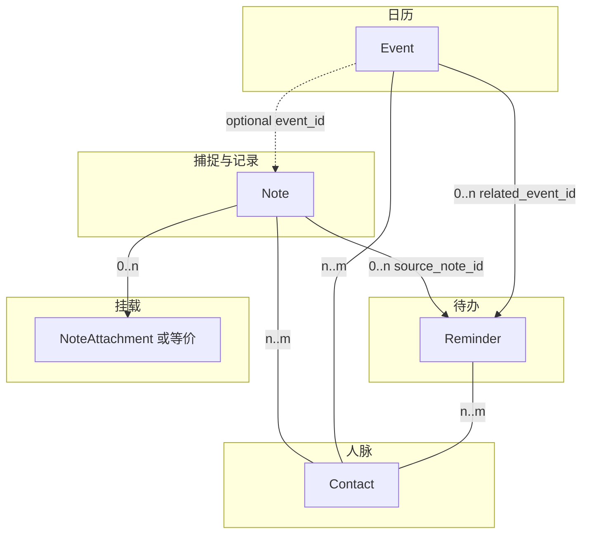
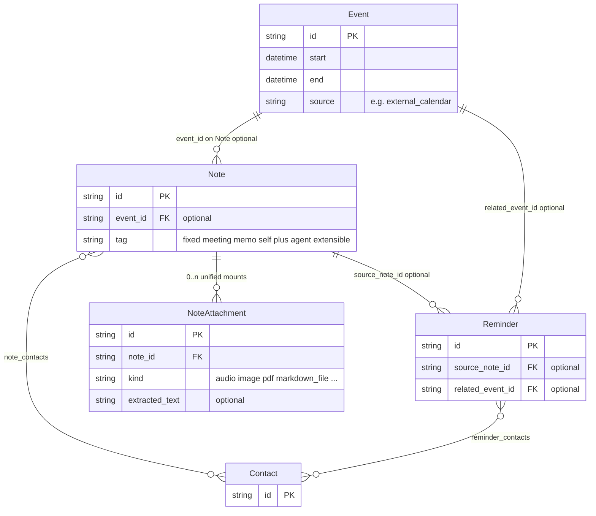
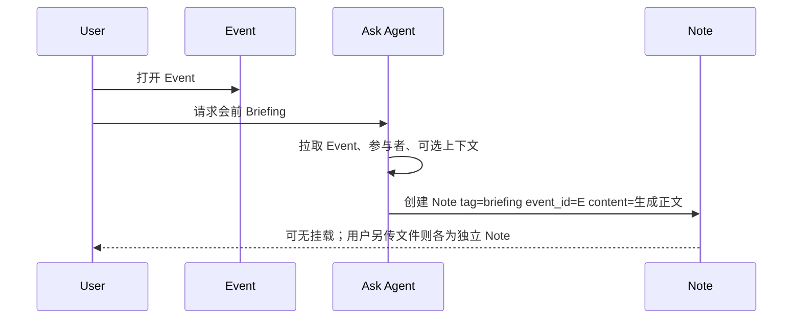
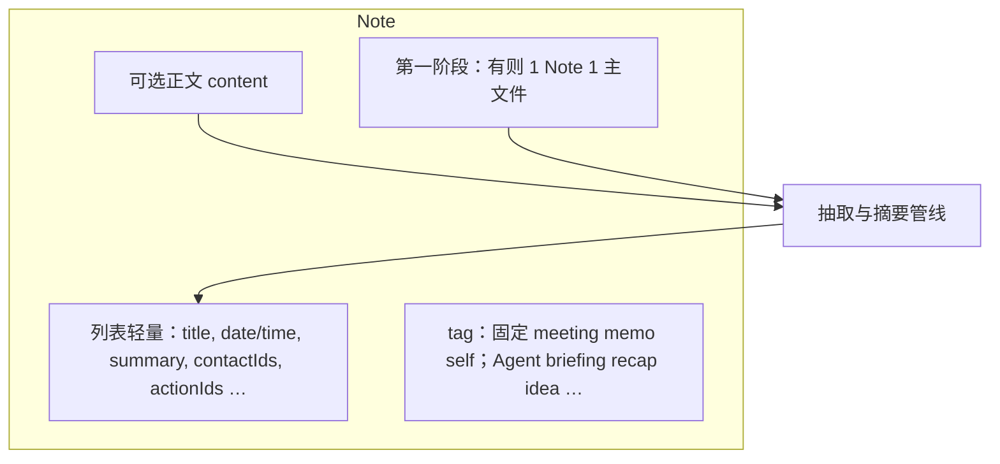

# 用户资产结构、关联关系与 Note 挂载（Phase 2）

## 1. 文档目的

- 统一 **Note / Event / Reminder / Contact** 及 **Note 下挂载资源** 的职责边界与可选关联。
- 用图示固化 **实体间关系**，避免日历接入后与「捕捉记录」混写。
- **第一阶段**：**一条 Note 至多一条主文件挂载**（一次多选 → **多条 Note**）；**单 Note 多挂载 + 融合摘要** 见后续 **§5、§7**。
- **Note**：单一实体，承载挂载（0..n）与可选正文；用 **`tag`** 区分来源与形态——**固定三类** `meeting` / `memo` / `self`，以及 **Agent 侧可扩展标签**（如 `briefing` / `recap` / `idea` 等），见 §4.1。

---

## 2. 核心实体一览

| 实体 | 职责（一句话） |
|------|----------------|
| **Note** | 可带 **正文** 与 **挂载**；**`tag`** 区分来源与形态。**第一阶段**：有文件时 **一条 Note 一条主文件**；**`briefing` / `recap` 等** 与 **self / meeting** 同为 **Note 的生成方式**，挂载规则一致（§7.1）。 |
| **Event** | 日历上 **一段时间占用**（可来自外部同步）；**不挂文件**。录音与文件在 **`event_id` 关联的 Note** 上。 |
| **Reminder** | 带时间的 **待办/承诺**：可溯源 Note，可关联 Event，可关联多人。 |
| **Contact** | **人脉**：与多条 Note、Event、Reminder **多对多** 聚合。 |
| **挂载资源** | 归在 **Note** 下：`attachments[]` / 子表；音频也可先用 **主音频字段** 表达，与 **`kind=audio`** 单条挂载语义一致。 |

---

## 3. 实体关联关系（总图）

下列关系为 **逻辑模型**（实现可用外键 + 关联表）。**可选**表示业务上允许为空。

**总览（关联方向一眼图）**：虚线表示「可选外键」。

**ER 示意**（Note→Event 为 **多对一可选**）：

### 3.1 关系说明（文字）

| 关系 | 基数 | 说明 |
|------|------|------|
| Note → Event | 0..1 | 该条 Note 对应某段日程；闪念常为空。 |
| Event → Note | 0..n | 同一段会议可有 **多条** Note（实录、会前 Agent 写入、会后补记等）。 |
| Reminder → Note | 0..1 | `source_note_id`；纯手建待办可无。 |
| Reminder → Event | 0..1 | `related_event_id`。 |
| Note ↔ Contact | n..m | 参与者/提及的人。 |
| Event ↔ Contact | n..m | 日历参与者与通讯录对齐。 |
| Reminder ↔ Contact | n..m | 交办对象、相关人、含自己。 |
| Note → NoteAttachment | 0..n | **第一阶段** 有附件时 **一条 Note 一条主挂载**（§7.1）；模型层仍允许多条，供后续阶段。 |
| Event → NoteAttachment | — | Event **无**附件表。 |

---

## 4. Note：挂载与 **`tag`**

### 4.1 `tag` 设计：固定三类 + Agent 可扩展

- **一条 Note 一条主 `tag`**（若未来需要多标签，可演进为 `tags[]`，当前文档按 **单值** 描述）。  
- **`tag` 词汇可以很多**：除下文 **固定三类** 外，**Agent 生成** 的标签由产品持续增加（建议 **后台维护白名单/版本**，避免客户端写死全集）。

#### 4.1.1 固定三类（用户侧来源，与硬件/App 行为绑定）

| `tag` | 含义 | 典型写入时机 |
|-------|------|----------------|
| **`meeting`** | 硬件 **会议/长录** | 硬件上报录音 → **后台**按协议/模式判为 meeting → **`tag=meeting`**。 |
| **`memo`** | 硬件 **闪念/短录** | 硬件上报 → 后台判为 memo → **`tag=memo`**。 |
| **`self`** | 用户 **自己在 App 内** 发起（上传音频/文件等） | 用户主动创建 → **`tag=self`**（与硬件分流无关）。 |

硬件 **meeting / memo** 的判定细则由 **固件 + 后台** 定义；本文只约定 **落库语义**。

#### 4.1.2 Agent 生成类（可扩展，同一 Note 实体）

由 **Ask Agent**（或后台任务）创建、且不属于上述三类来源时，使用 **Agent 标签**；挂载可为空，正文多为 **Agent 生成 + 用户可编辑**。

| `tag`（示例） | 含义 | 典型触发 |
|---------------|------|----------|
| **`briefing`** | 会前材料（背调、前情提要、议程建议等） | **Event** 内触发 Agent → 创建 Note 时常带 **`event_id`**。 |
| **`recap`** | 会后/阶段性 **纪要、复盘、结论整理** | 基于一条或多条 **源 Note**（录音/摘要）由 Agent 生成新 Note（建议 **`source_note_ids[]`** 可追溯）。 |
| **`idea`** | **想法、方案草稿、扩写文档** 等 Agent 辅助产出 | Agent 对话或「从选中 Note 生成」等入口 → **`tag=idea`**。 |

后续还可增加如 **`followup`**、**`digest`** 等标签；新产品形态通过 **扩展 `tag` 词汇** 接入即可。

### 4.2 挂载种类（`kind` 示例）

| `kind` | 说明 | 供 AI 使用的典型文本来源 |
|--------|------|---------------------------|
| **audio** | 硬件或 App 上传的录音 | **transcript**（ASR）；可选时间轴/说话人 |
| **image** | PNG/JPG 等 | **OCR** 或视觉理解输出的文本描述（由管线定义） |
| **pdf** | PDF 文件 | **全文或分页抽取文本**；过大时需截断或先缩略 |
| **markdown_file** | 上传的 `.md` | 解析后的纯文本 |
| （扩展） | 其他 Office 等 | 抽取文本策略单独定义 |

**第一阶段**：用户一次选 **多个文件**（入口不限，含会前场景）→ **每个文件一条 Note**、**每条一条主挂载**、**各自摘要**；可选 **`upload_session_id`** 成组。纯 Agent 生成、**无上传** 的 Note（如仅正文 Briefing）→ **可无挂载**。

**后续阶段**：**单条 Note** 上 **多挂载**（如录音 + PDF）→ **§5** 融合摘要与待办。

### 4.3 Agent 生成 Note

**结构**：**`Note`** + **Agent 类 `tag`** + 可选 **`content` / 结构化 blocks`** + 可选 **单条主挂载**（与 §7.1 一致：多文件则 **多条 Note**）。

| 场景 | `tag` | 要点 |
|------|-------|------|
| Event 会前 | **`briefing`** | **`event_id`** 指向该 Event；会前上传的 **每个文件** 仍为 **独立 Note**（各一条挂载），Agent 生成的 **正文 Briefing** 可为 **另一条** 可无挂载的 Note。 |
| 会后/复盘 | **`recap`** | 常引用 **`source_note_ids`**（来自 `meeting`/`memo`/`self` 等）；可选 **`event_id`**。 |
| 想法/方案 | **`idea`** | 可来自 Agent 对话或多 Note 合成；**`source_note_ids`** 建议可填。 |

`recap` / `idea` 的入口不必经过 Event，字段组合与上表一致。

### 4.4 Note 内部结构（概念）

---

## 5. 单 Note 多挂载时的融合摘要（后续阶段）

**第一阶段** 每条 Note **单源摘要**，**不**依赖本节。

**后续阶段**：**同一条 Note** 上 **多种挂载并存**（如 **音频 + PDF + 图**）+ 可选正文 → 用本节做 **一次融合摘要**。

### 5.1 统一中间表示：「可摘要文档块」

在调用主摘要模型前，将所有来源 **规范化** 为有序列表 **`DocBlock[]`**，每项至少包含：

- `source_id`（对应某条 attachment 或 `body`）  
- `source_kind`（`audio_transcript` / `pdf_text` / `image_ocr` / `markdown` / `user_body` …）  
- `text`（已抽取的可读文本；图片可为 OCR 或 caption）  
- `ordering_key`（排序用：用户拖拽顺序、上传时间、或产品默认规则）

### 5.2 排序与优先级（产品需默认一种，允许用户改）

建议 **默认顺序**（可配置）：

1. **用户正文** `content`（若有，通常表达当前意图，宜靠前或单独标注「用户强调」）。  
2. **音频 transcript**（口语信息密度高、常含会议事实）。  
3. **PDF 抽取文本**（按页或按章节切块）。  
4. **图片 OCR / 描述**（多为辅助）。

**用户可调整** `attachments` 顺序时，**排序应以用户顺序为准**，并在 `DocBlock` 里反映。

### 5.3 摘要生成策略（两种可并存）

| 策略 | 做法 | 适用 |
|------|------|------|
| **单次融合** | 将 `DocBlock[]` 用清晰分隔符拼成上下文（带标题：`## 来自录音` / `## 来自 PDF xxx`），一次 LLM 生成总摘要 + 可选要点/待办。 | 总 token 可控、块数少时。 |
| **Map-Reduce** | 先 **逐块** 生成短摘要，再 **第二轮** 合并为总摘要与行动项；冲突时在输出中 **标注来源**。 | PDF 很长、transcript 很长时。 |

### 5.4 长度与失败

- **Token 预算**：超长 PDF / 长录音先 **分段摘要** 再融合；或对 PDF 仅取前 N 页并 **在 summary 中声明「未读全」**。  
- **部分失败**：某附件解析失败时，该块标记 `failed`，**其余块仍参与摘要**，并在结果脚注 **「未纳入：xxx」**。  
- **冲突**：音频与 PDF 对同一事实表述不一致时，输出可采用 **「以录音为准 / 以文档为准」** 规则二选一，或 **并列呈现两条并标注来源**（更稳妥）。

### 5.5 输出落在哪里

- **列表**：仍写 **`BaseNote.summary`**（1～2 句总览）。  
- **详情**：可保留 **分来源小节**（便于核对）；派生 **Reminders** 时建议在结构上 **带回 `source_ref`**（来自哪块），便于用户点回。

---

## 6. 音频与 Transcript（作为挂载的一种）

| 问题 | 结论 |
|------|------|
| 音频挂哪？ | **`kind=audio` 的 NoteAttachment**，或等价的 **主音频字段**。 |
| Transcript？ | **与该音频挂载绑定**（1:1 或 1:多版本）；不挂在 Event 上。 |
| 列表接口 | 列表只拉 **轻量字段**；不默认带全文 transcript / 大文件。 |
| 与 Event | **可选** `event_id`；无日历则仅 Note。 |

---

## 7. 挂载资源演进：现阶段 vs 完整计划

### 7.1 第一阶段

**统一规则**：**一条 Note 一条主文件挂载**；**无上传** 的 Note（如 Agent 仅生成正文）可 **0 挂载**。

1. **硬件录音**：**`tag=meeting|memo`**，一 Note 一录音；**transcript + 摘要**。  
2. **App 单次上传**：**`tag=self`**，一 Note 一文件或一音频；**单独摘要**。  
3. **一次多选多个文件**（任意入口，含会前）：**每文件一 Note**、**每 Note 一挂载**、**各自摘要**；可选 **`upload_session_id`**、**`event_id`** 成组。  
4. **Agent 生成**（`briefing` / `recap` / `idea` 等）：与上同——**有文件则按文件拆 Note**；**仅生成文本** 则 **单 Note + `content`**、可无挂载。生成 Briefing 时可将 **同 Event 下多条材料 Note** 的 **摘要或抽取文本** 作为上下文（不必合并为单 Note 多挂载）。

### 7.2 后续阶段

- **单条 Note** **多挂载** → **§5** 融合摘要与派生待办。  
- Markdown：**正文内联** 与 **上传 .md** 的规则在 PRD 中单列，避免重复计入摘要。

---

## 8. Reminder / Contact 摘要

- **Reminder**：必有截止时间等；可选 `source_note_id`、`related_event_id`；可选多 Contact；允许无 Note/Event 的纯手动待办。  
- **Contact**：通过 Note / Event / Reminder 多对多聚合。

---

## 9. 修订记录

| 日期 | 说明 |
|------|------|
| 2026-03-20 | 初稿；第一阶段全局 **一 Note 一主文件**；Event 不挂文件；§5 为后续多挂载。 |
