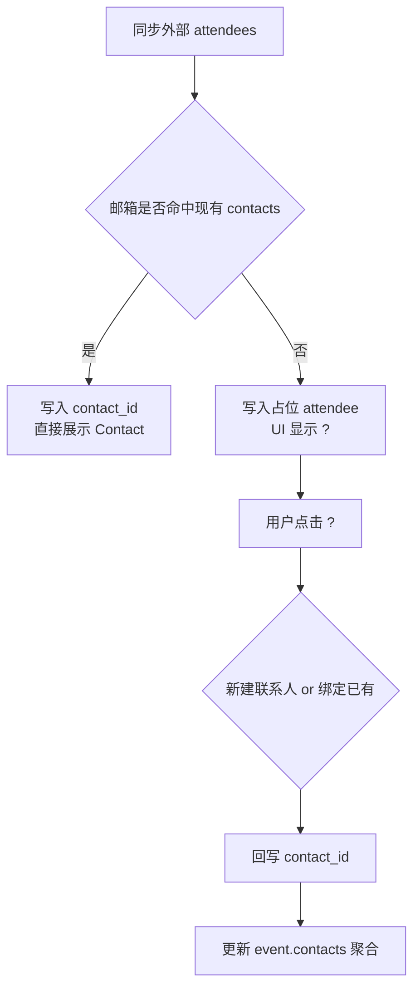

# PRD：资产模型（Phase 2）

| 属性 | 内容 |
|------|------|
| 状态 | 草案 |
| 目标 | 建立统一的 `Files / Notes / Events / Reminders / Contacts` 后台模型 |
| 本期范围 | 引入 `Files` 资产层；`Note` 关联 `File`（0..1）；`File.kind` 仅 `audio`；日历单向导入 |
| 权威关系图 | `ASSET_MODEL_AND_RELATIONS.md`（如有冲突，以本 PRD 为准） |

---

## 1. 业务目标与原则

### 1.1 目标

1. 支持将外部日历事件导入 BizCard 并统一管理。  
2. 支持以文件为输入、以 Note 为解析产物的处理链路。  
3. 统一 Reminder 与 Note/Event 的关联规则，避免语义冲突。

### 1.2 设计原则

- **输入与产物分离**：`Files` 存输入文件，`Notes` 存解析结果。  
- **职责清晰**：`Event` 管时间占位，`Note` 管内容，`Reminder` 管任务。  
- **单向同步**：来源日历 -> BizCard；本期不回写来源日历。  
- **MVP 收敛**：本期仅支持 `audio` 文件类型。

---

## 2. 核心模型定义

### 2.1 实体职责

| 实体 | 职责 |
|------|------|
| `File` | 用户上传或录音笔导入的源文件（本期仅 `audio`） |
| `Note` | 对输入内容的解析产物，承载 `transcript`、`summary`、正文等 |
| `Event` | 日历时间占位，来自内部或外部同步 |
| `Reminder` | 待办事项，可关联 Note 与 Event |
| `Contact` | 统一联系人资产，支持与 Note/Event/Reminder 聚合 |

### 2.2 关键关联

| 关系 | 约束 |
|------|------|
| `Note -> File` | 0..1（本期单 Note 单 File） |
| `Note -> Event` | 0..1 |
| `Reminder -> Note` | 0..1（`source_note_id`） |
| `Reminder -> Event` | 0..1（`related_event_id`） |
| `Note/Event/Reminder <-> Contact` | n..m |

### 2.3 Reminder 自动关联规则（最终版）

- Reminder 结构保留 `source_note_id` 与 `related_event_id` 两个可选字段。  
- 若有 `source_note_id` 且对应 Note 存在 `event_id`，系统自动补齐：  
  `related_event_id = note.event_id`。  
- 若两者都存在但不一致，以 `note.event_id` 为准并回写修正。  
- 若从 Event 页面直接创建 Reminder，可仅写 `related_event_id`。

### 2.4 Note `tag` 规则（本期与演进）

`tag` 用于标记 Note 来源/形态，当前采用单值字段。

- **本期固定标签**：`meeting` / `memo` / `self`
  - `meeting`：会议录音类记录
  - `memo`：闪念/短录类记录
  - `self`：用户在 App 内主动发起（如上传文件后生成）
- **后续扩展标签**：`briefing` / `recap` / `idea` 等 Agent 生成类
- **治理建议**：标签由服务端白名单管理，客户端不写死全集

---

## 3. Files -> Notes 处理流程（本期）

1. 用户上传 `audio` 文件（或录音笔导入），创建 `File`。  
2. 用户在 File 详情页触发 `generate summary`。  
3. 系统执行 ASR 与总结流程，生成 `Note` 并关联 `file_id`。  
4. 解析结果写入 Note：`transcript`、`summary`、结构化内容。  
5. File 仅保存源文件元信息与处理状态，不存最终业务摘要。

**结论**：`transcript` 与 `summary` 归属 `Note`，不归属 `Event`。

---

## 4. Event 字段规范（v1）

### 4.1 必填字段

| 字段 | 说明 |
|------|------|
| `id` | BizCard Event 主键 |
| `source` | 来源：`internal/google/outlook/apple/other` |
| `source_event_id` | 来源事件 ID |
| `title` | 标题 |
| `start_at` / `end_at` | 开始/结束时间（UTC 存储） |
| `timezone` | IANA 时区 |
| `is_all_day` | 是否全天 |
| `status` | `confirmed/tentative/cancelled` |
| `description` | 描述（允许空字符串） |
| `contacts` | 关联联系人列表（允许空数组） |
| `created_at` / `updated_at` | 时间戳 |

### 4.2 推荐字段

| 字段 | 说明 |
|------|------|
| `attendees` | 原始参会人（联系人映射输入） |
| `organizer_name` / `organizer_email` | 组织者信息 |
| `location_text` | 地点文本 |
| `meeting_url` | 在线会议链接 |
| `recurrence_rule` / `recurrence_event_id` / `original_start_at` | 重复事件支持 |
| `source_calendar_id` | 来源日历容器 ID |
| `source_updated_at` / `source_etag_or_version` | 来源增量同步依据 |
| `last_synced_at` / `sync_status` | 同步状态跟踪 |
| `is_local_edited` / `local_edited_at` | 本地编辑状态 |

### 4.3 Event 参会人到 Contact 的兜底策略（本期）

#### 4.3.1 背景

外部日历（如 Google Calendar）中的 `guests/attendees` 不一定都已存在于用户的 BizCard 联系人中。  
因此 Event 侧必须支持“已匹配联系人 + 未匹配参会人占位”并存。

#### 4.3.2 数据策略

1. **保留原始参会人**：所有外部 `attendees` 原样存入 `event.attendees`（事实源）。  
2. **联系人映射**：按邮箱优先、姓名次级匹配到 `contacts`。  
3. **未匹配兜底**：未匹配对象保留 `display_name + email` 占位，不丢失。  
4. **展示规则**：已匹配直接展示 Contact；未匹配展示姓名并加 `?`。  

#### 4.3.3 交互策略（产品口径）

1. 对未匹配参会人显示 `?` 标识（例如 `? Emily Chen`）。  
2. 用户点击 `?` 后，可直接在 App 内创建为 Contact，或绑定到已有 Contact。  
3. 创建/绑定成功后，立即更新该 attendee 的映射状态，并写入 `event.contacts` 聚合。  

#### 4.3.4 处理流程（清晰版）

#### 4.3.5 字段建议（attendees 内部结构）

| 字段 | 说明 |
|------|------|
| `display_name` | 参会人名称（来源字段） |
| `email` | 参会人邮箱（主匹配键） |
| `response_status` | 接受/拒绝/待确认 |
| `contact_id` | 匹配或新建后的 BizCard 联系人 ID（可空） |

### 4.4 字段来源参考

- [Google Calendar Events](https://developers.google.com/workspace/calendar/api/v3/reference/events)  
- [Microsoft Graph Event](https://learn.microsoft.com/en-us/graph/api/resources/event?view=graph-rest-1.0)  
- [Apple EventKit EKEvent](https://developer.apple.com/documentation/eventkit/ekevent)

---

## 5. 日历同步策略（v1）

### 5.1 同步模式

- **单向导入**：仅从外部日历拉取到 BizCard。  
- BizCard 内可编辑 Event，但不回写到来源日历。
- 提供两种更新入口：**用户手动刷新** + **系统定时刷新**。

### 5.2 拉取策略

1. **首次初始化**：按时间窗拉取（建议过去 30~90 天 + 未来 365 天）。  
2. **后续刷新（手动/定时）**：默认只拉取**未来时间窗**（如未来 30~90 天），不重复全量历史区间。  
3. **历史回补**：仅在用户显式触发“拉取历史”或排障任务时执行。  
4. Upsert 唯一键：`source + source_calendar_id + source_event_id`。  
5. 来源删除：不硬删，标记 `sync_status=source_deleted`。

### 5.3 覆盖策略

| 场景 | 策略 |
|------|------|
| 外部 `source_updated_at` > 本地 `updated_at` | 用外部数据覆盖本地 |
| 外部 `source_updated_at` <= 本地 `updated_at` | 保留本地版本，不覆盖 |
| 时间不可比或缺失 | 进入保护分支：不覆盖并记录 `sync_error` 供重试/人工检查 |

补充说明：

- 覆盖决策统一基于“最新更新时间优先”（Last Updated Wins）。  
- 手动刷新与定时刷新复用同一套比较逻辑。

### 5.4 客户端展示约束（与资产模型一致）

以下规则属于客户端呈现口径，但与本模型中 `Event/Reminder/source` 字段强相关，需作为一致性约束：

- Calendar 顶部通过单一“筛选与设置”入口打开侧边栏，统一管理视图、我的过滤与订阅日历。
- 视图范围收敛为 `单日` 与 `日程`：
  - 单日：`Event` 与 `Reminder` 都作为时间块参与同一冲突分栏算法；
  - 日程：按周分组，周内无安排不展开逐日条目。
- 颜色语义固定：`Event`（蓝）/`Reminder`（绿），避免来源色与任务语义冲突。
- `source` 维度筛选在“订阅日历”分区完成；条目需展示 provider 名称 + 账号，并支持 `重新同步` / `取消订阅`。
- 日程流允许向未来持续滚动（增量加载），并且顶部月份标题需与当前焦点日期联动更新。

详细交互、流程与验收见：

- `PRD_CALENDAR_EVENT_DETAIL_AND_CREATE.md`
- `PRD_CALENDAR_INTEGRATION_ENTRY_AND_MANAGEMENT.md`

---

## 6. 非范围（Out of Scope）

- 非 `audio` 文件类型（图片/PDF/Office）的正式支持。  
- 多 File 关联到单 Note。  
- 客户端 UI 细节与硬件协议细节。  
- 向 GitHub Issue 的提交流程。

---

## 7. 评审结论摘要（当前）

- `File` 是输入资产；`Note` 是解析产物。  
- 本期 `File.kind` 仅 `audio`。  
- `transcript + summary` 挂在 `Note` 主体。  
- Reminder 同时支持 Note/Event 关联，并执行自动回填规则。  
- Event 同步为单向导入，不回写来源日历。
- Event 更新入口包含手动刷新与定时刷新，按更新时间决定覆盖。  
- 初始化后默认只拉取未来时间窗，历史回补按需触发。  
- Event 参会人支持邮箱匹配与 `?` 兜底，用户可一键创建/绑定联系人。

---

## 8. 修订记录

| 日期 | 说明 |
|------|------|
| 2026-03-25 | 重构文档结构：去冗余、统一术语、收敛为可评审版本 |
