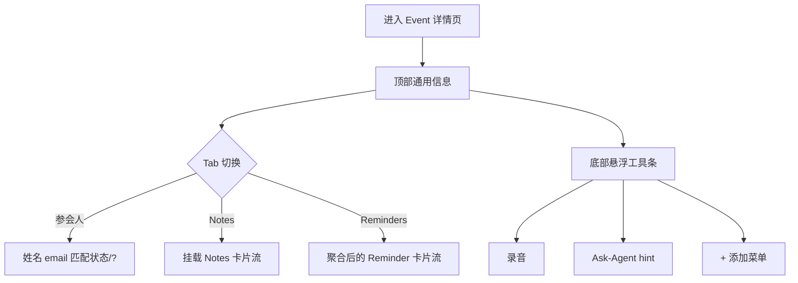
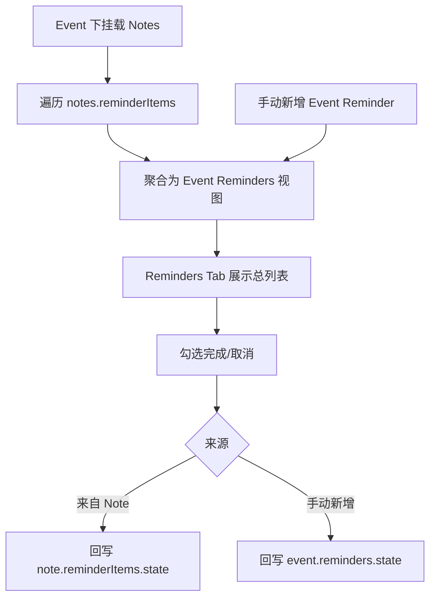
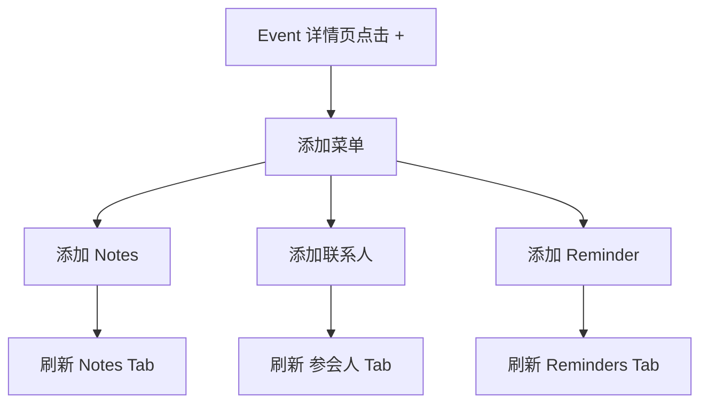

# PRD：Calendar Event 详情与新建体验（Phase 2）

| 属性 | 内容 |
|------|------|
| 状态 | 评审版 |
| 版本 | v1.0 |
| 目标 | 统一 Event 新建、详情页与资产挂载交互，保证数据与展示一致 |
| 关联文档 | `PRD_ASSET_MODEL_PHASE2.md`、`APP_INTERACTIVE_DEMO_PHASE2.html` |

---

## 1. Problem Statement

当前 Calendar 的 Event 体验在以下方面存在不一致：

- 新建入口与详情页挂载入口分散，用户对“在哪里添加资产”认知成本高。
- Event 详情页展示内容与资产模型（Notes/Reminders/Contacts/Files）未完全对齐。
- Notes 与 Reminders 在 Event 维度的关系未严格同源，容易出现“数量不一致”。
- 无参会人、无 Notes 场景下缺少可执行的下一步动作引导。

---

## 2. Solution Overview

构建统一的 Event 体验闭环：

1. **新建 Event**：支持完整字段输入，保存后写回时间线并参与冲突布局。
2. **Event 详情页**：顶部固定基础信息；下方以 Tab 承载资产域内容。
3. **统一添加入口**：详情页内所有“添加/关联”动作由底部 `+` 承载。
4. **数据同源规则**：Event 的 Reminders 展示由挂载 Notes 的提醒聚合而来（可叠加手动新增）。
5. **Agent 引导策略**：通过底部浮层 hint 引导 briefing/recap，不在列表内部重复提示。

---

## 3. 信息架构与导航

### 3.1 Calendar 主体层级

- 右上角仅保留一个入口：`筛选与设置`（图标按钮）。
- 点击后打开统一侧边栏（右侧 panel），不在主视图放并行筛选/切换入口。
- 主视图固定为日历容器，不再保留“全量 reminders”独立页面。

### 3.2 侧边栏分区（统一管理）

侧边栏分为三个分区，顺序固定：

1. **视图**
   - `单日` 视图
   - `日程` 视图（跨天连续滚动）

2. **我的**
   - 显示日程（Event）
   - 显示代办（Reminder）
   - 显示已完成代办

3. **订阅日历**
   - provider 列表（示例：Google / Outlook）
   - 每项展示：日历名 + 账号（如 `abc@gmail.com`）
   - 每项提供更多菜单（`重新同步` / `取消订阅`）
   - 分区底部提供 `添加第三方日历` 入口

说明：

- 侧边栏不需要“关闭按钮”；移动端点击遮罩区域即关闭。
- 订阅日历筛选逻辑收敛在侧边栏，不在主视图重复展示 chip。

### 3.3 Event 详情层级

- 顶部固定区域（所有 Tab 通用）：
  - 主题
  - 时间
  - 地点
  - 会议链接
  - 来源
- Tab 区域：
  - `参会人`
  - `Notes`
  - `Reminders`

说明：Tab 内不再重复展示“参会人列表/挂载 Notes/挂载 Reminders”等二级标题。

### 3.4 流程图（详情页信息架构）

---

## 4. Event 新建与编辑

### 4.1 字段范围（本期）

- 主题
- 时间（日期、开始、结束、时区）
- 参与者
- 是否重复
- 会议链接
- 会议地点
- 描述
- 附件

不包含：

- 参与者权限管理
- 会议室管理能力

### 4.2 入口规则

- 底部 `+`：先弹出快速新建弹层（Event / Reminder）。
- 时间线空白点击：直接进入新建 Event（不弹层）。
- Event 详情 `编辑`：进入编辑页并回填现有字段。
- 日程视图不提供额外“点击空白创建”引导文案，创建统一由底部 `+` 承载。

### 4.3 附件输入规则

- 附件不以逗号字符串保存在输入框。
- 输入框仅作为“单次输入”，点击添加后进入下方附件小列表。
- 列表项支持删除，保存时按列表持久化到 Event 挂载文件。

---

## 5. Event 详情页规范

### 5.1 参会人 Tab

- 列表字段：
  - 姓名
  - email
  - 匹配状态（已匹配 / `?` 未匹配）
- 无参会人时可通过底部 `+` 打开添加菜单，进入“添加联系人”流程。
- 联系人选择流程复用现有兜底逻辑：
  - 选择已有联系人直接挂载；
  - 未匹配项继续支持 `?` 触发新建/绑定。

### 5.2 Notes Tab

- 以 Notes 卡片形式展示挂载内容，视觉风格参考首页 Notes 卡片。
- 无 Notes 时展示空卡片（如“暂无挂载 Notes”）。
- 不在列表内放额外 hint。
- 通过底部浮层 hint 引导：
  - 无 Notes：提示可生成 briefing
  - 有 Notes：提示可生成 recap

### 5.3 Reminders Tab

- 使用 Reminder 卡片样式（checkbox + 标题 + 时间，完成置灰划线）。
- 数据同源规则：
  - Event Reminders = `notes[].reminderItems` 聚合
  - 可叠加 Event 层手动新增 reminders
- 示例约束：
  - 若 Event 有 2 条 Notes，分别带 2/1 个提醒，则 Reminders Tab 展示 3 条。

### 5.4 流程图（Reminders 同源聚合）

---

## 6. 统一添加入口（详情页底部 `+`）

在 Event 详情页点击 `+`，弹出“添加到当前 Event”菜单：

- 添加 Notes
- 添加联系人
- 添加 Reminder

原则：详情页内不设置并行入口（如 Tab 内“关联已有 Notes/添加参会人”按钮），避免入口重复。

### 6.1 流程图（详情页 + 添加）

---

## 7. Agent 交互策略

### 7.1 Ask-Agent 气泡 hint

- 保留详情页底部悬浮三键（录音 / Ask-Agent / 添加）。
- Ask-Agent 气泡作为唯一提示载体，文案随场景变化：
  - Notes Tab + 无 Notes：可生成 briefing
  - Notes Tab + 有 Notes：可生成 recap
  - 其他 Tab：提示通过 `+` 添加对应资产

### 7.2 目标

- 把“下一步怎么做”聚焦在一个稳定位置，避免在内容区重复提示导致噪音。

---

## 8. 状态与一致性规则

- 详情页打开时默认落在 `参会人` Tab。
- Tab 切换不改变顶部基础信息。
- 完成态统一：Reminders 勾选后置灰并加删除线。
- 当用户从详情返回日历，保持当前日期与视图状态。
- 单日视图冲突布局统一规则：
  - `event/event`、`event/reminder`、`reminder/reminder` 三类重叠均使用横向切分算法。
  - 颜色语义固定：Event = 蓝色；Reminder = 绿色。
- 日程视图规则：
  - 周标题格式：`第X周，M月D日 - M月D日`。
  - 跨月显示大月份标题（如 `8月`）。
  - 若某周无任何安排，仅展示周标题，不展开逐日内容。
  - 支持向未来无限滚动（按需增量加载未来日期）。
- 顶部月份主标题（如 `May 2026`）与焦点日期联动，滚动至新月份时自动更新。

---

## 9. 第三方接入（引用）

第三方日历接入（Onboarding 入口、日历页入口、接入管理页逻辑与页面设计）已拆分到独立文档：

- `PRD_CALENDAR_INTEGRATION_ENTRY_AND_MANAGEMENT.md`

---

## 10. Out of Scope

- Event 与外部日历双向回写同步。
- 权限体系（参会人权限、会议室预订规则）。
- 复杂提醒策略（多次重复提醒模板、智能延后建议）。
- Files 高级能力（预览、版本比对、权限协作）。

---

## 11. 验收标准（Demo 口径）

1. 可通过空白时间区直接新建 Event，并保存进时间线。  
2. Calendar 右上仅有一个筛选入口，点击可打开侧边栏三分区（视图/我的/订阅日历）。  
3. 侧边栏支持：单日/日程切换、日程与代办显隐、已完成代办显隐。  
4. 单日视图中任意冲突组合（event/event、event/reminder、reminder/reminder）均可横向分栏。  
5. 颜色语义一致：Event 蓝色、Reminder 绿色（单日与日程视图一致）。  
6. 日程视图满足“周级收敛”规则：无安排周不展开逐日，有安排周展开逐日。  
7. 日程视图具备跨月大标题 + 周标题，并支持向未来持续滚动。  
8. 顶部月份主标题随当前焦点日期滚动联动更新。  
9. 可通过详情页查看统一头部信息与三大 Tab 内容。  
10. 详情页 `+` 为唯一添加入口；Tab 内无重复添加按钮。  
11. Agent 提示只在底部气泡展示，不在 Notes 列表内部重复。  
12. 第三方接入策略与验收，按独立文档执行（见 `PRD_CALENDAR_INTEGRATION_ENTRY_AND_MANAGEMENT.md`）。

