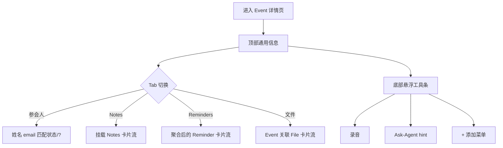
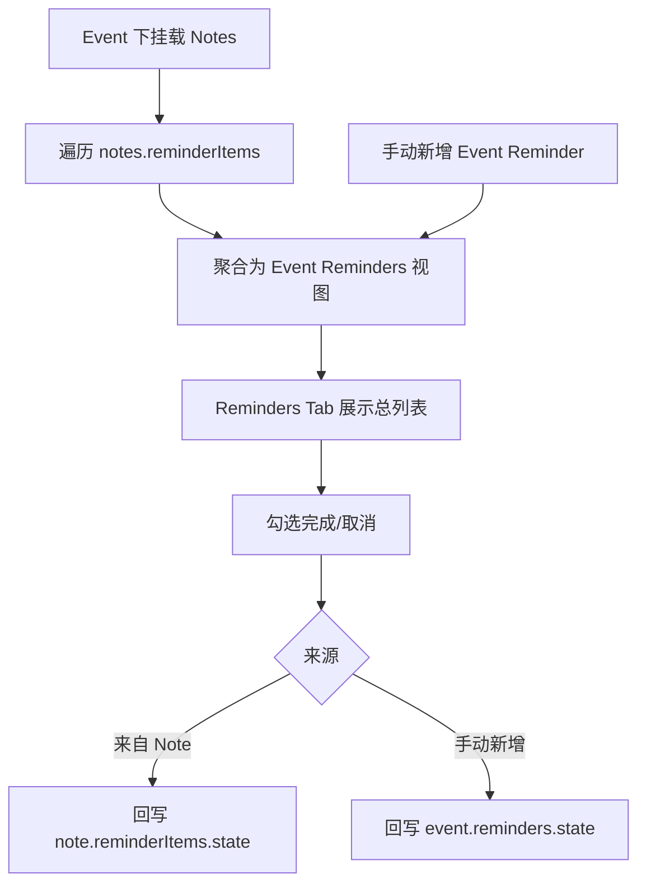
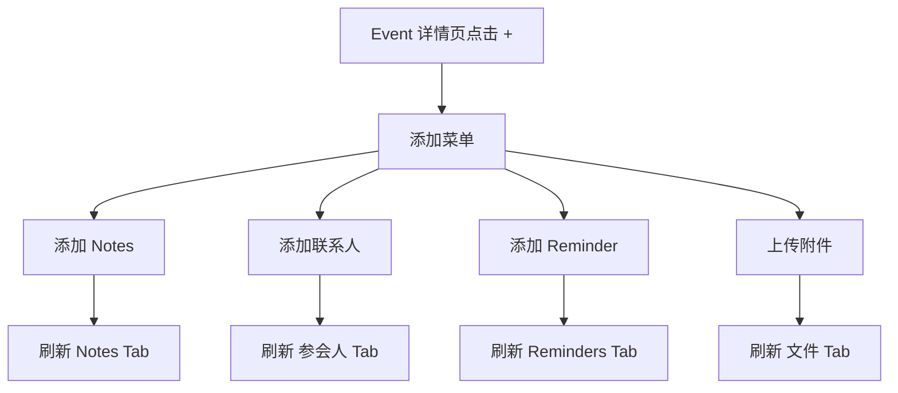

# PRD：Calendar Event 详情与新建体验（Phase 2）

| 属性 | 内容 |
|------|------|
| 状态 | 评审版 |
| 版本 | v1.6 |
| 目标 | 统一 Event 新建、详情页与资产挂载交互，保证数据与展示一致 |
| 关联文档 | `PRD_ASSET_MODEL_PHASE2.md`、`APP_INTERACTIVE_DEMO_PHASE2.html` |

**文档结构**：先 **Event（新建、详情、+、Agent）**，再 **日历主视图（单日 / 日程）**，最后 **日历壳层与侧边栏**。第三方接入见独立文档。

---

## 1. Event：信息架构、新建编辑与详情

### 1.1 详情信息架构

#### 1.1.1 层级

- 顶部固定区域（所有 Tab 通用）：
  - 主题
  - 时间
  - 地点
  - 会议链接
  - 来源
- Tab 区域（顺序固定）：
  1. `参会人`
  2. `Notes`
  3. `Reminders`
  4. `文件`

说明：Tab 内不再重复展示「参会人列表 / Notes / Reminders / 文件」等二级标题。

#### 1.1.2 流程图（详情页）

### 1.2 新建与编辑

#### 1.2.1 字段范围（本期）

- 主题
- 时间（日期、开始、结束、时区）
- 参与者
- 是否重复
- 会议链接
- 会议地点
- 描述
- 附件

不包含：

- 参与者权限管理
- 会议室管理能力

#### 1.2.2 入口规则

- 底部 `+`：先弹出快速新建弹层（Event / Reminder）。
- 时间线空白点击：直接进入新建 Event（不弹层）。
- Event 详情 `编辑`：进入编辑页并回填现有字段。
- 日程视图不提供额外“点击空白创建”引导文案，创建统一由底部 `+` 承载。

#### 1.2.3 附件输入规则

- 附件不以逗号字符串保存在输入框。
- 输入框仅作为“单次输入”，点击添加后进入下方附件小列表。
- 列表项支持删除，保存时按列表持久化到 **Event ↔ File** 关联（见 `PRD_ASSET_MODEL_PHASE2.md`）。
- **编辑页附件列表** 与详情 **「文件」Tab** 展示 **同源**：任一侧解除关联后，另一侧再次进入应一致。

### 1.3 详情页各 Tab 规范

#### 1.3.1 参会人 Tab

- 列表字段：
  - 姓名
  - email
  - 匹配状态（已匹配 / `?` 未匹配）
- 无参会人时可通过底部 `+` 打开添加菜单，进入“添加联系人”流程。
- 联系人选择流程复用现有兜底逻辑：
  - 选择已有联系人直接挂载；
  - 未匹配项继续支持 `?` 触发新建/绑定。

#### 1.3.2 Notes Tab

- 以 Notes 卡片形式展示挂载内容，视觉风格参考首页 Notes 卡片。
- 无 Notes 时展示空卡片（如“暂无挂载 Notes”）。
- 不在列表内放额外 hint。
- 通过底部浮层 hint 引导：
  - 无 Notes：提示可生成 briefing
  - 有 Notes：提示可生成 recap

#### 1.3.3 Reminders Tab

- 使用 Reminder 卡片样式（checkbox + 标题 + 时间，完成置灰划线）。
- 数据同源规则：
  - Event Reminders = `notes[].reminderItems` 聚合
  - 可叠加 Event 层手动新增 reminders
- 示例约束：
  - 若 Event 有 2 条 Notes，分别带 2/1 个提醒，则 Reminders Tab 展示 3 条。

#### 1.3.4 「文件」Tab（Event 挂载 File）

- **内容**：展示与本 Event **软关联**的全部 `File`（与 `+` →「上传附件」、新建/编辑页附件写入同一数据源）。
- **形态**：与 Notes / Reminders 一致，采用 **纵向卡片流**；每张卡片至少包含：文件名/标题、类型或图标（本期 `audio`）、上传或同步时间、处理状态（若有）。
- **查看**：点击卡片进入 **File 详情**（或全屏播放器/转写页，与 App 全局 File 体验一致）；列表内可提供 **行内播放**（音频）作为快捷入口。
- **删除**：
  - **主操作**：**解除与本 Event 的关联**（移除 `Event ↔ File` 记录），**不**默认从用户文件库删除实体。
  - **彻底删除**：放入卡片 **更多（⋯）** 或二次确认 Sheet，执行后从文件库删除（若产品允许）；本期可仅实现「解除关联」，「彻底删除」列在后续迭代。
- **空态**：无文件时展示空态文案（如「暂无会议文件」），由底部 **Ask-Agent hint** 提示通过 `+` 上传附件。

#### 1.3.5 流程图（Reminders 同源聚合）

### 1.4 统一添加入口（详情页底部 `+`）

在 Event 详情页点击 `+`，弹出“添加到当前 Event”菜单：

- 添加 Notes
- 添加联系人
- 添加 Reminder
- 上传附件（与 §1.3.4「文件」Tab 数据源一致）

原则：详情页内不设置并行入口（如 Tab 内重复「添加」按钮），避免入口重复；**上传附件** 完成后 **「文件」Tab** 立即反映。

#### 1.4.1 流程图（详情页 + 添加）

### 1.5 Agent 交互策略

#### 1.5.1 Ask-Agent 气泡 hint

- 保留详情页底部悬浮三键（录音 / Ask-Agent / 添加）。
- Ask-Agent 气泡作为唯一提示载体，文案随场景变化：
  - Notes Tab + 无 Notes：可生成 briefing
  - Notes Tab + 有 Notes：可生成 recap
  - 文件 Tab + 无文件：提示通过 `+` 上传附件
  - 其他 Tab：提示通过 `+` 添加对应资产

#### 1.5.2 目标

- 把“下一步怎么做”聚焦在一个稳定位置，避免在内容区重复提示导致噪音。

### 1.6 详情页状态规则

- 详情页打开时默认落在 `参会人` Tab。
- Tab 切换不改变顶部基础信息。
- 完成态统一：Reminders 勾选后置灰并加删除线。

---

## 2. 日历主视图：单日与日程（详细规范）

本节描述 **日程（列表）** 与 **单日（时间格）** 的交互、排版与数据展示规则；与 `PRD_ASSET_MODEL_PHASE2.md` 中颜色语义一致。

### 2.1 共用前提

- **内容类型**：`Event`（蓝）、`Reminder`（绿）；是否展示受侧边栏 **「我的」** 开关控制（日程/单日均生效）。
- **已完成代办**：在 **单日**、**日程** 中，只要 **「显示代办」** 为开，**已完成** 与 **未完成** **始终同列展示**；已完成项以 **删除线**（及置灰等）区分，**不提供**「隐藏已完成代办」类开关（与飞书、钉钉等主态一致）。
- **时区**：条目时间与展示均以用户当前 **本地时区** 为准；跨时区 Event 的展示规则与详情页一致（不在本节展开）。
- **从详情返回**：须保留离开前的 **视图模式（单日/日程）**、**焦点日期**、**列表/时间格的滚动位置**。

### 2.2 日程视图（Schedule，纵向列表）

#### 2.2.1 信息层级与标题样式

列表自上而下包含三类标题节点（从粗到细）：

| 层级 | 触发条件 | 展示内容（示例） | 行为 |
|------|----------|------------------|------|
| **跨月大标题** | 列表滚动使 **新自然月内第一个周块**（周标题行）进入视口时 | 中文 UI 用 `4月`；英文 UI 用 `April`（与 App 当前语言一致） | 作为 **月份分界锚点**，与下方周块之间保留固定间距 |
| **周标题** | 每一周一条（含无安排周） | `第 15 周 · 4月7日 - 4月13日`（周序号 + 该周起止日期） | **始终占位**；无安排周 **不展开** 其下逐日列表 |
| **日次标题** | 仅当该自然日 **存在至少一条** Event 或 Reminder（且未被「我的」过滤掉） | 中文 UI：`周一 4月8日`（与 App 当前语言一致） | 其下为该日条目列表 |

**周序号（周数）**：

- **固定采用 ISO 8601 周**：周一为周起始；展示为 `第 N 周`。
- 周标题中的起止日期为该 ISO 周对应的 **自然日范围**；跨日历月的周仍出现在 **该周起始日所在月份** 下的周序列中，并与当月 **跨月大标题** 配合展示。

#### 2.2.2 滚动与顶部「月份主标题」联动

- **顶部主标题**（如 `2026年5月`）表示 **当前「焦点月份」**，与 `筛选与设置` 同处日历顶栏。
- **焦点月份定义**：以列表视口内 **垂直可见区域** 中，**占据可视高度更多** 的周块/日块所属自然月为准；若两个月占比相同，取 **更靠上** 的区块所在月。
- **联动方式**：用户 **向上/向下滚动** 列表时，焦点月份变化则 **主标题切换** 为目标月份，过渡时长 **220ms**。
- **Date Picker 选日**：用户选中某日 → 列表 **滚动** 至该日 **日次标题** 顶端对齐 **视口上缘向下 25%** 处；若该日无条目（无日次标题），则滚动至该日所在 **周标题**，主标题为该日所在月。

#### 2.2.3 「选中日期」与列表对齐（周向日期条）

日程模式顶部使用 **周向日期条**（横向展示当周 7 天，可左右滑周）。

- **用户点选某一天**：若该日有日次标题，则滚动至该 **日次标题** 顶端落在 **视口上缘向下 25%**；若该日无条目（无日次标题），则滚动至该日所在 **周标题** 顶端落在 **视口上缘向下 25%**。随后更新日期条选中态为 **该日自然日**。
- **用户仅滑动列表**：按 **2.2.2** 更新月份主标题；日期条选中态 = **当前视口内、位于视口上缘之下的第一条「日次标题」所对应的自然日**。若视口内 **没有任何日次标题**（例如仅看到无安排周标题或空白间距），则 **日期条选中态保持不变**，直至滚动使某条日次标题进入视口。

#### 2.2.4 Sticky（吸顶）行为

**跨月大标题**、**周标题**、**日次标题** 均 **吸顶**：上滑时当前标题条停留在列表顶部，下一块标题 **顶开** 上一块（标准 sticky 堆叠）；同一自然日内滚动多条卡片时 **日次标题** 始终钉在当周块内该日区块顶部。

#### 2.2.5 排序与合并规则

**自然日之间**：在 **当前已加载列表** 内，按 **日历日期升序**（从早到晚）。

**同一自然日内**（混合 Event + Reminder）：

1. **全天 Event**（`is_all_day = true`）：排在 **该日最前**；若多条，按 **`title` 当前 locale 字典序升序**。
2. **定时 Event** 与 **带时间的 Reminder**：按 **`start_at`（Event）/ `due_at`（Reminder）** 升序。
3. **时间相同**（同一分钟）：**Event 先于 Reminder**；若同类多条，按 **`id` 字典序升序**。
4. **仅有日期、无具体时刻** 的 Reminder：排在 **该日定时块之后**、作为该日列表 **最后一段**。

**过滤后**：被「我的」隐藏的类别直接从列表移除；**周标题行** 不因过滤而隐藏（仍显示该周），无内容日 **不出现日次标题**。

#### 2.2.6 空态与「仅周标题」周

- 某周 **无任何** Event/Reminder：**只显示周标题行**（可灰字或缩略高度），**不展示** 该周下的日次标题与空日占位（避免无限空白）。
- 某日无条目：**不展示** 该日的日次标题。

#### 2.2.7 加载与滚动方向

- **首次进入**：从 **焦点日**（默认今天）起加载 **连续 8 周** 的数据窗口（含过去若列表向上延伸后已加载的区间）。
- **接近列表顶部**：再加载 **更早** 的整周数据，**prepend** 后 **校正滚动偏移** 使视口内容不跳动。
- **接近列表底部**：**追加** 未来周数据；**append** 后 **保持锚点** 使当前可见内容不跳动。

---

### 2.3 单日视图（Day，时间格 / Timeline）

#### 2.3.1 时间轴与刻度

- **纵轴**：**30 分钟** 为一格；**整点** 显示小时标签（如 `09:00`）。
- **可视日**：与 **周向日期条当前选中自然日** 一致。切换日时 **保留** 垂直滚动偏移对应的 **时刻**；若目标日无任何条目，**滚动位置对齐到当日 `08:00` 刻度线** 出现在视口上缘下 **约 20%** 处。

#### 2.3.2 Event 卡片（蓝色）

- **位置**：`start_at`–`end_at` 映射到纵轴区间；**高度 ∝ 时长**；**最短高度 24px**（短于 30min 的仍占 24px，保证可点）。
- **展示字段（最小集）**：标题（一行截断）、时间范围（`HH:mm–HH:mm`）；**有地点时** 显示地点图标（与详情一致）。
- **全天**：置于 **时间格上方独立「全天」横条**，**不进入** 30 分钟刻度格。

#### 2.3.3 Reminder 卡片（绿色）

- **位置**：以 **`due_at`** 对齐到当日时间轴：**卡片高度 = 30min 一格高度**，**上缘** 对齐到 **包含 `due_at` 的那一格** 的顶部（`due_at` 落在该格内）；与 Event **共用同一时间坐标系**。
- **展示字段**：checkbox（完成态）、标题、时间；完成后面部 **置灰 + 删除线**（与详情 Tab 一致）。

#### 2.3.4 重叠与冲突：横向切分

当 **时间区间重叠** 的条目（任意组合：`event/event`、`event/reminder`、`reminder/reminder`）在同一日视图内需要同时可见时：

1. **检测重叠**：两区间 `[s1,e1)`、`[s2,e2)` 有交集即视为重叠；**仅端点相接**（`e1 == s2`）**不算** 重叠。
2. **列分配**：对每一 **重叠连通组**，按条目 **`start_at` 升序**（同刻按 **Event 先于 Reminder**，再按 `id` 升序）排序后，依次为每条分配 **最小可用列号**（从左起第 0 列、第 1 列…），使所需列数最少。
3. **列宽与上限**：单列宽 **`floor(100% / N)`**，`N` 为当前组列数，**`N` 最大为 4**。当 `N > 4` 时，**仍只分 4 列**，该重叠组在 **水平方向可滑动**（仅该时间带区域内部横向 scroll），用户可滑见第 5 条及以后。
4. **Z 序**：同列内卡片 **上缘对齐** 各自时间区间；**不** 用 z-index 遮挡邻条。

#### 2.3.5 交互

- **点击 Event 卡片**：进入 **Event 详情**。
- **点击 Reminder 卡片**：打开 **底部 Sheet** 进行查看/编辑（本期无独立 Reminder 详情页）。
- **点击空白格**：**新建 Event**（见 §1.2.2），默认起止时间为 **所点格对应的 30 分钟区间**。
- **长按**：本期 **不做** 拖拽改时。

#### 2.3.6 与日程视图及侧边栏的一致性

- **颜色**：Event 蓝、Reminder 绿，与 §2.3.2–2.3.3 及侧边栏一致。
- **过滤**：侧边栏关闭「显示日程」则单日仅显示 Reminder，反之亦然；**全开** 则混合展示并按 **2.3.4** 处理冲突。

---

## 3. 日历壳层与侧边栏

### 3.1 顶栏与主区域

- 右上角仅保留一个入口：`筛选与设置`（图标按钮）。
- 点击后打开统一侧边栏（右侧 panel），不在主视图放并行筛选/切换入口。
- 主视图固定为日历容器，不再保留“全量 reminders”独立页面。

### 3.2 侧边栏分区（统一管理）

侧边栏分为三个分区，顺序固定：

1. **视图**
   - `单日` 视图
   - `日程` 视图（跨天连续滚动）

2. **我的**
   - 显示日程（Event）
   - 显示代办（Reminder，**含已完成**；完成态在列表中 **删除线** 展示，不提供「隐藏已完成」开关）

3. **订阅日历**
   - provider 列表（示例：Google / Outlook）
   - 每项展示：日历名 + 账号（如 `abc@gmail.com`）
   - 每项提供更多菜单（`重新同步` / `取消订阅`）
   - 分区底部提供 `添加第三方日历` 入口

说明：

- 侧边栏不需要“关闭按钮”；移动端点击遮罩区域即关闭。
- 订阅日历筛选逻辑收敛在侧边栏，不在主视图重复展示 chip。
- **已完成代办**：在 **单日**、**日程** 及 **代办相关列表** 中与未完成 **一并展示**；已完成项以 **删除线**（及置灰等）与未完成区分，**不**再提供「显示/隐藏已完成代办」类开关（与飞书、钉钉等主流行为主态对齐）。

---

## 4. 第三方接入（引用）

第三方日历接入（**日历内**侧边栏订阅管理、添加页、重新同步/取消订阅；**不含** Onboarding）已拆分到独立文档：

- `PRD_CALENDAR_INTEGRATION_ENTRY_AND_MANAGEMENT.md`

---

## 5. Out of Scope

- Event 与外部日历双向回写同步。
- 权限体系（参会人权限、会议室预订规则）。
- 复杂提醒策略（多次重复提醒模板、智能延后建议）。
- Files 高级能力（预览、版本比对、权限协作）。

---

## 6. 验收标准（Demo 口径）

### 6.1 通用

1. 可通过空白时间区直接新建 Event，并保存进时间线。  
2. Calendar 右上仅有一个筛选入口，点击可打开侧边栏三分区（视图/我的/订阅日历）。  
3. 侧边栏支持：单日/日程切换；「我的」内仅 **日程 / 代办** 类型显隐（**不含**「已完成」开关）；已完成代办 **始终** 与未完成同列展示并 **删除线**。  
4. 颜色语义一致：Event 蓝色、Reminder 绿色（单日与日程视图一致）。  
5. 可通过详情页查看统一头部信息与 **四个 Tab**（参会人 / Notes / Reminders / 文件）内容。  
6. 详情页 `+` 为唯一添加入口；Tab 内无重复添加按钮。  
7. Agent 提示只在底部气泡展示，不在 Notes 列表内部重复。  
8. 第三方接入策略与验收，按独立文档执行（见 `PRD_CALENDAR_INTEGRATION_ENTRY_AND_MANAGEMENT.md`）。  
9. **文件** Tab 以卡片列出 Event 关联 File；可查看并可 **解除关联**；上传附件后列表即时更新。

### 6.2 日程视图（§2.2）

10. 无安排周仅展示周标题，不展开逐日、不出现空白日占位。  
11. 有安排周展示日次标题，其下条目为 Event 与 Reminder **混合列表**，排序符合 §2.2.5。  
12. 跨月时出现月份大标题；滚动列表时 **顶部月份主标题** 随焦点月份变化而更新（§2.2.2）。  
13. 从 datepicker 选日后，列表滚动至对应日期区块，主标题月份正确。  
14. 周向日期条与列表滚动 **双向同步** 行为符合 §2.2.3。  
15. 周标题含 **周序号 + 起止日期**；周序号为 **ISO 8601 周**。  
16. 向未来滚动可继续加载更多周，加载后视口不无故跳动（§2.2.7）。

### 6.3 单日视图（§2.3）

17. 时间轴为 **30 分钟** 一格；全天 Event 在 **全天横条**，不占用刻度格。  
18. Event 与 Reminder 混合展示，重叠时 **§2.3.4** 列分配与 **`N>4` 时横向滑动** 生效。  
19. 点击空白格创建 Event，默认时间为 **该格对应 30 分钟区间**。  
20. 点击 Reminder 卡片打开 **底部 Sheet**；点击 Event 卡片进 **Event 详情**。  
21. 侧边栏「我的」过滤后，单日视图仅显示允许的类型，冲突布局仍正确。

---

## 7. 修订记录

| 版本 | 日期 | 说明 |
|------|------|------|
| v1.0 | — | 初版 |
| v1.1 | 2026-04-08 | 扩展主视图：日程视图（滚动/表头/周数/排序/sticky/加载）与单日视图（时间格/Event·Reminder 卡片/冲突）细则；验收标准按场景拆分 |
| v1.2 | 2026-04-08 | 主视图细则：唯一默认规则（周条、ISO 周、30min 刻度、列分配、Reminder Sheet 等） |
| v1.3 | 2026-04-08 | Event 详情新增 **「文件」Tab**（卡片列表、查看、解除关联）；编辑页与「文件」Tab 同源；`+` 含上传附件；Agent hint；验收 |
| v1.4 | 2026-04-08 | **结构调整**：去掉 Problem/Solution；顺序改为 **Event → 日历主视图 → 侧边栏**；章节编号重排 |
| v1.5 | 2026-04-08 | **已完成代办** 始终展示、删除线区分；侧边栏 **去掉**「显示已完成代办」开关；与飞书/钉钉主态对齐 |
| v1.6 | 2026-04-08 | §4 独立文档引用：第三方接入 **不含 Onboarding**，与 `PRD_CALENDAR_INTEGRATION_ENTRY_AND_MANAGEMENT.md` v1.1 对齐 |
