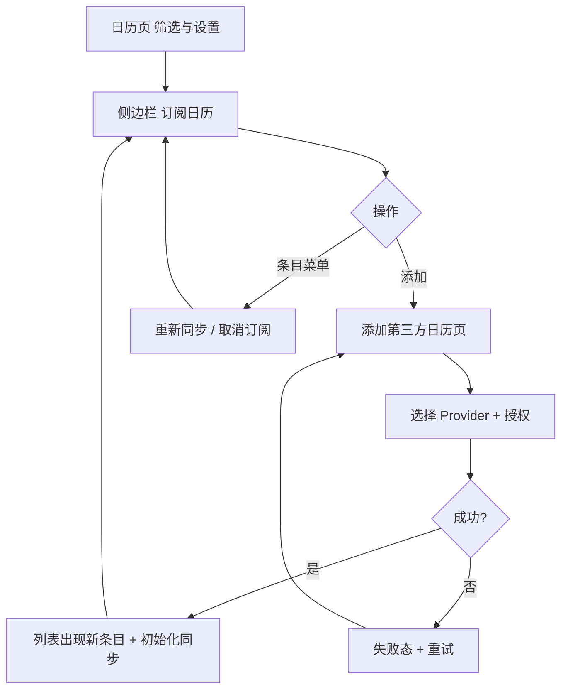
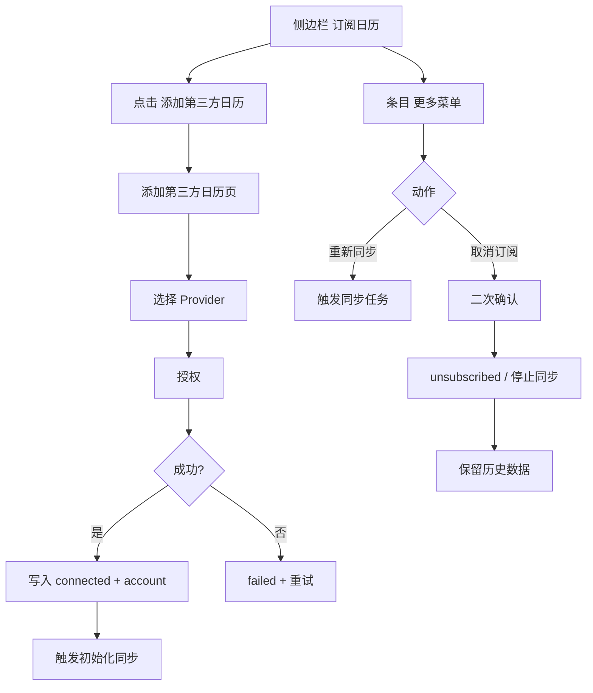

# PRD：第三方日历接入（侧边栏订阅管理）

| 属性 | 内容 |
|------|------|
| 状态 | 评审版 |
| 版本 | v1.1 |
| 目标 | **本期**明确日历内 **侧边栏「订阅日历」** 的信息架构、操作规则与「添加第三方日历」页；**不包含** Onboarding 引导（另迭代） |
| 关联文档 | `PRD_ASSET_MODEL_PHASE2.md`、`PRD_CALENDAR_EVENT_DETAIL_AND_CREATE.md` |

**本期范围**：只做 **日历内入口 + 侧边栏管理 + 添加页**；首次安装/账号引导中的「连接第三方日历」步骤 **不纳入本文档**，待后续单独 PRD。

---

## 1. 目标与非目标

### 1.1 目标

- 用户从日历右上 **「筛选与设置」** 打开侧边栏，在 **「订阅日历」** 分区完成：查看已接入账号、控制来源显隐、添加新接入、重新同步、取消订阅。
- **「添加第三方日历」** 独立页承载 Provider 选择与授权；成功后回到侧边栏列表可见新条目。
- 多入口不重复：日内 **唯一** 管理入口为侧边栏（与 `PRD_CALENDAR_EVENT_DETAIL_AND_CREATE.md` §3 一致）。

### 1.2 非目标（本期）

- **Onboarding** 中的第三方日历步骤、跳过态、补救策略（暂不定义）。
- Provider 技术实现细节（OAuth 参数、各端 SDK 差异）。
- 双向同步（仍为外部 → BizCard）。
- 组织级策略（企业管理员批量下发接入策略）。

---

## 2. 日历内入口（唯一主路径）

### 2.1 入口

- 日历页右上：**「筛选与设置」**（与视图/我的同一面板）。
- 侧边栏第三分区：**「订阅日历」**。

### 2.2 未接入任何 Provider 时

- 分区仍展示：**「添加第三方日历」**（或等价主按钮），点击进入添加页。
- 不依赖「曾在引导中跳过」等条件；**无已接入列表时仅强调添加入口即可**。

### 2.3 已接入至少一个 Provider 时

- 分区展示：**已接入列表** + 底部 **「添加第三方日历」**（继续新增）。
- 管理动作（重新同步、取消订阅、显隐）**仅在侧边栏条目上**，不另建与侧边栏重复的「日历设置主页」。

### 2.4 流程图（日历内闭环）

---

## 3. 侧边栏「订阅日历」分区（核心）

### 3.1 分区结构

1. **标题**：`订阅日历`
2. **列表项**（每个已接入 Provider/账号一行，或按产品拆分为「日历」子项，与数据模型一致即可）：
   - 展示：**Provider 名称** + **账号**（如 `abc@gmail.com`）
   - **显隐**：控制该来源事件是否在主日历中展示（与主 PRD 中「第三方日历筛选」一致）
   - **更多菜单**：`重新同步`、`取消订阅`
3. **底部 CTA**：`添加第三方日历`

### 3.2 操作规则

| 操作 | 触发位置 | 行为 |
|------|----------|------|
| 添加接入 | 点击 `添加第三方日历` | 进入 **添加第三方日历页** → 选 Provider → 授权 |
| 重新同步 | 条目更多菜单 | 触发同步任务；用于失败恢复或手动刷新 |
| 取消订阅 | 条目更多菜单 | **二次确认** → 停止后续同步；**历史数据保留** |
| 显隐来源 | 条目开关（或等价） | 仅影响展示，不删除远端连接状态（除非产品定义为「隐藏=断开」，本期以前者为准） |

### 3.3 添加第三方日历页

- **标题**：`添加第三方日历`
- **内容**：Provider 列表（示例：Google Calendar / Exchange 日历 / 本地日历等）
- **说明**：可附一句能力说明（如支持 Exchange、Office 365、Outlook 等，以实际为准）
- **状态**：接入中 / 成功 / 失败；失败支持重试

### 3.4 流程图（侧边栏与添加页）

---

## 4. 状态与边界

### 4.1 用户/会话维度（本期）

- **未接入**：无任何有效 provider 订阅。
- **已接入**：至少一个 provider 处于「已连接且未取消订阅」状态。
- **部分失败**：多 provider 时，部分同步失败可在条目上展示失败态 +「重新同步」。

不强制落库字段名；实现侧需支持列表展示与操作闭环。

### 4.2 展示优先级（侧边栏）

1. 若有条目处于 **失败/需关注** 态，优先在条目上展示提示与 **重新同步**。
2. 若 **未接入**，分区以 **添加第三方日历** 为主。
3. 若 **已接入**，默认展示 **列表 + 添加**。

### 4.3 与日历主体验的关系

- 未接入第三方时：**不阻塞** 本地 Event 新建与管理。
- 接入后：外部事件按同步策略进入日历；筛选以侧边栏为准。
- **日内管理第三方订阅的唯一入口**：侧边栏「订阅日历」；新增通过 **`添加第三方日历`** 进入独立页。

---

## 5. 文案与交互规范

- 侧边栏分区标题：`订阅日历`
- 条目信息：`provider_name` + `account`
- 条目菜单：`重新同步`、`取消订阅`（危险操作需二次确认）
- 添加页标题：`添加第三方日历`

---

## 6. 验收标准（本期）

1. 用户可通过 **筛选与设置 → 订阅日历 → 添加第三方日历** 完成新增接入（**不依赖** Onboarding）。  
2. 侧边栏展示已接入 **Provider + 账号**，并支持 **显隐** 该来源事件。  
3. 条目菜单支持 **重新同步** 与 **取消订阅**（取消后停更、保留历史）。  
4. 添加页可选 Provider 并完成授权；成功后列表更新并触发初始化同步。  
5. 未接入第三方时，日历本地能力不被阻塞。  

---

## 7. Out of Scope

- **Onboarding** 内第三方日历步骤与相关状态机。  
- Provider 高级配置、组织级策略。  
- 双向同步与冲突解决算法。  

---

## 8. 修订记录

| 版本 | 日期 | 说明 |
|------|------|------|
| v1.1 | 2026-04-08 | **本期聚焦侧边栏管理**；**移除** Onboarding 相关需求与验收；入口统一为日历内侧边栏 |
| v1.0 | — | 初版（含 Onboarding + 日历管理） |
