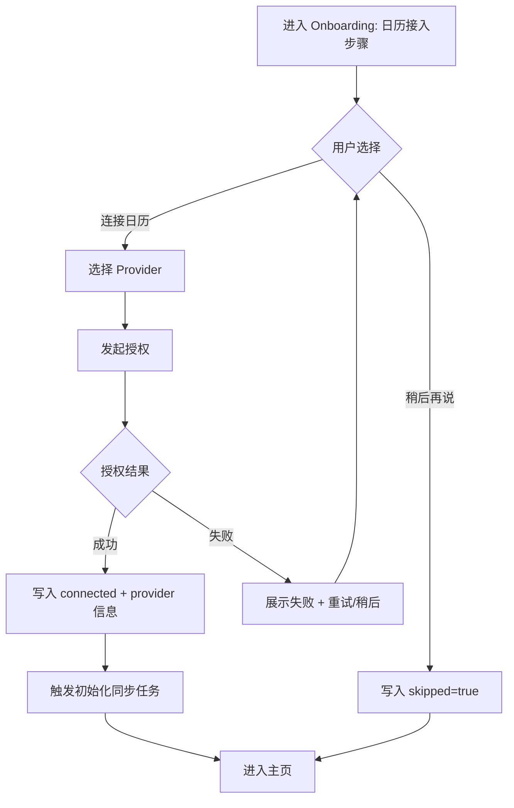
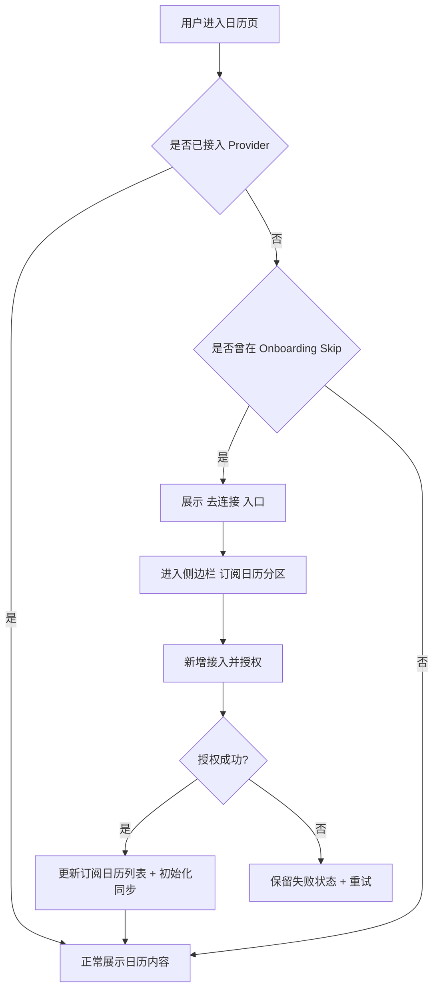
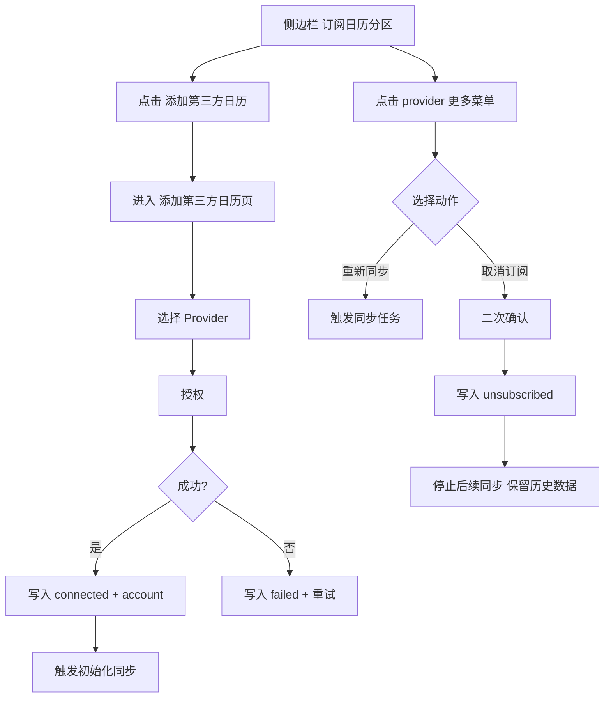
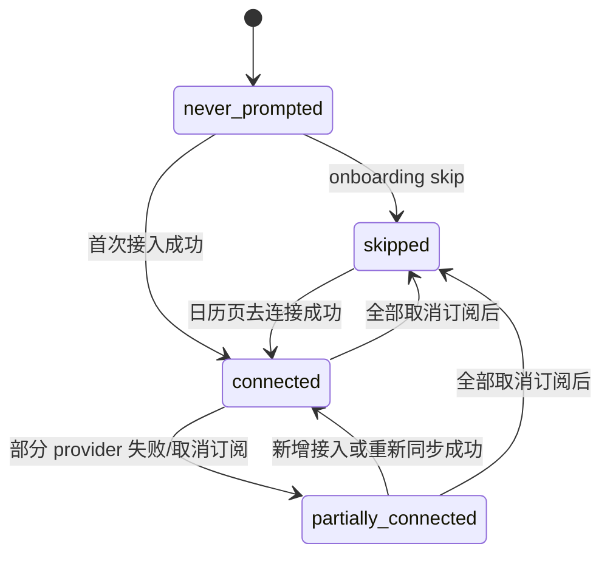

# PRD：第三方日历接入（Onboarding + 日历管理）

| 属性 | 内容 |
|------|------|
| 状态 | 评审版 |
| 版本 | v1.0 |
| 目标 | 明确第三方日历接入在 onboarding 与日历内的入口、流程、状态与管理页设计 |
| 关联文档 | `PRD_ASSET_MODEL_PHASE2.md`、`PRD_CALENDAR_EVENT_DETAIL_AND_CREATE.md` |

---

## 1. Problem Statement

第三方日历接入是 Event 数据来源前置能力，但当前缺少统一设计：

- onboarding 是否接入、何时接入没有明确产品路径。
- 用户在 onboarding 跳过后，缺少稳定入口回到“接入/管理”流程。
- 已接入 app 的管理（查看状态、断开、新增）缺少标准化页面与规则。

---

## 2. Solution Overview

建立“双入口 + 单管理页”的接入框架：

1. **Onboarding 入口**：首次引导中提示接入第三方日历，支持接入或跳过。
2. **日历页入口**：用户可在日历右上 `筛选与设置` 打开侧边栏，并在“订阅日历”分区进入接入流程。
3. **统一管理页（添加页）**：集中承载“新增接入”，已有订阅管理操作收敛在侧边栏条目菜单。

---

## 3. 目标与非目标

### 3.1 目标

- 不阻塞主流程前提下，提高接入转化率。
- 保证“跳过用户”有可发现、可返回的接入入口。
- 降低多入口维护成本，所有管理动作收敛到同一页面。

### 3.2 非目标

- 不覆盖第三方 provider 的技术细节（OAuth 参数、SDK 差异）。
- 不做双向同步（本期仍为外部 -> BizCard）。
- 不做组织级策略（企业管理员批量下发接入策略）。

---

## 4. 用户流程设计

### 4.1 Onboarding 流程

#### 4.1.1 入口位置

- onboarding 中加入“连接第三方日历”步骤，位置建议在账号基础信息之后、进入主页之前。

#### 4.1.2 用户动作

- `连接日历`：进入 provider 选择与授权流程。
- `稍后再说`（Skip）：直接进入主流程，不阻塞使用。

#### 4.1.3 状态落库

- 若用户 skip，记录：
  - `calendar_integration_skipped = true`
  - `integration_connected_count = 0`
  - `last_integration_prompt_at`

#### 4.1.4 流程图（Onboarding 接入决策）

---

### 4.2 日历页补救入口（Skip 后）

#### 4.2.1 入口触发规则

- 当 `calendar_integration_skipped = true` 且无已接入 provider 时：
  - 日历页右上 `筛选与设置` 入口保持可见；
  - 侧边栏“订阅日历”分区展示 `添加第三方日历` 入口。
- 当已有已接入 provider 时：
  - 仍通过同一路径进入订阅管理与新增流程，不创建第二入口。

#### 4.2.2 入口形式

- 右上图标：`筛选与设置`
- 侧边栏分区：`订阅日历`
- 分区 CTA：`添加第三方日历`

#### 4.2.3 流程图（Skip 后补救入口）

---

## 5. 订阅管理与添加页（核心）

### 5.1 页面目标

- 统一管理所有 provider 接入状态与操作。

### 5.2 页面结构

1. **侧边栏（订阅日历）**
   - Provider 名称 + 账号（如 `abc@gmail.com`）
   - 条目显隐（是否在日历中展示该来源事件）
   - 条目更多菜单：`重新同步`、`取消订阅`

2. **添加第三方日历页**
   - 标题：`添加第三方日历`
   - Provider 列表（Google Calendar / Exchange 日历 / 本地日历）
   - 辅助说明（支持 Exchange、Office 365、Outlook、Hotmail 等）

3. **状态反馈**
   - 接入中、成功、失败状态标识
   - 失败后支持重试/重新同步

### 5.3 页面操作规则

- **新增接入**
  - 侧边栏点击 `添加第三方日历` -> 进入添加页 -> 选择 provider -> 授权
  - 返回后新 provider 出现在“订阅日历”列表
  - 成功后触发初始化同步任务（异步）

- **取消订阅**
  - 在侧边栏 provider 条目菜单触发
  - 取消后该 provider 不再接收后续同步；历史数据保留

- **重新同步**
  - 在侧边栏 provider 条目菜单触发
  - 用于手动刷新状态/拉取最新变更

### 5.4 流程图（接入管理页操作）

---

## 6. 状态机与边界规则

### 6.1 用户维度状态

- `never_prompted`：尚未进入接入引导
- `skipped`：onboarding 明确跳过
- `connected`：至少一个 provider 已连接
- `partially_connected`：多 provider 场景下部分连接

### 6.3 状态流转图

### 6.2 展示优先级

1. 若有连接失败 provider，优先展示“重新同步”提示。
2. 若全部未连接且曾 skip，优先展示“去连接”入口。
3. 若至少一个已连接，默认展示“订阅日历列表 + 添加第三方日历”。

---

## 7. 与日历主体验的关系

- 未接入第三方时，不阻塞日历本地功能（本地 Event 新建/管理仍可用）。
- 接入后，外部事件按同步策略进入日历容器与详情页展示。
- 侧边栏是唯一日内管理入口；接入新增通过侧边栏进入“添加第三方日历”页。

---

## 8. 交互与文案规范

### 8.1 Onboarding

- 标题：`连接你的日历（可选）`
- 说明：`连接后可自动同步你在其他日历中的日程`
- 按钮：`连接日历` / `稍后再说`

### 8.2 管理页

- 侧边栏分区标题：`订阅日历`
- 条目信息：`provider_name + account`
- 条目菜单：`重新同步`、`取消订阅`
- 新增页标题：`添加第三方日历`
- 危险操作：`取消订阅` 需二次确认

---

## 9. 验收标准

1. onboarding 存在第三方日历接入步骤，且可 skip。  
2. 用户 skip 后，仍可通过右上 `筛选与设置` -> `订阅日历` -> `添加第三方日历` 完成接入。  
3. 侧边栏可展示 provider 名称与账号，并支持显示/隐藏来源事件。  
4. provider 条目菜单支持 `重新同步` 与 `取消订阅`。  
5. 添加页可完成新增接入，接入成功触发初始化同步。  
6. 取消订阅后停止更新但保留历史数据。  
7. 未接入第三方时，日历本地能力不被阻塞。  

---

## 10. Out of Scope

- provider 级别高级配置（多账号策略、组织级策略）。
- 双向同步（BizCard 修改回写第三方）。
- 同步冲突高级策略（本文件仅定义接入与管理，不定义冲突算法）。

