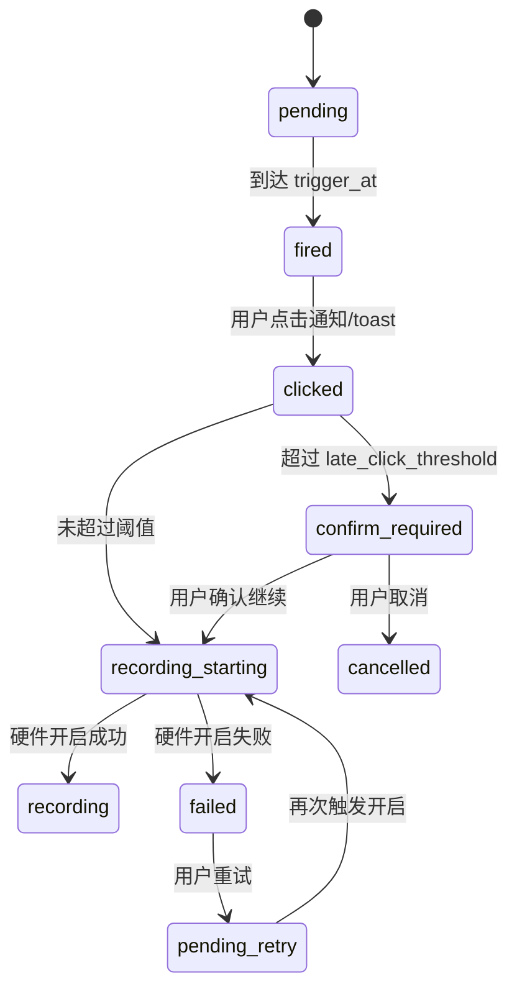

# PRD：Calendar 通知与录音联动（Phase 2）

| 属性 | 内容 |
|------|------|
| 状态 | 评审版 |
| 版本 | v1.1 |
| 目标 | 统一 Event/Reminder 通知触发，并将通知点击动作收敛为“快捷开启硬件录音” |
| 关联文档 | `PRD_ASSET_MODEL_PHASE2.md`、`PRD_CALENDAR_EVENT_DETAIL_AND_CREATE.md` |

---

## 1. 需求背景

当前 Calendar 已具备 Event 与 Reminder 的展示和编辑能力，但“通知触达 -> 录音开启”的闭环尚未标准化，导致：

- 通知策略不统一，用户难以形成稳定预期。
- 会议开始前后关键时刻缺少低摩擦录音入口。
- 异常场景（录音拉起失败、通知点击过晚）缺少明确交互规范。

---

## 2. 目标与原则

### 2.1 目标

1. Event 与 Reminder 使用统一触发引擎与通知分发模型。  
2. 用户点击 App 内 toast 或系统通知后，可快捷开启硬件录音。  
3. 关键异常场景可预期、可解释、可追踪。  

### 2.2 核心原则

- **来源无差别**：不区分 Event 来源（第三方导入 / App 内创建），采用同一通知策略。  
- **动作直达**：通知主路径聚焦“开启录音”。  
- **失败显式**：录音开启失败只做报错提示，不做兜底录音替代流程。  
- **过期保护**：通知点击过晚时，先二次确认再开启录音。  

---

## 3. 范围定义

### 3.1 本期范围

- Event 临近提醒与到点提醒。
- Reminder 到期提醒。
- App 内 toast 与系统通知触发。
- Notification Hub（铃铛）内通知列表展示与状态管理。
- 通知点击后“快捷开启硬件录音”。
- 录音失败报错与“过久后点击”的确认提示。

### 3.2 非范围

- 录音硬件底层协议实现细节。
- 通知文案多语言策略细化（仅定义中文基线文案）。
- 复杂重复提醒模板（如多轮升级提醒）。

---

## 4. 通知触发模型

### 4.1 触发对象

1. **Event**
   - 临近提醒（示例：开始前 30 分钟 / 10 分钟）
   - 到点提醒（开始时刻）
2. **Reminder**
   - 到期提醒（`due_at`）

### 4.2 触达通道

- `in_app_toast`：App 前台内提示。
- `system_notification`：系统通知（后台/锁屏等）。
- 允许双通道并行；同一触发点必须幂等去重。

### 4.3 Toast 逻辑（前台）

#### 4.3.1 展示规则

- 当 App 在前台且命中触发条件时，展示 toast。
- toast 默认停留 4~6 秒，可手动关闭。
- 同一时刻多条提醒触发时，按触发时间顺序串行展示（不叠层覆盖）。
- 同一 `dedupe_key` 的 toast 不重复展示。

#### 4.3.2 交互动作

- 主动作：`开启录音`
- 次动作：`稍后10分钟`（可选）
- 关闭动作：仅关闭提示，不改变源对象完成状态

#### 4.3.3 文案建议

- Event 临近：`会议即将开始 · {event_title}`
- Event 到点：`会议已到开始时间 · {event_title}`
- Reminder 到期：`到期提醒 · {reminder_title}`

### 4.4 去重键（建议）

`user_id + source_type + source_id + trigger_at + trigger_kind`

---

## 5. 点击通知后的录音联动

### 5.1 标准路径

用户点击 toast 或系统通知：

1. 进入目标 Event/Reminder 上下文。
2. 触发“开启硬件录音”动作。
3. 成功后进入录音中状态，并写入录音会话日志。

### 5.2 失败处理（硬约束）

- 若硬件录音拉起失败：
  - 展示错误提示（toast / modal）。
  - 记录失败原因（错误码、设备状态、时间）。
  - **不**自动兜底到“普通录音页”或其他录音方案。

建议文案：

- 标题：`录音开启失败`
- 描述：`未能连接录音设备，请检查设备状态后重试。`
- 按钮：`我知道了` / `重试`

### 5.3 过久点击保护（硬约束）

- 当用户在“会议通知触发后较久时间”才点击“开启录音”时，先弹确认框。
- 默认阈值：`late_click_threshold_min = 120`（可配置）。

确认框建议：

- 标题：`会议已开始较久`
- 描述：`当前会议已开始超过 120 分钟，是否继续开启录音？`
- 按钮：`继续录音` / `取消`

---

## 6. Notification Hub（铃铛）展示规范

### 6.1 入口与定位

- 入口形态：铃铛图标（Notification Hub）。
- Hub 仅承载“已触发通知”的查看与操作，不替代日历/代办主列表。

### 6.2 列表展示

每条通知至少包含：

- 类型标识（Event 临近 / Event 到点 / Reminder 到期 / 录音失败）
- 主标题（事件名或提醒名）
- 时间信息（触发时间）
- 状态（未读/已读/已处理）

列表分组建议：

- `今天`
- `更早`

### 6.3 条目操作

- `开启录音`（Event 类通知）
- `稍后10分钟`
- `标记已读`

补充：

- 通知在 toast 展示后，也应写入 Hub（即使用户未点击 toast）。
- 用户在 Hub 内完成操作后，条目状态需同步更新（如 `已处理`）。

---

## 7. 状态机（通知到录音）

---

## 8. 数据与埋点建议

### 8.1 关键字段

- `trigger_id`
- `source_type`（`event` / `reminder`）
- `source_id`
- `trigger_kind`（`before_start_30m` / `before_start_10m` / `on_start` / `on_due`）
- `trigger_at`
- `channel`
- `status`（`pending/fired/clicked/recording/failed/cancelled`）
- `error_code`（失败时）
- `is_late_click`（是否超时点击）

### 8.2 核心埋点

- 通知触发成功率
- 通知点击率（CTR）
- 录音开启成功率
- 录音开启失败率（按错误码分布）
- 超时点击占比与确认通过率

---

## 9. 验收标准

1. Event 与 Reminder 触发均可产生 App 内 toast / 系统通知。  
2. App 前台触发时可展示 toast，且支持点击 `开启录音`。  
3. 所有已触发通知都会进入 Notification Hub 列表。  
4. Hub 支持通知分组展示与条目状态更新（未读/已读/已处理）。  
5. 点击通知后默认执行“开启硬件录音”。  
6. 录音拉起失败时，系统显示错误并记录日志；不跳转兜底录音页。  
7. 会议通知超时点击（超过阈值）时，先弹确认框，确认后才可开启录音。  
8. 同一触发点不会重复发送多条通知（幂等生效）。  
9. 通知与录音链路关键埋点可查询。  

---

## 10. 修订记录

| 版本 | 日期 | 说明 |
|------|------|------|
| v1.0 | 2026-04-09 | 初版：统一通知触发、录音联动、失败报错与超时确认 |
| v1.1 | 2026-04-09 | 增加 toast 规则与 Notification Hub（铃铛）展示规范 |

