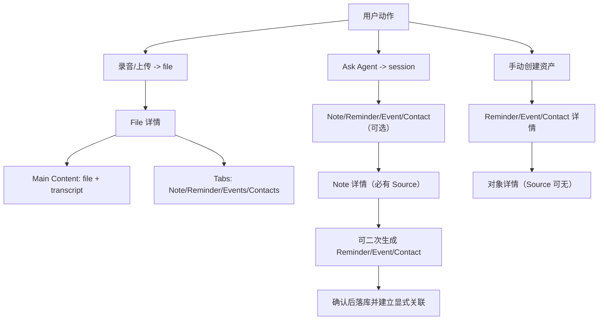
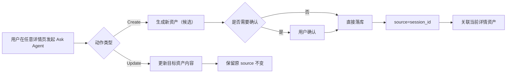

# PRD：资产详情页与来源关联模型（Phase 2）

| 属性 | 内容 |
|------|------|
| 状态 | 评审版 |
| 版本 | v5.8 |
| 目标 | 用用户可感知的方式统一 File / Note / Reminder / Event / Contact 的展示与关联逻辑 |
| 关联文档 | `PRD_ASSET_MODEL_PHASE2.md`、`PRD_CALENDAR_EVENT_DETAIL_AND_CREATE.md`、`context-container-demo.html` |

---

## 1. 设计目标（产品视角）

本 PRD 不从底层表关系出发，而从“用户做了什么、用户应该看到什么”出发。

核心目标：

1. 用户在首页能快速看到“可回看内容”（File、Note）。  
2. 用户进入任何资产详情时，结构一致、含义清晰。  
3. 关联关系可解释、可控，不因自动扩散造成混淆。  
4. Ask Agent 在任何详情页中都能稳定执行“新增/修改”动作。  

---

## 2. 范围与术语

## 2.1 本期范围

- 首页展示策略（File + Note）。
- 5 类详情页结构：
  - File
  - Note
  - Reminder
  - Event
  - Contact
- 来源与关联规则。
- Ask Agent 通用增改规则。

## 2.2 术语

- `source`：资产来源。不同资产允许不同来源类型，详见“5.7 各资产 Source 类型矩阵”。
- `explicit relation`：用户或系统显式建立的关系。
- `derived relation`：仅展示层推导关系（不自动落库）。

---

## 3. 首页展示策略

首页主流展示：

1. `File` 卡片流（录音/上传后的源内容入口）。  
2. `Note` 卡片流（可回看的内容成果）。  

不在首页主流展示（进入各自列表）：

- Reminder
- Event
- Contact

说明：
- 用户如果只创建了 reminder/event/contact，可在对应列表页查看，不强行上首页主流。

---

## 4. 详情页统一结构

详情页采用“首屏关键内容 + 目录切换”：

1. 首屏：默认展示最关键内容（Main Content）。
2. 目录 Tab：按资产类型切换附加信息。

目录命名统一：

- `Main Content`
- `Source`
- `Files`
- `Note`
- `Reminder`
- `Events`
- `Contacts`

按有数据显示，缺项可隐藏。

## 4.1 统一展示逻辑（最终口径）

1. **Source**
   - 按来源类型采用两种形态：
     - 纯文本展示：仅展示来源描述，不可交互。
     - 可交互来源卡片：支持跳转到 `File` 详情或 Ask Agent `session`。
   - 当来源不可访问时，展示禁用态与“来源不可用”提示。

2. **Main Content**
   - 每类资产按自身内容形态展示，不强制统一模板。
   - 目标是“首屏可读”：用户进入详情即可看到当前资产的核心信息。

3. **Note Tab**
   - 默认展示第 1 条 note 的完整内容。
   - 同时提供 note 子 Tab（或同级切换器）以切换查看其他 note。

4. **Reminder Tab**
   - 卡片列表展示。
   - 每张卡展示：`checkbox`、标题、截止时间。

5. **Contacts Tab**
   - 卡片列表展示。
   - 每张卡展示：头像、名称、title、公司、联系人识别状态（`?` 标识未识别/待绑定）。

6. **Files Tab**
   - 卡片列表展示。
   - 每张卡展示：文件类型、文件名称、文件上传时间。

7. **Events Tab**
   - 卡片列表展示。
   - 每张卡展示：event 标题、开始-结束时间、地点、参与人数。

---

## 5. 五类详情页规范

## 5.1 File 详情（容器型）

首屏（Main Content）按文件类型展示：

1. `audio`
   - 文件标题
   - 时长
   - 解析后的 transcript（摘要/全文）
   - 可播放的播放条（播放/暂停/进度）
2. `image`
   - 文件标题
   - 图片原图预览
3. `md`
   - 文件标题
   - 文档原文内容

CTA 与关联规则（第一期）：

1. `audio`
   - 未解析前展示 `generate summary` CTA。
   - 解析后可展示关联资产 Tab：`Note` / `Reminder` / `Events` / `Contacts`。
2. `image`
   - 仅展示标题与原图。
   - 不展示 `generate` 类 CTA。
   - 不展示关联资产（第一期不支持）。
3. `md`
   - 仅展示标题与原文。
   - 不展示 `generate` 类 CTA。
   - 不展示关联资产（第一期不支持）。

通用规则：
- 同一 file 下产出的资产默认并列，不自动互相关联。
- 无数据的 Tab 隐藏；对 `image/md`，本期默认无关联 Tab。

## 5.2 Note 详情（内容型）

首屏（Main Content）：
- 单条 note 正文（只显示当前 note）

Tab：
- Source（必有）
- Files
- Reminder
- Events
- Contacts

规则：
- Note 必须有来源（file 或 user_request_session）。
- 基于 note 二次生成并确认的资产，显式关联到该 note。

## 5.3 Reminder 详情

首屏（Main Content）：
- 标题、DDL、状态

Tab：
- Source（可无）
- Files
- Note
- Events
- Contacts

## 5.4 Event 详情

首屏（Main Content）：
- 主题、时间、地点、描述

Tab：
- Source（可无）
- Files
- Note
- Reminder
- Contacts

## 5.5 Contact 详情

首屏（Main Content）：
- 姓名、联系方式、组织信息

Tab：
- Source（可无）
- Files
- Note
- Reminder
- Events

## 5.6 Source 回跳规则（新增）

当详情页展示 Source 时，需提供明确回跳入口：

1. Source = `file`
   - 点击 Source 卡片，跳转到对应 `File` 详情页（同 `file_id`）。
2. Source = `user_request_session`
   - 点击 Source 卡片，跳转回对应 Ask Agent 对话会话（同 `session_id`）。

补充：
- 若 Source 缺失或不可访问，入口置灰并提示“来源不可用”。
- Note 页因 Source 必有，必须提供可点击回跳入口。

## 5.7 各资产 Source 类型矩阵（最终口径）

为避免歧义，以下 Source 类型按资产定义：

1. **File 的 Source**
   - `user_uploaded`
   - `meeting_recorded`
   - `flash_recorded`

2. **Note 的 Source**
   - `file`
   - `user_request_session`

3. **Reminder 的 Source**
   - `user`
   - `file`
   - `user_request_session`
   - `note`
   - `event`

4. **Event 的 Source**
   - `user`
   - `third_party`
   - `file`
   - `user_request_session`
   - `note`

5. **Contact 的 Source**
   - `user_created`
   - `user_scanned`
   - `user_exchanged`
   - `file`
   - `user_request_session`
   - `note`
   - `reminder`
   - `event`

## 5.8 Source 确认规则（suggested vs direct）

1. 来自 `file/note/event` 的 AI 建议资产，需用户确认后才最终创建，确认后来源同时确认。  
2. 来自 `user_request_session` 且用户明确“直接创建”的请求，可直接创建，无需二次确认。  
3. 同一会话内多个新资产默认不自动互相关联，除非用户显式要求关联。  

---

## 6. 关联规则（防混淆）

1. 同源不等于互相关联。  
2. 资产详情页中新增/删除关联，只影响当前资产。  
3. 不自动把关系扩散到其他资产。  
4. 展示层可显示 derived 关系，但需明确标识 `derived`。  

## 6.1 联系人挂载优先级（补充）

当 AI 从 `file` 中抽取 reminder/event 并识别到“责任人/参与人”时，联系人关系挂载规则如下：

1. 若联系人语义来自某条 `reminder`（例如“冯总让我们下周五前提交报告”），优先建立：
   - `reminder <-> contact`
2. 同批次解析中，不因该 reminder 识别到联系人而自动建立：
   - `file <-> contact`（除非另有明确证据或用户确认）
3. 若同一联系人同时被 event 参会人或 note 明确提及，可分别建立：
   - `event <-> contact`
   - `note <-> contact`
4. 仍遵循“同源不等于互相关联”：一个 reminder 新增联系人，不自动扩散到同 file 下其他 reminder/note/event。

## 6.2 联系人 `?` 标识规则（补充）

`?` 用于标识“已识别为人，但尚未完成联系人实体确认/绑定”的状态。

针对从 `note/file` 解析出的 reminder 中“非本人关联人”，匹配逻辑固定如下：

1. 若解析出的人名可匹配到用户 Contacts 中某个联系人（可唯一命中），则：
   - 不新建联系人；
   - 直接将该已有 Contact 卡片关联到该 reminder 的 Contacts Tab。
2. 若解析出的人名无法匹配到用户 Contacts（模糊匹配失败或无命中），则：
   - 在该 reminder 的 Contacts Tab 创建一张联系人卡片；
   - 该卡片带 `?` 标识（待确认）。

出现 `?` 的条件（本期口径）：

1. 人名无法匹配到用户已有 Contacts。  
2. 该人名已作为 reminder 关联联系人展示，但仍处于待确认状态。  

`?` 消失条件（满足任一）：

1. 用户手动选择并绑定已有联系人。  
2. 用户新建联系人并完成绑定。  
3. 后续数据补全后系统可唯一确认并自动绑定（需可审计）。

示例：
- `file1` 产出 `note1`、`reminder1`、`event1`
- 默认关系：
  - `file1 <-> note1`
  - `file1 <-> reminder1`
  - `file1 <-> event1`
- 不默认建立：
  - `note1 <-> reminder1`
  - `note1 <-> event1`

---

## 7. Ask Agent 通用增改规则

从任何详情页进入 Ask Agent，统一分两类动作。

## 7.1 新增（Create）

规则：

1. 新资产来源按场景判定：  
   - 用户在对话中明确“直接创建” -> `source = user_request_session`  
   - AI 从 `file/note/event` 推导建议 -> `source = file/note/event`（确认后生效）  
2. 若创建入口来自某个详情页，新资产显式关联当前详情页资产（当前上下文）。  
3. 同一请求中多个新资产默认不自动互相关联。  
4. 若为 AI suggested 的 reminder/event/contact，需用户确认后才落库。  

## 7.2 修改（Update）

规则：

1. 只更新目标资产内容字段。  
2. 不改该资产原有 source（file/session 不被覆盖）。  
3. 可记录操作来源会话 `last_modified_by_session_id` 作为审计信息。  

## 7.3 来源与默认关联统一决策规则（入口 + 上传）

为避免实现歧义，新增资产的 `source` 与默认关联统一按“触发入口”判定：

| 触发入口 | 新资产 source | 默认关联行为 | 补充说明 |
|------|------|------|------|
| 详情页内 Ask Agent 创建 | `user_request_session` | 新资产默认关联当前详情资产 | 来源是 session，关联来自入口上下文 |
| 全局 Ask Agent 创建（非详情页） | `user_request_session` | 默认无关联 | 仅在用户显式要求时建立关联 |
| 详情页 `+` 创建资产 | `user` | 新资产默认关联当前详情资产 | 典型：在 event 详情手动创建 reminder |
| 详情页 `+` 关联已有资产 | 不变（不新建 source） | 当前详情资产与被选资产建立关系 | 只新增关系，不新建资产 |
| 全局上传文件 | `user_uploaded` | 新 file 默认无关联 | 不与既有资产自动建立关系 |
| 详情页内上传文件 | `user_uploaded` | 新 file 默认关联当前详情资产 | 属于入口上下文关联，不改变 source 类型 |

上传后的解析补充（第一期）：

1. `audio` 解析得到的产物默认关联该 file，不默认互相关联。  
2. AI suggested 产物需要确认的，确认后才落库并建立与 file 的关系。  
3. `image/md` 第一阶段不触发生成，不新增关联资产。  

关系范围约束（沿用）：

- 上述默认关联仅作用于“当前目标资产对”，不自动扩散到同 source 下其他资产。

## 7.4 入口驱动示例（补充）

### 示例 A：详情页内 Ask Agent 创建（有默认关联）

前置：用户在 `event_e1` 详情页。  
操作：Ask Agent 输入“帮我生成会前摘要 note”。  
结果：

- 新建 `note_n1`
- `note_n1.source = user_request_session`
- 默认建立 `note_n1 <-> event_e1`
- `note_n1` 可在 `event_e1` 的 Note Tab 中看到

### 示例 B：全局 Ask Agent 创建（默认无关联）

前置：用户在全局对话入口，不在任何详情页。  
操作：Ask Agent 输入“创建一个明天 18:00 的提醒”。  
结果：

- 新建 `reminder_r1`
- `reminder_r1.source = user_request_session`
- 默认不关联任何 note/event/contact/file
- 若用户补充“关联到 Kevin”，则再建立 `reminder_r1 <-> contact_kevin`

### 示例 C：详情页 `+` 创建资产（source=user）

前置：用户在 `note_n2` 详情页。  
操作：点击 `+`，手动创建 reminder。  
结果：

- 新建 `reminder_r2`
- `reminder_r2.source = user`
- 默认建立 `reminder_r2 <-> note_n2`

### 示例 D：详情页 `+` 关联已有资产（只建关系）

前置：用户在 `reminder_r3` 详情页，系统里已有 `contact_c7`。  
操作：点击 `+` -> 关联联系人 -> 选择 `contact_c7`。  
结果：

- 不创建新资产
- 不改任一资产 source
- 新增关系 `reminder_r3 <-> contact_c7`

### 示例 E：同一会话多产物不自动互挂（边界）

前置：用户在 `file_f1` 详情页发起 Ask Agent。  
操作：同一条请求创建 `note_n3` 与 `reminder_r4`。  
结果：

- 两者 `source` 均为 `user_request_session`
- 两者都默认关联 `file_f1`
- 不自动建立 `note_n3 <-> reminder_r4`（除非用户明确要求）

---

## 8. 关键场景示例

## 8.1 文件解析场景

输入：`file1`  
产出：`note1`、`reminder1/2`  
AI suggested：`reminder3/4`

规则：

- `note1/reminder1/reminder2` 默认都只关联 `file1`。  
- `reminder3/4` 未确认前不落库。  
- 确认后 `reminder3/4` 关联 `file1`。  

## 8.2 基于 note 二次生成场景

在 `note1` 详情中生成并确认 `reminder5/6`：

- `reminder5/6 <-> note1`
- `reminder5/6` 的 source 记为 `note1`（不回挂为 `file1`）

## 8.3 Ask Agent 多段请求场景

请求：  
“帮我调研 A 公司，并提醒我明晚 6 点和 Kevin 吃饭”

处理：

- 对话中先显示主结果。  
- 用户点击“应用为 Note”后创建 note。  
- reminder 可走 direct create 或 suggested confirm。  
- note 与 reminder 默认不自动互挂，除非用户显式建立。  

## 8.4 基于 event 生成会前摘要

- 在 event 详情发起 Ask Agent 生成会前摘要。  
- 生成 note 后：
  - `source = session_id`
  - 显式关联当前 event
- 用户可从 note 的 Source 区“回到对话”。

## 8.5 文件解析出 reminder + 模糊联系人

输入语句示例：  
“冯总让我们下周五之前提交报告”

解析结果：

- 生成 `reminder_r1`：标题“下周五前提交报告”。  
- 识别联系人：
  - “我” -> 当前用户（可直接绑定）。
  - “冯总” -> 识别为人名但未唯一确认，展示为 `?` 联系人。

关系落库：

- `file1 <-> reminder_r1`
- `reminder_r1 <-> contact_me`
- `reminder_r1 <-> contact_feng(?)`

不自动落库：

- `file1 <-> contact_feng(?)`（除非后续有明确规则/确认触发）

## 8.6 在 file 场景通过 Ask Agent 新建 note2

场景：

- 已有：`file1` 解析得到 `note1`。  
- 用户在 `file1` 详情中发起 Ask Agent，要求创建 `note2`。

规则：

1. `note2.source = user_request_session`（来源是会话，不是 file）。  
2. 因为创建入口在 `file1` 详情，建立显式关联：`file1 <-> note2`。  
3. 因此 `note2` 会出现在 `file1` 的 Note Tab 中。  
4. `note2` 详情的 Source 区应展示并可回跳对应 session。  
5. 若后续用户在 `note2` 下新增 reminder，则该 reminder 与 `note2` 建立关系，不自动与 `note1` 建立关系。

## 8.7 用户上传文件场景（全局 vs 详情页）

场景 A（全局上传）：

- 用户在首页上传 `audio_a1`
- 结果：
  - `file_a1.source = user_uploaded`
  - 默认无既有资产关联
  - 解析后得到 `note_n10`、`reminder_r10`，则：
    - `file_a1 <-> note_n10`
    - `file_a1 <-> reminder_r10`

场景 B（在 note 详情页上传）：

- 用户在 `note_n20` 详情点击上传，上传 `audio_a2`
- 结果：
  - `file_a2.source = user_uploaded`
  - 默认建立 `file_a2 <-> note_n20`
  - 若解析得到 `reminder_r20`，则：
    - `file_a2 <-> reminder_r20`
    - 不自动建立 `reminder_r20 <-> note_n20`（除非用户显式建立）

---

## 9. 关联关系思维导图（Mermaid）

---

## 10. Ask Agent 流程图（Mermaid）

---

## 11. 验收标准

1. 首页主流仅展示 File 与 Note。  
2. 五类详情页均采用“Main Content + 目录 Tab”结构。  
3. File 详情第一期仅支持 `audio/image/md` 三类展示规则。  
4. `audio` 未解析前展示 `generate summary` CTA；`image/md` 不展示生成 CTA 与关联资产。  
5. Note 详情可验证 Source 必有。  
6. 关联修改仅影响当前资产，不自动扩散。  
7. AI suggested 资产确认前不落库。  
8. Ask Agent 在任意详情页下均可执行统一增改规则。  
9. 从 file 解析出的联系人若未唯一确认，需以 `?` 标识并优先挂在触发资产（如 reminder/event）而非 file。  
10. 在 file 详情中经 session 创建的 note，需满足“source=session + 显式关联 file”并在 file 的 Note Tab 可见。
11. 入口驱动规则可验证：详情页 Ask Agent/`+创建` 会默认关联当前资产；全局 Ask Agent 创建默认无关联；`+关联` 只新增当前对关系。
12. 用户上传规则可验证：全局上传 file 默认无关联；详情页上传 file 默认关联当前资产；上传解析产物默认只关联该 file。

---

## 12. 修订记录

| 版本 | 日期 | 说明 |
|------|------|------|
| v5.0 | 2026-03-25 | 全量重构：以用户可感知体验为主线，统一详情逻辑、场景示例与流程图 |
| v5.1 | 2026-03-25 | 清理重复旧版（v4.x）拼接内容，保留单一最终口径 |
| v5.2 | 2026-03-25 | 扩展 File 详情：细化 audio/image/md 首屏规则，明确第一期仅 audio 支持 generate summary 与关联资产 |
| v5.3 | 2026-03-25 | 新增统一展示逻辑：Source 形态、Main Content 口径，以及 Note/Reminder/Contacts/Files/Events Tab 具体展示字段 |
| v5.4 | 2026-03-25 | 补充联系人细则：`?` 标识触发与消失条件、提醒场景联系人挂载优先级；新增 file 场景下 `source=session` 的 note 关联规则 |
| v5.5 | 2026-03-25 | 新增“来源与默认关联决策规则（入口驱动）”：明确详情页 Ask Agent、全局 Ask Agent、`+创建`、`+关联` 四类入口的 source 与默认关联行为 |
| v5.6 | 2026-03-25 | 补充入口驱动示例（A-E）：覆盖详情页 Ask Agent、全局 Ask Agent、`+创建`、`+关联` 与多产物边界场景 |
| v5.7 | 2026-03-25 | 补充用户上传资产规则：全局上传与详情页上传的 source/默认关联差异，及上传解析产物的关系边界 |
| v5.8 | 2026-03-25 | 合并规则章节：将入口驱动与上传驱动合并为统一决策规则（表格化），减少分散阅读成本 |

