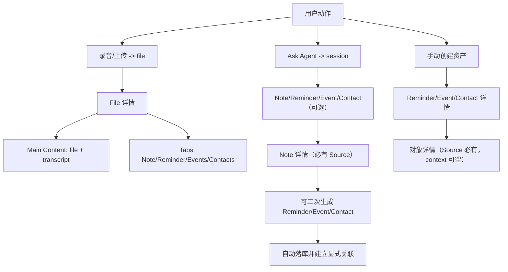
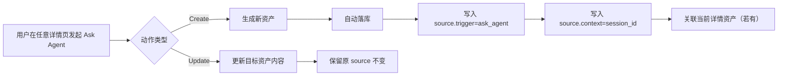

# PRD：资产详情页与来源关联模型（Phase 2）

| 属性 | 内容 |
|------|------|
| 状态 | 评审版 |
| 版本 | v5.16 |
| 目标 | 用用户可感知的方式统一 File / Note / Reminder / Event / Contact 的展示与关联逻辑 |
| 关联文档 | `PRD_ASSET_MODEL_PHASE2.md`、`PRD_CALENDAR_EVENT_DETAIL_AND_CREATE.md`、`context-container-demo.html` |

---

## 1. 设计目标（产品视角）

本 PRD 不从底层表关系出发，而从“用户做了什么、用户应该看到什么”出发。

核心目标：

1. 用户在首页能快速看到“可回看内容”（File、Note）。  
2. 用户进入任何资产详情时，结构一致、含义清晰。  
3. 关联关系可解释、可控，不因自动扩散造成混淆。  
4. Ask Agent 在任何详情页中都能稳定执行“新增/修改”动作。  

---

## 2. 范围与术语

## 2.1 本期范围

- 首页展示策略（File + Note）。
- 5 类详情页结构：
  - File
  - Note
  - Reminder
  - Event
  - Contact
- 来源与关联规则。
- Ask Agent 通用增改规则。

## 2.2 术语

- `source`：统一采用二元结构：
  - `source.trigger`：触发方式（谁/什么触发了资产创建），如 `user_uploaded` / `ai_generated` / `ask_agent` / `user_created` / `3rd_party` / `user_scanned` / `user_exchanged`。
  - `source.context`：来源标识；按 trigger 解释：
    - `ai_generated`：上游资产 `asset_id`
    - `ask_agent`：`session_id`
    - 其他 trigger：`asset_id` 或 `null`
- `explicit relation`：用户或系统显式建立的关系。
- `derived relation`：仅展示层推导关系（不自动落库）。

---

## 3. 首页展示策略

首页主流展示：

1. `File` 卡片流（录音/上传后的源内容入口）。  
2. `Note` 卡片流（可回看的内容成果）。  

不在首页主流展示（进入各自列表）：

- Reminder
- Event
- Contact

说明：
- 用户如果只创建了 reminder/event/contact，可在对应列表页查看，不强行上首页主流。

---

## 4. 详情页统一结构

详情页采用“首屏关键内容 + 目录切换”：

1. 首屏：默认展示最关键内容（Main Content）。
2. 目录 Tab：按资产类型切换附加信息。

目录命名统一：

- `Main Content`
- `Source`
- `Files`
- `Note`
- `Reminder`
- `Events`
- `Contacts`

按有数据显示，缺项可隐藏。

## 4.1 统一展示逻辑（最终口径）

1. **Source**
   - 按来源类型采用两种形态：
     - 纯文本展示：仅展示来源描述，不可交互。
     - 可交互来源卡片：支持跳转到 `File` 详情或 Ask Agent `session`。
   - 当来源不可访问时，展示禁用态与“来源不可用”提示。

2. **Main Content**
   - 每类资产按自身内容形态展示，不强制统一模板。
   - 目标是“首屏可读”：用户进入详情即可看到当前资产的核心信息。

3. **Note Tab**
   - 默认展示第 1 条 note 的完整内容。
   - 同时提供 note 子 Tab（或同级切换器）以切换查看其他 note。

4. **Reminder Tab**
   - 卡片列表展示。
   - 每张卡展示：`checkbox`、标题、截止时间。

5. **Contacts Tab**
   - 卡片列表展示。
   - 每张卡展示：头像、名称、title、公司、联系人识别状态（`?` 标识未识别/待绑定）。

6. **Files Tab**
   - 卡片列表展示。
   - 每张卡展示：文件类型、文件名称、文件上传时间。

7. **Events Tab**
   - 卡片列表展示。
   - 每张卡展示：event 标题、开始-结束时间、地点、参与人数。

---

## 5. 五类详情页规范

## 5.1 File 详情（容器型）

首屏（Main Content）按文件类型展示：

1. `audio`
   - 文件标题
   - 时长
   - 解析后的 transcript（摘要/全文）
   - 可播放的播放条（播放/暂停/进度）
2. `image`
   - 文件标题
   - 图片原图预览
3. `md`
   - 文件标题
   - 文档原文内容

CTA 与关联规则（第一期）：

1. `audio`
   - 未解析前展示 `generate summary` CTA。
   - 解析后可展示关联资产 Tab：`Note` / `Reminder` / `Events` / `Contacts`。
2. `image`
   - 仅展示标题与原图。
   - 不展示 `generate` 类 CTA。
   - 不展示关联资产（第一期不支持）。
3. `md`
   - 仅展示标题与原文。
   - 不展示 `generate` 类 CTA。
   - 不展示关联资产（第一期不支持）。

通用规则：
- 同一 file 下产出的资产默认并列，不自动互相关联。
- 无数据的 Tab 隐藏；对 `image/md`，本期默认无关联 Tab。

## 5.2 Note 详情（内容型）

首屏（Main Content）：
- 单条 note 正文（只显示当前 note）

Tab：
- Source（必有）
- Files
- Reminder
- Events
- Contacts

规则：
- Note 必须有 `source.trigger`，且 `source.context` 需可解释（`asset_id` / `null`）。
- 基于 note 二次生成的资产，自动落库并显式关联到该 note。

## 5.3 Reminder 详情

首屏（Main Content）：
- 标题、DDL、状态

Tab：
- Source（必有，context 可空）
- Files
- Note
- Events
- Contacts

## 5.4 Event 详情

首屏（Main Content）：
- 主题、时间、地点、描述

Tab：
- Source（必有，context 可空）
- Files
- Note
- Reminder
- Contacts

## 5.5 Contact 详情

首屏（Main Content）：
- 姓名、联系方式、组织信息

Tab：
- Source（必有，context 可空）
- Files
- Note
- Reminder
- Events

## 5.6 Source 回跳规则（新增）

当详情页展示 Source 时，回跳依据 `source.context` 的类型：

1. `source.context = asset_id`
   - 点击 Source 卡片，跳转到对应资产详情页。
2. `source.context = null`
   - 仅展示 trigger 信息，无回跳入口。
3. `source.context = session_id`（常见于 `trigger=ask_agent`）
   - Source 区提供“回到会话”入口，跳转对应 Ask Agent 会话。

补充：
- 所有资产都必须有 `source.trigger`，仅 `source.context` 允许为 `null`。
- 当 `source.trigger = ai_generated` 且 `source.context` 指向对象被删除，当前资产按级联规则删除。

## 5.7 各资产 Source（trigger/context）矩阵（最终口径）

为避免“来源语义混用”，统一按 `source.trigger + source.context` 描述：

1. **File**
   - 例：用户上传 `file1`
   - `source.trigger = user_uploaded`
   - `source.context = null`

2. **由任意资产 context 解析出的资产（note/reminder/event/contact）**
   - 例：`context = asset_x` 的解析任务生成 `note1`
   - `source.trigger = ai_generated`
   - `source.context = asset_x`

3. **基于任意资产 context 发起 Ask Agent 生成资产**
   - 例：在 `asset_x` 场景生成 `note2`
   - `source.trigger = ask_agent`
   - `source.context = session1`
   - 同时可与 `asset_x` 建立显式关系（用于入口展示）

4. **用户手动创建资产（`+`）**
   - `source.trigger = user_created`
   - `source.context = 当前详情资产`（若在详情页创建）/ `null`（若全局创建）

5. **Event 的第三方同步创建**
   - `source.trigger = 3rd_party`
   - `source.context = 外部事件标识（若可用）/ null`

6. **Contact 的用户创建细分**
   - `source.trigger = user_created`（手动新建）
   - `source.trigger = user_scanned`（扫描名片）
   - `source.trigger = user_exchanged`（交换名片）
   - `source.context = 当前详情资产`（若有）/ `null`

## 5.8 Source 落库规则（最终口径）

1. 来自 `file/note/event` 上下文的 AI 产物，统一自动落库，写入 `source.trigger=ai_generated` 与对应 `source.context`。  
2. 来自 Ask Agent 的创建结果，统一自动落库，写入 `source.trigger=ask_agent`、`source.context=session_id`。  
3. 同一会话内多个新资产默认不自动互相关联，除非用户显式要求关联。  

---

## 6. 关联规则（防混淆）

1. 同源不等于互相关联。  
2. 资产详情页中新增/删除关联，只影响当前资产。  
3. 不自动把关系扩散到其他资产。  
4. 本期不展示 `derived` 关系，仅展示显式关系（explicit）。  

## 6.1 Reminder-Contact 解析与匹配规则（补充）

1. 从 `file1` 解析出的 `reminder1`，默认建立 `file1 <-> reminder1`。  
2. 后台在生成 `reminder1` 时，同步抽取参与人并先填充到 `file1` 关联的 Reminders 列表中（以 reminder 为载体）。  
3. 系统对 `reminder1` 的参与人与用户现有 Contacts 做匹配：
   - 命中已有联系人：替换为现有 Contact 并建立 `reminder1 <-> contact_x`；
   - 未命中：保留解析名并带 `?` 展示。  
4. 用户点击 `?` 可快速创建联系人：
   - 新联系人 `source.trigger = user_created`
   - `source.context = reminder1`
   - 建立 `reminder1 <-> new_contact`。
5. 不因 reminder 识别到参与人而自动建立 `file <-> contact`。

## 6.2 联系人 `?` 标识规则（补充）

`?` 用于标识“已识别为人，但尚未完成联系人实体确认/绑定”的状态。

针对从 `note/file` 解析出的 reminder 中“非本人关联人”，匹配逻辑固定如下：

1. 若解析出的人名可匹配到用户 Contacts 中某个联系人（可唯一命中），则：
   - 不新建联系人；
   - 直接将该已有 Contact 卡片关联到该 reminder 的 Contacts Tab。
2. 若解析出的人名无法匹配到用户 Contacts（模糊匹配失败或无命中），则：
   - 在该 reminder 的 Contacts Tab 创建一张联系人卡片；
   - 该卡片带 `?` 标识（待确认）。

出现 `?` 的条件（本期口径）：

1. 人名无法匹配到用户已有 Contacts。  
2. 该人名已作为 reminder 关联联系人展示，但仍处于待确认状态。  

`?` 消失条件（满足任一）：

1. 用户手动选择并绑定已有联系人。  
2. 用户新建联系人并完成绑定。  
3. 后续数据补全后系统可唯一确认并自动绑定（需可审计）。

示例：
- `file1` 产出 `note1`、`reminder1`、`event1`
- 默认关系：
  - `file1 <-> note1`
  - `file1 <-> reminder1`
  - `file1 <-> event1`
- 不默认建立：
  - `note1 <-> reminder1`
  - `note1 <-> event1`

---

## 7. Ask Agent 通用增改规则

从任何详情页进入 Ask Agent，统一分两类动作。

## 7.1 新增（Create）

规则：

1. 新资产来源按场景判定：  
   - 用户在对话中明确“直接创建” -> `source.trigger=ask_agent`，`source.context=session_id`
   - AI 从 `file/note/event` 推导生成 -> `source.trigger=ai_generated`，`source.context=上游资产id`（自动落库）  
2. 若创建入口来自某个详情页，新资产显式关联当前详情页资产（当前上下文）。  
3. 同一请求中多个新资产默认不自动互相关联。  
4. AI 生成资产本期默认直接落库，不再要求用户二次确认。  

## 7.2 修改（Update）

规则：

1. 只更新目标资产内容字段。  
2. 不改该资产原有 source（file/session 不被覆盖）。  
3. 可记录操作来源会话 `last_modified_by_session_id` 作为审计信息。  

## 7.3 来源与默认关联统一决策规则（入口 + 上传）

为避免实现歧义，新增资产的 Source 与默认关联统一按“触发入口”判定：

| 触发入口 | `source.trigger` | `source.context` | 默认关联行为 | 补充说明 |
|------|------|------|------|------|
| 详情页内 Ask Agent 创建 | `ask_agent` | `session_id` | 新资产默认关联当前详情资产 | 回跳会话直接用 `source.context` |
| 全局 Ask Agent 创建（非详情页） | `ask_agent` | `session_id` | 默认无关联 | 仅在用户显式要求时建立关联 |
| 详情页 `+` 创建资产 | `user_created` | `当前详情资产_id` | 新资产默认关联当前详情资产 | 属于手动创建 |
| 详情页 `+` 关联已有资产 | 不变（不新建 source） | 不变 | 当前详情资产与被选资产建立关系 | 只新增关系，不新建资产 |
| 全局上传文件 | `user_uploaded` | `null` | 新 file 默认无关联 | 不与既有资产自动建立关系 |
| 详情页内上传文件 | `user_uploaded` | `当前详情资产_id` | 新 file 默认关联当前详情资产 | 便于删除时按 context 追踪 |

上传后的解析补充（第一期）：

1. `audio` 解析得到的产物默认关联该 file，不默认互相关联。  
2. AI 产物默认自动落库并建立与 file 的关系。  
3. `image/md` 第一阶段不触发生成，不新增关联资产。  

关系范围约束（沿用）：

- 上述默认关联仅作用于“当前目标资产对”，不自动扩散到同 source 下其他资产。

## 7.4 入口驱动示例（补充）

### 示例 A：详情页内 Ask Agent 创建（有默认关联）

前置：用户在 `event_e1` 详情页。  
操作：Ask Agent 输入“帮我生成会前摘要 note”。  
结果：

- 新建 `note_n1`
- `note_n1.source.trigger = ask_agent`，`note_n1.source.context = session_s1`
- 默认建立 `note_n1 <-> event_e1`
- `note_n1` 可在 `event_e1` 的 Note Tab 中看到

### 示例 B：全局 Ask Agent 创建（默认无关联）

前置：用户在全局对话入口，不在任何详情页。  
操作：Ask Agent 输入“创建一个明天 18:00 的提醒”。  
结果：

- 新建 `reminder_r1`
- `reminder_r1.source.trigger = ask_agent`，`reminder_r1.source.context = session_s2`
- 默认不关联任何 note/event/contact/file
- 若用户补充“关联到 Kevin”，则再建立 `reminder_r1 <-> contact_kevin`

### 示例 C：详情页 `+` 创建资产（source=user_created）

前置：用户在 `note_n2` 详情页。  
操作：点击 `+`，手动创建 reminder。  
结果：

- 新建 `reminder_r2`
- `reminder_r2.source.trigger = user_created`，`reminder_r2.source.context = note_n2`
- 默认建立 `reminder_r2 <-> note_n2`

### 示例 D：详情页 `+` 关联已有资产（只建关系）

前置：用户在 `reminder_r3` 详情页，系统里已有 `contact_c7`。  
操作：点击 `+` -> 关联联系人 -> 选择 `contact_c7`。  
结果：

- 不创建新资产
- 不改任一资产 source
- 新增关系 `reminder_r3 <-> contact_c7`

### 示例 E：同一会话多产物不自动互挂（边界）

前置：用户在 `file_f1` 详情页发起 Ask Agent。  
操作：同一条请求创建 `note_n3` 与 `reminder_r4`。  
结果：

- 两者 `source.trigger` 均为 `ask_agent`，`source.context` 均为同一 `session_id`
- 两者都默认关联 `file_f1`
- 不自动建立 `note_n3 <-> reminder_r4`（除非用户明确要求）

## 7.5 删除任意资产后的关系解耦与级联规则（trigger/context 模型）

删除任意资产 `asset_x` 时，统一基于 `source.context` 执行：

### 7.5.1 关系解耦

1. 删除 `asset_x` 后，先移除其直接关系：`asset_x <-> *`。  
2. 不自动扩散改写其他资产之间的关系。

### 7.5.2 级联删除规则（核心）

1. 级联删除集合：所有满足 `source.trigger = ai_generated` 且 `source.context = asset_x` 的资产。  
2. 保留集合：`source.trigger in {ask_agent, user_created}` 的资产，即使 `source.context = asset_x`，也不级联删除。  
3. 对保留集合仅解除与 `asset_x` 的显式关系，并保留资产本体。  
4. 为避免误删，执行前必须展示“删除预估清单”（按资产类型与数量），并要求用户二次确认。

### 7.5.3 Session 冻结规则

当 `asset_x` 被删除时，与其绑定的上下文会话（如 `session.context = asset_x`）进入只读冻结：

1. 允许跳转查看历史消息；  
2. 禁止继续发送新消息或继续在该上下文上生成资产。

### 7.5.4 级联边界说明

1. `source.context = null` 的资产不在本次级联链中。  
2. `source.trigger = ask_agent/user_created` 的资产保留并可继续访问：
   - `note` 继续在首页 Note 流；
   - `reminder` 继续在 Calendar；
   - `event` 继续在 Event/Calendar 列表；
   - `contact` 继续在 Contacts 列表。

---

## 8. 关键场景示例

## 8.1 文件解析场景

输入：`file1`  
产出：`note1`、`reminder1/2`  
AI generated：`reminder3/4`

规则：

- `note1/reminder1/reminder2/reminder3/reminder4` 均自动落库并关联 `file1`。  
- 同一 file 下产出默认并列，不自动互相关联。  

## 8.2 基于 note 二次生成场景

在 `note1` 详情中生成 `reminder5/6`：

- `reminder5/6 <-> note1`
- `reminder5/6` 的 source 记为 `note1`（不回挂为 `file1`）

## 8.3 Ask Agent 多段请求场景

请求：  
“帮我调研 A 公司，并提醒我明晚 6 点和 Kevin 吃饭”

处理：

- 对话中先显示主结果。  
- 用户点击“应用为 Note”后创建 note。  
- reminder 可走 direct create 或 AI generated 自动落库。  
- note 与 reminder 默认不自动互挂，除非用户显式建立。  

## 8.4 基于 event 生成会前摘要

- 在 event 详情发起 Ask Agent 生成会前摘要。  
- 生成 note 后：
  - `source.trigger = ask_agent`
  - `source.context = session_id`
  - 显式关联当前 event
- 用户可从 note 的 Source 区“回到对话”。

## 8.5 文件解析出 reminder + 模糊联系人

输入语句示例：  
“冯总让我们下周五之前提交报告”

解析结果：

- 生成 `reminder_r1`：标题“下周五前提交报告”。  
- 识别联系人：
  - “我” -> 当前用户（可直接绑定）。
  - “冯总” -> 识别为人名但未唯一确认，展示为 `?` 联系人。

关系落库：

- `file1 <-> reminder_r1`
- `reminder_r1 <-> contact_me`
- `reminder_r1 <-> contact_feng(?)`

不自动建立关系：

- `file1 <-> contact_feng(?)`（除非后续有明确规则/确认触发）

## 8.6 在 file 场景通过 Ask Agent 新建 note2

场景：

- 已有：`file1` 解析得到 `note1`。  
- 用户在 `file1` 详情中发起 Ask Agent，要求创建 `note2`。

规则：

1. `note2.source.trigger = ask_agent`，`note2.source.context = session_id`。  
2. 因为创建入口在 `file1` 详情，建立显式关联：`file1 <-> note2`。  
3. 因此 `note2` 会出现在 `file1` 的 Note Tab 中。  
4. `note2` 详情的 Source 区应展示并可回跳对应 session。  
5. 若后续用户在 `note2` 下新增 reminder，则该 reminder 与 `note2` 建立关系，不自动与 `note1` 建立关系。

## 8.7 用户上传文件场景（全局 vs 详情页）

场景 A（全局上传）：

- 用户在首页上传 `audio_a1`
- 结果：
  - `file_a1.source = user_uploaded`
  - 默认无既有资产关联
  - 解析后得到 `note_n10`、`reminder_r10`，则：
    - `file_a1 <-> note_n10`
    - `file_a1 <-> reminder_r10`

场景 B（在 note 详情页上传）：

- 用户在 `note_n20` 详情点击上传，上传 `audio_a2`
- 结果：
  - `file_a2.source = user_uploaded`
  - 默认建立 `file_a2 <-> note_n20`
  - 若解析得到 `reminder_r20`，则：
    - `file_a2 <-> reminder_r20`
    - 不自动建立 `reminder_r20 <-> note_n20`（除非用户显式建立）

## 8.8 删除资产场景（trigger/context 级联）

场景：

- `audio_file1` 解析得到：`note1`、`reminder1/2/3`、`event1`（这些资产 `source.trigger=ai_generated`，`source.context=audio_file1`）。  
- 用户在该 file 上通过 Ask Agent 生成：`note2`（`source.trigger=ask_agent`，`source.context=session_s1`，并关联 `audio_file1`）。  
- 用户手动上传并关联：`pic1/pic2`（独立 file）。

执行：删除 `audio_file1`（作为被删资产）。

结果：

1. 删除 `audio_file1` 后，优先移除其直接关系。  
2. 满足 `source.trigger = ai_generated` 且 `source.context = audio_file1` 的解析衍生产物进入级联删除集合。  
3. `note2` 的 `source.trigger = ask_agent`（即使关联了 `audio_file1`）仍默认保留，仅解除 `note2 <-> audio_file1` 关系。  
4. `session_s1` 若 `session.context = audio_file1`，则冻结为只读（可查看，不可继续提问）。  
5. `pic1/pic2` 作为独立上传 file（不满足 `source.context = audio_file1` 时）保留，并继续在 File 流可见。  

---

## 9. 关联关系思维导图（Mermaid）

---

## 10. Ask Agent 流程图（Mermaid）

---

## 11. 验收标准

1. 首页主流仅展示 File 与 Note。  
2. 五类详情页均采用“Main Content + 目录 Tab”结构。  
3. File 详情第一期仅支持 `audio/image/md` 三类展示规则。  
4. `audio` 未解析前展示 `generate summary` CTA；`image/md` 不展示生成 CTA 与关联资产。  
5. Note 详情可验证 Source 必有。  
6. 关联修改仅影响当前资产，不自动扩散。  
7. AI 生成资产默认自动落库。  
8. Ask Agent 在任意详情页下均可执行统一增改规则。  
9. 从 file 解析出的联系人若未唯一确认，需以 `?` 标识并优先挂在触发资产（如 reminder/event）而非 file。  
10. 在 file 详情中经 session 创建的 note，需满足“source.trigger=ask_agent、source.context=session + 显式关联 file”并在 file 的 Note Tab 可见。
11. 入口驱动规则可验证：详情页 Ask Agent/`+创建` 会默认关联当前资产；全局 Ask Agent 创建默认无关联；`+关联` 只新增当前对关系。
12. 用户上传规则可验证：全局上传 file 默认无关联；详情页上传 file 默认关联当前资产；上传解析产物默认只关联该 file。
13. 删除任意资产规则可验证：先关系解耦；仅 `ai_generated + context=被删资产` 级联删除；`ask_agent/user_created` 资产保留并去耦；`ask_agent` 资产可通过 `source.context(session_id)` 回到会话。  
14. Source 规则可验证：所有资产必须有 `source.trigger`，仅 `source.context` 可为空。  

---

## 12. 修订记录

| 版本 | 日期 | 说明 |
|------|------|------|
| v5.0 | 2026-03-25 | 全量重构：以用户可感知体验为主线，统一详情逻辑、场景示例与流程图 |
| v5.1 | 2026-03-25 | 清理重复旧版（v4.x）拼接内容，保留单一最终口径 |
| v5.2 | 2026-03-25 | 扩展 File 详情：细化 audio/image/md 首屏规则，明确第一期仅 audio 支持 generate summary 与关联资产 |
| v5.3 | 2026-03-25 | 新增统一展示逻辑：Source 形态、Main Content 口径，以及 Note/Reminder/Contacts/Files/Events Tab 具体展示字段 |
| v5.4 | 2026-03-25 | 补充联系人细则：`?` 标识触发与消失条件、提醒场景联系人挂载优先级；新增 file 场景下 `source=session` 的 note 关联规则 |
| v5.5 | 2026-03-25 | 新增“来源与默认关联决策规则（入口驱动）”：明确详情页 Ask Agent、全局 Ask Agent、`+创建`、`+关联` 四类入口的 source 与默认关联行为 |
| v5.6 | 2026-03-25 | 补充入口驱动示例（A-E）：覆盖详情页 Ask Agent、全局 Ask Agent、`+创建`、`+关联` 与多产物边界场景 |
| v5.7 | 2026-03-25 | 补充用户上传资产规则：全局上传与详情页上传的 source/默认关联差异，及上传解析产物的关系边界 |
| v5.8 | 2026-03-25 | 合并规则章节：将入口驱动与上传驱动合并为统一决策规则（表格化），减少分散阅读成本 |
| v5.9 | 2026-03-25 | 新增删除 file 规则：session 只读冻结、Ask Agent 主动创建资产保留去耦、独立上传 file 保留；补充对应场景示例 |
| v5.10 | 2026-03-25 | 将删除规则升级为“删除任意资产”：先关系解耦，再按“用户主动 Ask-Agent 产物 / 资产直接衍生产物”分流处理，并补充 session 冻结条件 |
| v5.11 | 2026-03-25 | Source 定义升级为二元模型（`trigger + context`），并将创建/示例/删除规则统一映射到该模型 |
| v5.12 | 2026-03-25 | trigger 口径调整：手动创建统一为 `user_created`，补充 Event `3rd_party` 与 Contact `user_created/user_scanned/user_exchanged`；取消 AI 二次确认并改为自动落库 |
| v5.13 | 2026-03-25 | 强化 Source/级联口径：trigger 必有、context 可空；context 命中执行递归级联删除；重写 reminder-contact 解析匹配与 `?` 快速创建流程 |
| v5.14 | 2026-03-25 | 删除规则改为“触发器分流”：仅 `ai_generated+context=x` 级联删除；`ask_agent/user_created` 保留并解除关系，同时明确保留资产的入口归位 |
| v5.15 | 2026-03-25 | 补齐 Ask-Agent 回跳漏洞：完善会话回跳规则并同步到示例与流程图 |
| v5.16 | 2026-03-25 | 简化 Source 模型：移除 `source.session_ref`，统一由 `source.context=session_id` 承载 Ask-Agent 会话回跳；保留资产上下文通过显式关联表达 |

