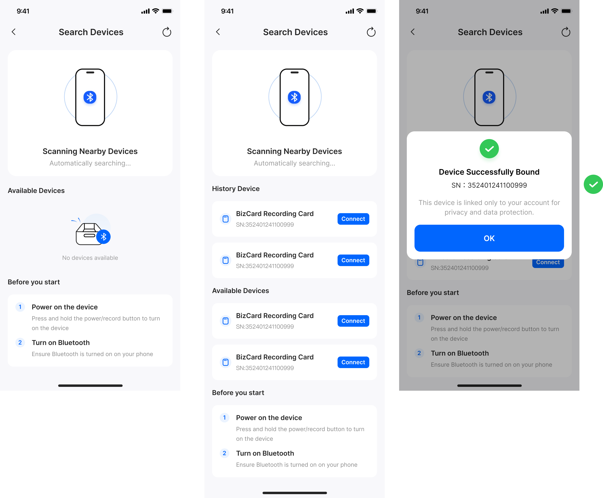

# 硬件 2.0：硬件管理页改造方案（Peer Review）

> **文档目的**：汇总硬件 2.0 中与「蓝牙耳机连接 / 耳机录音模式」相关的产品理解、与现有「Search Devices」页的关系，以及推荐的信息架构与落地阶段，供 peer review。  
> **状态**：已拍板关键决策，进入实现评审准备（见 §16）  
> **关联需求**：[硬件2.0 蓝牙耳机连接流程](../硬件2.0%20蓝牙耳机连接流程.md)、[_硬件2.0 需求内容](../_硬件2.0%20需求内容.md)  
> **Peer Review**：[硬件2.0_硬件管理页改造方案_review.md](../reviews/硬件2.0_硬件管理页改造方案_review.md)（2026-04-15）

---

## 1. 背景与目标

### 1.1 背景

硬件 2.0 的核心变化之一，是引入 **蓝牙耳机连接流程**：通过手机 App、录音卡片、蓝牙耳机三者配合，完成「会议/通话场景下的耳机录音模式」。卡片侧涉及 **三条蓝牙关系**（详见第 2 节），其中 **耳机搜索与配对由 App 完成**（卡片屏幕极小，不适合作为主配对界面）。

当前 App 的硬件管理以 **「Search Devices」** 为主：发现 BizCard Recording Card、展示历史与附近设备、Connect、绑定成功。该流程 **不包含** 第二条、第三条经典蓝牙链路的引导与状态展示。

### 1.2 目标（本方案范围）

- 在 **硬件管理相关路径** 中，引导用户完成：**系统连接 `Eureka-Audio`（手机音频路由到卡片）** → **卡片扫描并连接目标耳机（桥接）**，与《硬件2.0 蓝牙耳机连接流程》一致。
- 默认 **卡片硬件与固件能力已就绪**，本方案聚焦 **App 侧信息架构、流程与状态表达**，便于设计与开发对齐。

### 1.3 非目标（可在评审中确认）

- 固件指令集、协议字段的最终定义（需与硬件联调文档单独锁定）。
- 录音业务层（日历、录音准备页）的完整联动，仅做必要交叉引用。

### 1.4 UI 设计阶段补充（与 `硬件2.0_设备控制台_UI设计与线框_方案B.md` 对齐）

- **设备控制台采用单页 + 耳机模式 Toggle**（不用并列 Tab，避免与「先 BLE 后耳机」的先后级矛盾）：**Toggle 兼卡片侧经典蓝牙开关**；**BLE 未连时 Toggle 禁用**；Toggle ON 后展开 **手机蓝牙 → Eureka 经典 → 耳机桥接** 等引导链。**曾连通过经典后若 BLE 断开**：耳机区差异化展示（§5.7），**允许用户将 Toggle 关为 OFF**，**关闭后再次打开禁用直至 BLE 恢复**。**仅当** Toggle ON 且引导链完成时，可与录音准备页联动为「可录」。
- **与 1.0 的差异**：无耳机模式时，BLE 断与「未连接卡片」心智一致；引入耳机模式后，可能出现 **BLE 断但经典链路仍保持、耳机模式仍在运行** 的场景，设备控制台需在 Header 区分展示，**不可**与完全未连接空态混用。
- **录音列表断链展示**：沿用当前版本已有兜底逻辑，本方案不重复定义。

---

## 2. 产品理解：三条蓝牙链路

| 链路 | 连接关系 | 类型 | 作用 |
|------|----------|------|------|
| ① 控制链路 | 手机 App ↔ 卡片 | BLE | 遥控：扫描耳机、指定 MAC、电量等；**不传音频**；用户打开 App 并唤醒卡片后应可用。 |
| ② 下行音频 | 手机系统 ↔ 卡片（`Eureka-Audio`） | 经典蓝牙（如 HFP/A2DP） | 让手机将会议/通话音频路由到卡片，供录音截取。通常在 **系统蓝牙设置** 中完成连接。 |
| ③ 桥接音频 | 卡片 ↔ 用户蓝牙耳机 | 经典蓝牙 | 卡片将下行音频送至耳机（用户听到对方），并接收 **耳机麦克风** 上行（用户自己的声音）进入卡片录音。 |

**与《_硬件2.0 需求内容》对齐**：耳机已连接时 **强接管**——录音优先使用 **蓝牙耳机麦克风**，而非机身环境麦/骨传导。  
**断连策略（本方案口径）**：在 **耳机录音模式** 下，任一经典蓝牙链路（`Eureka-Audio` 或卡片↔耳机桥接）断开将导致录音不完整，因此 **录音直接终止**（详见 §11）。

---

## 3. 录音路径理解（用于对外说明与评审对齐）

以下为用户可理解的「双路」说明（实现可为同一混音管线，此处按产品语义拆分）：

1. **对方声音（手机下行）**  
   经 **手机 → 卡片** 经典蓝牙进入卡片并参与录音；同一路径上，卡片可将该音频经 **卡片 → 耳机** 经典蓝牙转发至耳机，用户因此能听到对方。

2. **我的声音（上行）**  
   经 **耳机上的麦克风** → **耳机 ↔ 卡片** 经典蓝牙进入卡片并参与录音。  
   **注意**：在耳机录音模式下，应表述为 **耳机麦克风**，避免与「卡片机身麦克风」混淆。

---

## 4. 用户主流程（与需求文档一致）

### Phase 1：连接手机音频链路（原「系统授权」表述已弃用）

> **命名说明（回应 Review）**：本阶段实质是 **在系统蓝牙中连接 `Eureka-Audio`**，不是系统「麦克风权限」弹窗；对外文案避免单独使用「权限」二字，除非与 iOS/Android 真实权限申请一一对应。

1. 用户在 **设备控制台** 或 **录音准备** 等入口，开启 **「耳机录音模式」**（开关或大按钮）。
2. App 检测手机是否已通过系统连接 **`Eureka-Audio`**（经典蓝牙）。
3. **若未连接**：半屏强阻断 Bottom Sheet，引导用户前往系统蓝牙设置连接；提供 **「前往系统蓝牙设置」**（Deep Link）。
4. 用户返回 App 后，检测到已连接 → 收起弹窗，**Toast** 提示「手机音频已成功路由」等。

#### Phase 1 检测机制

App 检测 `Eureka-Audio` 连接状态的技术路径：

- **iOS**：通过 `AVAudioSession` 的 `currentRoute` 检查当前音频输出/输入是否包含 `Eureka-Audio` 设备；监听 `routeChangeNotification` 获取实时变化。
- **Android**：通过 `BluetoothAdapter.getBondedDevices()` + `BluetoothProfile.getConnectedDevices(BluetoothProfile.A2DP)` 检查；注册 `BluetoothDevice.ACTION_ACL_CONNECTED/DISCONNECTED` 广播。
- **从系统蓝牙返回后**：App 在 `onResume` / `viewDidAppear` 时主动拉取一次连接状态，作为兜底。

### Phase 2：耳机配对与桥接（中继打通）

> **硬前置（回应 Review）**：**仅当 ① BLE 控制链路已建立且可下发指令** 时，才允许进入「开始扫描耳机」与扫描中 UI；若仅有系统侧 `Eureka-Audio` 已连而 BLE 未就绪，页面只展示引导（先连卡片 / 唤醒卡片），**禁止**出现可点击的「假扫描」。

1. 进入「寻找耳机」态：文案引导用户将耳机置于可配对状态；强调 **耳机需与手机断开**（若与流程文档一致）。
2. 用户点击 **「耳机已就绪，开始扫描」** → App 经 **① BLE** 指令卡片开启主蓝牙扫描。
3. 展示 **附近可连接设备** 列表（过滤非音频类设备）。
4. 用户选择自己的耳机 → 展示连接中状态 → 成功则 **「耳机已成功接入」**；卡片端可配合常驻小图标（与需求一致即可）。

### 录音主设备（回应 Review：链路终点）

- **权威口径（本方案）**：会议/通话场景下，**录音编码与文件落点在卡片侧**；手机通过 `Eureka-Audio` 提供下行音频源，**耳机麦克风上行经耳机—卡片链路至卡片**。  
- 若其他文档出现「耳机麦克风传回手机」类表述，视为 **通话路由/系统音频路径** 的口语化描述或与旧版假设混用，**实现与 PRD 以本方案及硬件需求定稿为准**，需在「唯一事实源」修订时统一删除或改写。

---

## 5. 当前版本 UI 基线（v1）

以下为当前无耳机能力时的 **Search Devices** 三连屏：无设备扫描态、已发现历史与附近设备、绑定成功弹窗。

**文字摘要：**

- 页面标题：**Search Devices**；顶栏含返回、刷新。
- 上部：手机 + 蓝牙图示，文案如「Scanning Nearby Devices」。
- 列表：**History Device** / **Available Devices**，条目为 **BizCard Recording Card** + SN + **Connect**。
- 底部：**Before you start**（开机、手机蓝牙等说明）。
- 绑定成功：**Device Successfully Bound** 弹窗 + 隐私说明 + OK。

**结论**：当前页心智为 **「发现卡片 → 连接/绑定账号」**，对应以 **卡片为唯一硬件类型**；**不包含** Phase 1 / Phase 2 的耳机引导与三条链路状态。

---

## 6. 改造方向：从「找卡片」到「连接编排」

### 6.1 核心变化

- **信息模型**：由「单设备列表」扩展为 **「卡片连接 + 手机音频路由 + 耳机桥接」** 的可理解状态（至少需区分：仅连手机 / 已具备手机音频路由 / 已连耳机）。
- **任务入口**：在合适层级提供 **「耳机录音模式」** 及 Phase 1 → Phase 2 的线性引导，避免与「搜附近卡片」混在同一扫描列表中造成误解。

### 6.2 信息架构（已拍板：二态路由）

本方案采用 **方案 B（两级结构）**，页面间通过 **二态路由** 自动切换：

- **扫描页（Search Devices）**：负责发现设备、展示已绑定卡片列表（1:N）、绑定新卡片。BLE 连接成功后自动跳转到设备控制台。
- **设备控制台**：单张卡片的全链路管理。BLE 断连后自动回到扫描页。

**页面路由判断**：用户每次进入设备页时，根据当前 BLE 连接状态决定落地页面：

| 条件 | 落地页面 |
|------|----------|
| 有 BLE 连接中的卡片 | 直接进入该卡片的设备控制台 |
| 无 BLE 连接 + 无经典蓝牙活跃 | 扫描页（纯净态） |
| 无 BLE 连接 + 有卡片经典蓝牙仍在 | 扫描页 + 顶部第三态横幅（详见 §11.1） |

**绑定模型**：

| 关系 | 基数 | 说明 |
|------|------|------|
| 账号 → 卡片 | 1 : N | 一个账号可绑定多张卡片 |
| 卡片 → 账号 | 1 : 1 | 一张卡片只能绑定一个账号，解绑后方可绑定其他账号 |

成功绑定后的默认落地页：进入 **设备控制台**（而非回到仅"找卡片"的列表页）。管理页内 **无直接「切换到其他卡片」的入口**，用户返回扫描页后才能选择其他卡片。

### 6.3 与现有组件的复用

- **可复用**：列表行样式、Connect、绑定成功弹窗、刷新与扫描动效基线。
- **需新增**：`Eureka-Audio` 未连接时的 **Bottom Sheet**、Phase 2 **扫描中/设备列表/连接中/成功** 状态、可选 **三步链路** 状态条（BLE / 系统音频 / 耳机）。

---

## 7. 落地阶段建议（实现顺序）

| 阶段 | 内容 |
|------|------|
| **P0** | 与固件确定 BLE 指令与错误码（扫描、连接指定耳机、状态上报）；App 侧状态机与埋点。 |
| **P0** | 硬件管理路径：按 **方案 B（设备控制台）** 落地，完成 **耳机录音模式** + Phase1 Sheet + Phase2 引导与列表闭环（可先接 Mock）。 |
| **P1** | 与「录音准备」等入口的状态一致；进入录音前的最小条件校验。 |
| **P1** | 异常：扫描超时、连接失败、经典蓝牙链路断开停录提示；与"经典断链即停录"的口径对齐。 |
| **P2** | 多机型图示折叠、返回系统设置后的轮询策略、无障碍与文案法务（如「音频权限」是否改为更准确的「连接 Eureka 音频设备」等）。 |

---

## 8. Peer Review 结论摘要

- **总体结论**：Review 已收敛支持本方案；当前文档以"可测试口径"为准，可进入 UI 定稿与实现评审（详见 [review 文档](../reviews/硬件2.0_硬件管理页改造方案_review.md)）。
- **信息架构**：Review 与方案已一致：采用 **方案 B（两级结构）**——`Search Devices` 维持「找卡片 / 绑卡片」心智；**设备控制台**承载三条链路与耳机编排。

---

## 9. 统一状态机总表（v0，用于跨团队对齐）

下表将多条链路并列，**「主 UI 状态」**为建议展示给用户的一句话心智（可再压缩为标签）。

| BLE 控制（App↔卡片） | 系统音频 `Eureka-Audio` | 卡片↔耳机桥接 | 录音中？ | 麦克风来源（产品语义） | 建议主 UI 状态 |
|----------------------|-------------------------|----------------|----------|------------------------|----------------|
| 未建立 | 任意 | 任意 | 否 | — | 先连接卡片 / 唤醒设备 |
| 已建立 | 未连接 | 任意 | 否 | — | 需连接 Eureka 音频设备 |
| 已建立 | 已连接 | 未连接 | 否 | — | 可配耳机 / 未桥接耳机 |
| 已建立 | 已连接 | 已连接 | 否 | 耳机麦（若开耳机模式） | 耳机已就绪 |
| 已建立 | 已连接 | 已连接 | 是 | 耳机麦克风（强接管） | 录音中（耳机麦） |
| 已断开 | 已连接 | 已连接 | 是 | 耳机麦克风（强接管） | 录音中（控制链路断开） |
| 任意 | 断开 | 任意 | 是 | — | 录音中断（手机音频链路断开） |
| 任意 | 任意 | 断开 | 是 | — | 录音中断（耳机桥接断开） |

**说明**：真实实现可增加子状态（扫描中、连接中、重试中等）；上表为 **v0**，与固件上报字段对齐后细化。

---

## 10. 前置条件与门禁（主动作）

| 用户动作 | 允许条件（AND） | 若不允许：拦截位置与行为 |
|----------|-----------------|-------------------------|
| 开启「耳机录音模式」 | 已绑定目标卡片 + BLE 可用（或可恢复） | 引导绑定/唤醒卡片；不展示已开启假状态 |
| 进入 Phase 1 引导（去系统蓝牙） | 同上 | 同上 |
| 点击「开始扫描耳机」 | BLE 已建立 +（建议）`Eureka-Audio` 已连接 | **禁用按钮** + 文案：先完成手机音频链路 / 先连接卡片 |
| 在列表中选择耳机并连接 | BLE 可用 + 扫描已发起且未超时 | 错误态 + 重试 |
| 从录音准备页开录（耳机模式） | 与设备控制台 **同一状态源** 判定通过 | 阻断或提示先恢复链路（见 §11） |

---

## 11. 异常与处理（产品闭环框架）

以下每条在详细设计时补全：**用户可见文案**、**是否自动重试**、**是否打断录音**、**恢复路径**。

| 场景 | 方向性策略（实现口径） |
|------|----------------------------|
| `Eureka-Audio` 未连或中途断开 | **会议/通话录音（含耳机模式）立即终止录音**：对方音频来源中断，继续录制会造成文件不完整且用户误判；提示重连 `Eureka-Audio` 后可重新开始；本次文件标记为"链路异常中断"（供列表/转写侧识别）。 |
| 卡片↔耳机桥接中途断开（耳机没电/断连） | **耳机模式下立即终止录音**：上行（我的声音）与监听（我听对方）均受影响；提示检查耳机电量并重新桥接后再开始。 |
| BLE 断开但两条经典蓝牙仍保持连接 | **录音可继续**（音频链路不依赖 BLE），但 **失去远程控制能力**：设备控制台自动退回扫描页并展示 **第三态横幅**（见 §11.1），**硬阻断**所有其他卡片的连接/绑定操作，仅允许对当前活跃卡片重连 BLE。若固件策略为 BLE 断开会主动断开桥接，则按上面两条"经典链路断开→终止录音"处理。 |
| 耳机扫描超时 / 无结果 | 允许重试；说明耳机需可发现、可能与手机断开 |
| 耳机连接失败 | 错误码映射文案；重试 / 换设备 |
| 耳机被手机抢占连接 | 卡片回连超时后，App 提示「耳机可能已连接手机」→ 提供「前往系统蓝牙设置」Deep Link 引导用户手动断开耳机与手机的连接后重试（详见 §15.3） |
| 未启用耳机录音模式时，耳机链路发生变化（断开/断电/被手机抢占） | 若当前录音 **未依赖耳机链路**（即未启用耳机录音模式），则耳机链路变化 **不影响当前录音**；仅提示"耳机不可用/未连接"供用户理解，不触发停录。 |
| App 退后台再回前台状态不同步 | 进入硬件管理/控制台时 **主动拉取**硬件上报；必要时强制刷新 BLE |

### 11.1 第三态：BLE 断开但经典蓝牙仍在——硬阻断逻辑

**定义**：当一张卡片的 BLE 控制链路断开，但其经典蓝牙链路（Eureka-Audio 和/或耳机桥接）仍然活跃时，App 进入「第三态」。

**触发与表现**：

1. 设备控制台检测到 BLE 断连 → 自动退回扫描页
2. 扫描页顶部展示醒目横幅：标明哪张卡片的耳机模式仍在运行、音频链路活跃中
3. 横幅提供「重新连接 BLE」按钮（唯一允许的连接操作）
4. **硬阻断**所有其他卡片的操作：

| 元素 | 状态 |
|------|------|
| 当前活跃卡片的「重新连接」 | **可用**（突出展示） |
| 其他已绑定卡片的「连接」按钮 | **禁用灰显** |
| Available Devices 的「Bind」按钮 | **禁用灰显** |
| 「添加新的 BizCard」入口 | **禁用** |

**退出第三态的途径**：

| 途径 | 结果 |
|------|------|
| 点击「重新连接 BLE」成功 | 跳转到该卡片的设备控制台，用户可正常操作 |
| 经典蓝牙自行断开（卡片 5 分钟超时关机、耳机没电） | App 清除横幅，回到纯净扫描态 |
| 用户靠近卡片，BLE 自动重连 | 同第一条 |

**设计意图**：BLE 一次只能连一张卡，在经典蓝牙仍活跃时连接其他卡片会导致旧卡片处于完全不可控的「孤儿态」——录音可能仍在进行但无法停止、耳机模式无法关闭。硬阻断避免了这种不可逆的混乱状态。

**状态来源**：App 维护 `classicBtActiveCard` 状态。BLE 断前缓存耳机模式状态作为初始判断，同时结合系统蓝牙 API（`BluetoothAdapter` / `AVAudioSession`）实时校验 Eureka-Audio 连接状态。卡片↔耳机桥接状态仅靠缓存推断。

---

## 12. 术语与命名（建议统一）

| 建议使用 | 避免混用 |
|----------|----------|
| 连接 Eureka 音频设备 / 手机音频链路 | 「系统授权」单独指代本流程 |
| 耳机录音模式 | 「耳机连接模式」（除非刻意区分两种产品概念） |
| 连接 `Eureka-Audio`（系统蓝牙） | 「手机音频权限」（易与麦克风权限混淆） |
| 设备控制台 | 「设备详情」/「硬件管理页」（统一为"设备控制台"） |
| 关机（5 分钟超时终态） | 「深度休眠」与「关机」混用 |

---

## 13. 反馈分工原则（App vs 卡片）

| 状态/事件 | 以谁为主 | 说明 |
|-----------|----------|------|
| BLE 连接、扫描耳机、连接失败重试 | App 为主 | 信息量大，需文案与列表 |
| 电量、极简连接态 | 卡片屏为主 | 弱打扰、抬手可见 |
| 耳机桥接成功 | 两端可都提示 | App 一次成功反馈 + 卡片常驻小图标；**避免**重复 Toast |
| 录音中链路异常（停录/控制断开） | 录音页/全局轻提示为主 | 避免在硬件页抢焦点 |

---

## 14. 状态所有权（单一状态源）

- **硬件状态总控**：建议以 **设备控制台** 为 **展示全链路** 的主页面；`Search Devices` 仅负责发现与绑定。
- **「耳机录音模式」开关**：与 **录音准备页** 共用 **同一状态源**（同一远端状态或同一全局 store），避免两处开关不一致。
- **硬件主动上报**（断连、停录、控制断开）：优先更新 **总控状态**；录音准备页 **订阅**同一源，而非各自轮询各自解释。

---

## 15. 历史耳机 / 最近耳机（体验策略）

- **结论**：支持「自动回连最近一次耳机」作为首版核心体验（见 §15.1）。它不是锦上添花，而是耳机模式能否高频复用的关键。

### 15.1 自动回连触发时机

用户在设备控制台打开耳机模式 Toggle 后，自动回连按以下顺序触发：

1. **Toggle ON** → App 通过 BLE 指令卡片开启经典蓝牙能力
2. **检测 `Eureka-Audio`** → 若已连接，跳过 Phase 1 引导；若未连接，先弹出 Bottom Sheet 引导
3. **`Eureka-Audio` 就绪后** → 检查是否有历史耳机记录 → 有则下发回连指令（进入 W4 态）→ 无则进入 W5 手动扫描
4. **回连超时（建议 10-15s）** → 降级到 W5 手动扫描

### 15.2 自动回连合理性与约束

这里的"自动回连"分两段，分别成立、也分别需要前置条件与兜底：

- **手机 ↔ 卡片（BLE 控制链路）自动回连**
  - **合理性**：手机端对 BLE 设备可维护已配对/已绑定关系；只要 App 在前台或具备相应后台能力，且卡片处于可连接/广播态，通常可做到"打开耳机模式→BLE 自动连上卡片"。
  - **前置条件**：卡片已绑定；卡片已被唤醒并进入广播；手机系统蓝牙开启；App 具备蓝牙连接权限与重连策略。
  - **兜底**：若短时间内未回连，展示「请靠近卡片/点亮卡片」与重试按钮。

- **卡片 ↔ 耳机（经典蓝牙桥接）自动回连**
  - **合理性**：卡片与耳机完成过一次配对/连接后，卡片侧通常可保存耳机标识（如 MAC/地址/LinkKey 等），在耳机出仓上电进入可连接态时发起回连；从用户心智上也符合"曾经连过→下次自动连"。
  - **前置条件（需硬件确认但产品可先写清）**：卡片侧可持久化保存"最近一次耳机"；耳机出仓后处于可连接态且未被手机抢占连接；卡片具备发起 classic 回连能力。
  - **核心交互**：用户开启耳机模式后，页面进入「等待耳机回连」态（可见倒计时/进度），同时给出"改连其他耳机/重新扫描"的入口。
  - **失败兜底**：回连超时→提示用户让耳机进入配对态并点击「开始扫描」。

### 15.3 耳机被手机抢占场景

耳机出仓后的默认行为通常是回连**最近一次配对的设备**。若耳机之前连的是手机而非卡片，则出仓后可能优先连接手机，导致卡片回连失败。

| 阶段 | 策略 |
|------|------|
| **首次配对** | 用户必须先将耳机与手机断开，再由卡片发起扫描配对（Phase 2 引导文案已包含此步骤） |
| **非首次（有历史）** | 卡片发起回连 → 若超时失败 → App 提示「耳机可能已连接手机，请先在手机蓝牙中断开耳机后重试」，并提供「前往系统蓝牙设置」Deep Link |
| **产品限制说明** | 由于标准蓝牙协议无法"抢夺"已连接设备，此场景无法完全自动化解决，需文案引导用户手动操作 |

---

## 16. 已拍板决策（实现口径）

以下与 [review 阻塞项](../reviews/硬件2.0_硬件管理页改造方案_review.md) 对齐，现已统一口径，作为后续实现与测试用例的依据。

1. **5 分钟超时终态**：未连手机且无本地操作，设备 **直接关机**（非深度休眠）。
2. **角键闪念长按阈值**：长按 **0.5s** 触发闪念（与单击打点区分清晰；工程容差由固件侧给出并同步文档）。
3. **录音文件主落点**：会议/通话场景 **录音编码与文件落点在卡片侧**。
4. **闪念 vs 强接管**：耳机已连接时，**闪念也必须强制使用耳机麦克风**完成"我的声音"收音；仅在**耳机未连接**时，才使用侧边滑块对应麦克风。
5. **信息架构与状态源**：采用 **方案 B（两级结构）**；以 **设备控制台**作为全链路入口与状态总控页；`Search Devices` 仅负责发现/绑定。
6. **断连策略**：耳机录音模式下，任一经典蓝牙链路断开 → **终止录音**；「无缝降级继续录音」不作为产品承诺。
7. **页面路由**：采用 **二态路由**——扫描页（Search Devices）与设备控制台之间根据 BLE 连接状态自动切换；管理页无直接切换设备入口。
8. **绑定模型**：账号:卡片 = **1:N**（一个账号可绑定多张卡片）；卡片:账号 = **1:1**（一张卡片只能绑定一个账号）。
9. **第三态硬阻断**：BLE 断开但经典蓝牙仍活跃时，扫描页展示横幅并 **禁止连接/绑定任何其他卡片**，仅允许对当前活跃卡片重连 BLE（详见 §11.1）。

**同步动作（已执行/需持续保持单一事实源）**

- Phase 1 命名从「系统授权」改为「连接手机音频链路」类表述（§4）。
- Phase 2 必须以 BLE 可用为门禁（§4、§10）。
- 与录音落点/耳机强接管相关的含混表述已在相关文档中清理（见《硬件2.0 蓝牙耳机连接流程》《_硬件2.0 需求内容》修订）。
- 命名统一为「设备控制台」，不再混用「设备详情」。

---

## 17. 附录：相关文档

- [硬件2.0 蓝牙耳机连接流程](../硬件2.0%20蓝牙耳机连接流程.md)
- [_硬件2.0 需求内容](../_硬件2.0%20需求内容.md)
- [硬件2.0 蓝牙长连接功能](../硬件2.0%20蓝牙长连接功能.md)
- [硬件2.0_硬件管理页改造方案_review](../reviews/硬件2.0_硬件管理页改造方案_review.md)

---

**修订记录**

| 日期 | 作者 | 说明 |
|------|------|------|
| 2026-04-15 | — | 初稿，供 peer review |
| 2026-04-15 | — | 合并 Peer Review：§8～§16、Phase 命名与门禁、录音落点口径、Decision Needed |
| 2026-04-16 | — | 文档治理：修复 §16 重复项、统一「设备控制台」命名、补充断连策略决策项、增加 §15.1 触发时机 / §15.3 抢占场景 / Phase 1 检测机制 / §11 抢占异常行 / §12 命名行 |
| 2026-04-16 | — | 架构更新：§6.2 改为二态路由 + 绑定模型 1:N/1:1；§11 BLE 断连行更新为第三态横幅 + 硬阻断；新增 §11.1 第三态完整逻辑；§16 补充决策项 7-9 |
