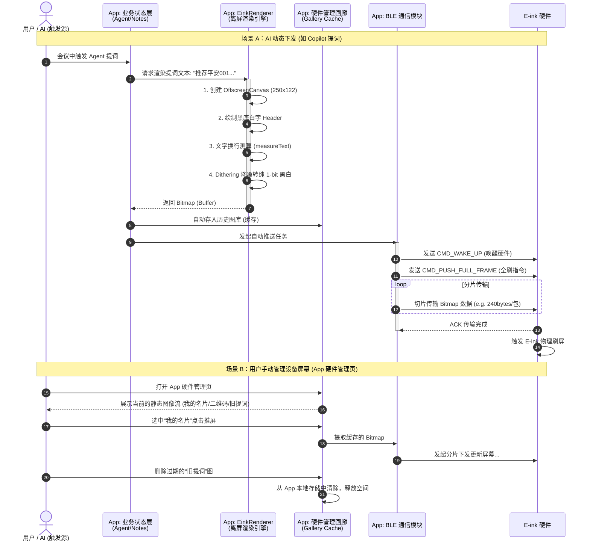

# 硬件 E-ink 内容管理与渲染逻辑图 (E-ink Logic)

在 BizCard 2.0/3.0 架构中，E-ink 墨水屏是一个**“轻量级的外设”**。为了避免在硬件端进行复杂的排版计算和字库存储，我们采用了**“手机端离屏渲染 (Offscreen Rendering) + 蓝牙下发位图 (Bitmap Sync)”**的策略。

此外，为了让用户掌握对这块“第二屏幕”的控制权，我们在 App 内提供了对应的 **E-ink Display Manager (硬件内容管理页)**，用户可以查看看当前推送到屏幕的图像，并对历史沉淀的静态图（如二维码、提词卡片、名片页）进行选择下发或删除。

## 软硬协同核心逻辑流转图

下面是 App 侧与硬件侧的交互与渲染逻辑。

## 说明
1. **Renderer (离屏渲染)**：极大地降低了硬件 BROM 的压力。我们只需要在 App 内升级渲染器，就能支持更复杂的 UI 布局（如饼图、特殊的品牌字体），硬件只需负责“无脑展示像素”。
2. **Gallery (硬件管理画廊)**：相当于一个中间层缓存。因为某些画面（如个人名片、微信二维码）是高频展示的，将它们缓存在 App 里，用户可以在“E-ink Display Manager”页面（参考 `hardware-manager-demo.html`）实现一键秒切，无需重新调用 Canvas 渲染。