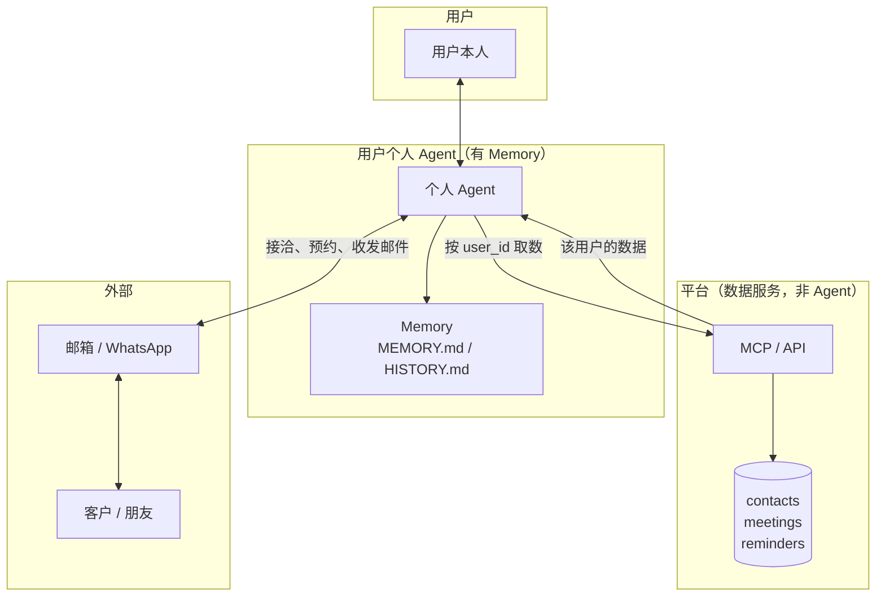
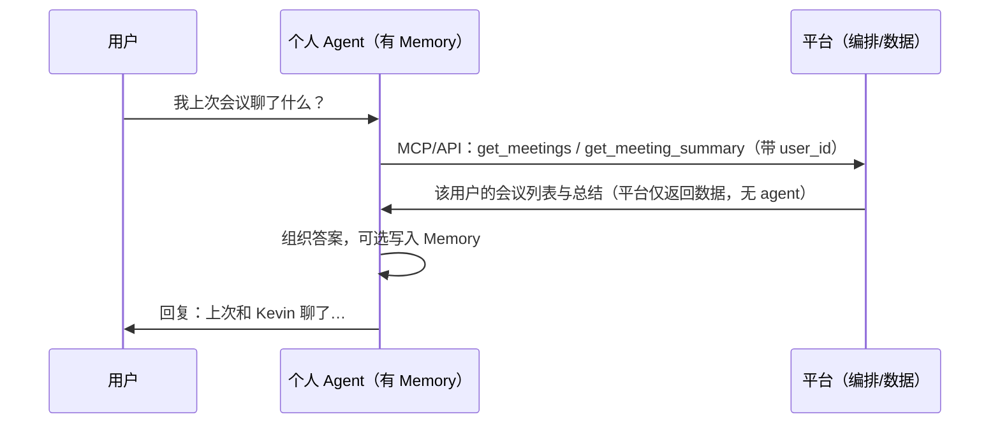

# Agent 架构：平台数据服务 + 用户个人 Agent

用户在平台拥有 **contacts、meetings、reminders** 三类资产，并拥有增删改查能力。现阶段**从简**：无日程（calendar_events）资产，仅 **reminders**（date + time，无 timeframe）；约会时用**外部 calendar** 查用户空闲，匹配后在 bizcard 内只建 **reminder**。用户有**唯一一个 agent**（思路 B）：**对内**通过 App 的「ask agent」入口对齐需求、答疑与组合能力；**对外**以个人分身身份在邮箱/WhatsApp 等渠道接待外部人员，具备全部 context 但**选择性回答**、不暴露内部信息。记忆（memory）归属该唯一 agent。**平台不需要 agent**，只提供数据服务（API/MCP + 存储）即可。

---

## 一、整体角色划分

| 角色 | 职责 | 是否需要 Agent | Memory |
|------|------|----------------|--------|
| **平台** | 按 user_id 提供该用户的 contacts/meetings/reminders 增删改查（MCP 或 REST API + 数据库）。不对话、不推理，只做**数据服务**。 | **不需要**：无 LLM、无对话、无记忆，只是接口 + 存储。 | 无 |
| **用户唯一 Agent** | 用户唯一的对话对象：**对内**在 App ask agent 入口答疑与组合能力；**对外**以个人分身接待外部，有全部 context、选择性回答。需要数据时**调用平台 API/MCP** 拿该用户数据并组织答案或执行动作。 | **需要**：唯一 agent，有 LLM、对话、memory；按 channel 区分对内/对外策略。 | 有（每用户一份） |

- **平台** = 数据服务层（API/MCP + DB），不是 agent。
- **唯一 agent** = 对内 ask agent + 对外个人分身；memory + 调平台拿数据 + 接洽/预约/邮件，按渠道应用「不暴露」策略。

---

## 二、架构示意

---

## 三、「我上次会议聊了什么」的流程（合理方案）

- **不应**由用户去问「平台 agent」、再由平台 agent 查数据回答。
- **应**由用户问**个人 agent**；个人 agent 理解意图后，**向平台（MCP/API）请求该用户的会议数据**（带 user_id），拿到 meetings/summary 后，由个人 agent 组织成答案回复用户，并可将这次问答纳入**个人 agent 的 memory**。

这样做的**好处**：

1. **Memory 天然 per-user**：个人 agent 按用户隔离（每用户一个实例或 workspace），不需要平台「存所有用户的 memory 再区分」。
2. **平台保持简单**：平台不做 agent，只做「按 user_id 给数据」的 API/存储，无状态、易扩展。
3. **职责清晰**：和用户对话、记事的都是个人 agent；平台只是数据服务，压根不需要 agent。

---

## 四、原子能力（Skill）与编排

### 4.1 核心抽象：原子能力 = 对所有资产的增删改查

- 平台暴露的**原子能力**，就是对**所有资产**的**增删改查**（CRUD）。例如：
  - **contacts**：search_contacts, get_contact, create_contact, update_contact（及删除若需）
  - **meetings**：search_meetings, get_meeting, get_meeting_summary, get_meeting_transcript, update_meeting
  - **reminders**：list_reminders, get_reminder, create_reminder, update_reminder（及删除若需）
- 现阶段**从简**：无「日程」资产（不使用时序的 calendar_events）；reminder 仅 date + time（due_at），无 timeframe。
- **其余的事**交给用户对 nanobot 说，由 **nanobot（个人 agent）** 利用这些原子能力来**编排**用户意图：例如「帮我给 Kevin 约下周二」→ nanobot 查联系人、查日程、拟内容、再调「发消息」等能力执行。平台只提供原子 skill，不负责「怎么组合」。

### 4.2 其余原子能力：通信与内容解析、会议深度解析

除了「资产 CRUD」外，以下能力也适合做成**原子 skill**，由平台或独立服务提供，nanobot 按需调用、参与编排：

| 类别 | 原子能力 | 说明 | 示例 |
|------|----------|------|------|
| **通过某种联系方式发消息** | send_message（或按渠道拆成 send_email, send_whatsapp, send_sms） | 按渠道、收件人、内容发送；入参可包含 contact_id 或 channel + 地址。 | 已有 send_email；可扩展 channel 或统一为 send_message(channel, to, subject, body)。 |
| **解读消息内容** | parse_message / interpret_inbound | 把原始入站消息（邮件正文、WhatsApp 消息等）解析成**结构化**：意图、实体、摘要、是否会议请求、是否需回复等。 | 入参：raw_text 或 message_id；出参：intent, entities, summary, needs_reply, suggested_actions。供 nanobot 决定「自动回还是交给用户」。 |
| **Meeting 深度解析** | 在 get_meeting_summary / get_meeting_transcript 之上再做一层「解析」 | 对会议内容的**深度利用**：提取待办、按话题拆分、按发言人归纳、关键结论/风险点等。 | 例如：extract_meeting_action_items(meeting_id)、extract_meeting_topics(meeting_id)、meeting_speaker_breakdown(meeting_id)、meeting_insights(meeting_id)。可由平台提供（若平台有 NLP/LLM），或由 nanobot 侧 skill 调 get_transcript 后再做解析。 |

- **发消息**：已有 send_email 时可先保留，后续再抽象为 send_message(channel, ...)；建议在 MCP 或 nanobot skill 里统一成「发消息」原子能力，便于编排「给谁、通过什么渠道、发什么」。
- **解读消息**：建议做成独立 skill/tool（如 parse_inbound_message），供 heartbeat 收件后调用，输出结构化结果再交给 nanobot 推理（是否自动回、是否写提醒、是否汇报用户）。
- **Meeting 深度解析**：建议做成 skill（平台提供接口或 nanobot 内 skill 调 get_transcript 后本地解析），便于用户问「这场会有什么待办」「谁说了什么」「按话题总结一下」时，nanobot 直接调用而不必自己从全文里抽。

### 4.3 小结

- **原子 skill** = 资产 CRUD + 发消息 + 解读消息 + meeting 深度解析（及后续可扩展的其它原子能力）。
- **编排** = 用户对 nanobot 说想法，nanobot 组合上述原子能力完成意图；平台/服务只提供原子能力并做好 skill 封装，方便 nanobot 调用。

### 4.4 约会/预约（从简）：外部 calendar 查空闲，bizcard 内只建 reminder

现阶段 bizcard **无日程资产**（不使用时序的 calendar_events，避免 start_at/end_at 带来的复杂度），只有 **reminders**（date + time，due_at，无 timeframe），便于管理。

**约会逻辑**：
1. **查用户是否可行**：依赖**外部 calendar**（如用户绑定的 Google Calendar、Outlook 等）查询用户某时段是否空闲；对外 agent 或个人 agent 调用**外部 calendar 的接口/工具**，而非 bizcard 内部。
2. **匹配成功后**：在 **bizcard 内部**只**创建一条 reminder**，例如「明天下午两点和 Alice 开会」：content=会议主题/对象，due_at=该时间，contact_id=Alice。不创建 calendar event。
3. **示例**：Alice 和对外 agent 对话中要预约「明天下午 2 点开会」→ 对外 agent 调用工具查（外部）用户日程 → 若可行，则在 bizcard 内 create_reminder（明天下午两点和 Alice 开会）。

**约会作为具体 skill**：无论**我主动去约**还是**别人在会话中约我**，都需要**先确认我的 calendar**（外部）后才能给答复。即：约会 = 先查 calendar → 再答复/建 reminder；不查 calendar 不承诺时间。

---

## 五、对外 Agent 与「发信息」设计：为什么需要单独的对外 Agent

### 5.1 问题：外部用户不该碰到内部信息

若**只有**一个个人 agent 既对用户本人对话、又直接接待外部（客户/朋友）发来的消息，则外部用户有可能在提问时问到「你们上次会议聊了什么」「能发一下会议纪要吗」等。此时若该 agent 能查会议、联系人、提醒，就会**不当暴露内部信息**。因此：

- **个人 agent**：只对**用户本人**，可访问平台资产（contacts/meetings/reminders）和 memory；负责「我上次会议聊了什么」、拟邮件、约会议等。
- **对外 agent**：只对**外部**（客户、朋友），**不**应能查会议、查完整联系人、读用户 memory；只应使用**对外资料**（个人/公司简介、文章、知识库）和「代发消息」能力，避免把内部数据暴露给外部。

所以需要**额外一个对外 agent** 来承接外部用户的消息，与个人 agent 在数据和权限上隔离。

### 5.2 对外 agent 收到消息后的流向：转发给个人 agent

对外 agent 在**接收到**外部消息后，不应自己去查会议/联系人做回答，而应：

1. **能自己回的**：仅用**对外资料**（简介、FAQ、知识库）即可回复的（例如「你们做什么的」「方案文档有吗」）→ 对外 agent 直接回复。
2. **需要内部信息或用户决策的**（例如会议请求、询价、敏感问题、或无法从对外资料得到答案）→ **转发给个人 agent** 做进一步处理：
   - 个人 agent 可查平台资产与 memory，决定回复要点、是否约会议、是否写提醒；
   - 个人 agent 把「拟好的回复」或「待用户确认」再交给对外 agent 去**执行发送**，或由个人 agent 通知用户「有人问了 X，建议回复 Y，是否发出？」。

即：**对外 agent 接收 → 能答则答（仅用对外资料），否则转发给个人 agent → 个人 agent 处理后再把结果回传给对外 agent 执行发送或进 human。**

### 5.3 「发信息」Skill 的归属与流程

| 环节 | 谁来做 | 说明 |
|------|--------|------|
| **拟稿 + 发起发送** | **个人 agent** | 用户对个人 agent 说「给 Kevin 发邮件说下周二可以」→ 个人 agent 查联系人、拟内容、调用「提交待发」接口（或 对外 agent 的 send API），即 **发信息 skill 在个人 agent 侧**（bizcard 查人 + 拟稿 + 提交）。 |
| **执行发送** | **对外 agent** 或 邮箱/WhatsApp 接管层 | 收到「待发」队列或个人 agent 的请求后，用用户接管的邮箱/WhatsApp **真正发出**。对外 agent 不查会议/提醒，只做「发什么、发给谁」的执行。 |
| **接收外部消息** | **对外 agent** | 入站邮件/WhatsApp → 对外 agent 先解析；能按对外资料回复则回复，否则**转发给个人 agent**（见上）。 |

因此：**发信息 skill** 设计为「个人 agent 侧拟稿 + 提交，对外侧只执行发送」；**接收并回复外部消息**由对外 agent 承接，必要时转发个人 agent 再回传结果。

### 5.3.1 Outreach（主动触达）与「回复谁管、谁发」

- **Outreach**：基于用户**全部 context**（会议、联系人、reminder、memory）主动起草一条触达内容，通过合适渠道发给对方。这需要**个人 agent 起草**（有 context），**对外 agent 代发**（管 channel）。所以 outreach = 个人 agent draft → 对外 agent send。
- **Outreach 之后的回复**：对方回复会进**对外 agent**（因为 channel 在对外侧）。对外 agent **没有**完整 context（没有会议、memory、bizcard 细节），若独自回复容易不够贴切；若转给**个人 agent**，个人 agent 有 context 可以拟好回复，但**个人 agent 不掌管 channel**，无法直接发到邮箱/WhatsApp，必须把拟好的内容再交给**对外 agent** 代发。
- **统一模式**：**对外 agent = 管 channel（收 + 发）**；**个人 agent = 管 context（起草 / 决策）**。对外 agent 要么（1）仅用对外资料简单回复，要么（2）把 inbound 转给个人 agent → 个人 agent 起草回复 → 把草稿/正文交给对外 agent → 对外 agent 代发。这样不存在「个人 agent 直接发 channel」或「对外 agent 凭无 context 硬回」的混淆；始终是「谁有 channel 谁发，谁有 context 谁拟」。

### 5.4 小结

- 用户需要**额外的对外 agent** 承接外部消息，与个人 agent 隔离，避免外部问到会议等内容时泄露内部信息。
- 对外 agent 收到消息后：能只用对外资料回答则自己回；否则**转发给个人 agent** 做进一步处理，个人 agent 再交回「回复内容」或「待用户确认」由对外 agent 执行发送。
- **发信息**：个人 agent 负责拟稿与发起；对外 agent（或通道）负责执行发送；接收与首轮回复由对外 agent 负责，需内部/用户决策时转个人 agent。

### 5.5 按渠道划分：对外 agent 独立部署，可自主完成约会/发资料

**为何不用「按渠道切模式」的单 agent**：若按渠道判断「个人 / 对外」（例如 WhatsApp = 对外模式），则用户**无法**在该渠道（WhatsApp）上查自己的 bizcard、会议、memory，因为该渠道只开放对外资料。因此更合理的做法是：**对外单独一个 agent**，按**渠道**划分谁接待。

**设计要点：**

- **对外 agent** = **独立 agent**，可部署在用户预设的**所有对外渠道**（WhatsApp、邮箱等）。  
  - **不**共享个人 agent 的 memory，**不**调 MCP（bizcard）。  
  - 仅有**对外资料**（简介、FAQ、知识库、可对外公开的文档/链接等）供其查询，用于应对外部的需求和访问。

- **个人 agent** = 部署在用户**私密入口**（如 Telegram、App）。用户在这里查 bizcard、会议、提醒、记 memory、让个人 agent 拟邮件并提交发送。  
  - 用户若要通过 WhatsApp 查自己的会议/联系人，则 WhatsApp 需由**个人 agent** 接管（即该渠道不部署对外 agent），否则在「对外渠道」上就是对外 agent 接待，**不能**查 bizcard，这是按渠道划分带来的取舍。

- **外部请求（约会、发资料）**：对外 agent 在**仅用对外资料 + 可执行动作**的前提下，可**自主完成**，无需转发个人 agent：  
  - 例如 约会：对外资料中可配置「预约链接」「可选时间段说明」等，对外 agent 回复链接或代填预约、代发会议邀请（用对外侧可见的信息）。  
  - 例如 发资料：对外资料中有产品单页、方案文档等，对外 agent 直接发文件或链接。  
  - 只有当前述资料与动作无法满足（例如必须看用户真实日程、或需用户拍板）时，才通知用户或生成「待用户确认」草稿，由用户在个人 agent 侧处理。

**小结**：对外 = 独立 agent，部署在用户预设的对外渠道；不共享 memory、不调 MCP；用对外资料与有限动作自主完成约会、发资料等；仅在需要内部数据或用户决策时才转交/通知。个人 agent 与对外 agent 按**渠道**划分，用户查 bizcard 在个人 agent 所在渠道进行。

### 5.6 当前两 agent 方案的问题与替代思路

**当前方案的问题**：个人 agent 拟稿 → 对外 agent 代发；对方回复后对外 agent 无 context，需转个人 agent 拟稿再回传代发。带来的问题包括：**回复不及时**（多一跳）、**转发与调用 token 高**、流程复杂易出错。

下面两种思路可二选一或组合使用，以减轻上述问题。

---

**思路 A：Outreach 时给对外 agent 临时附带「本线程可用的 context」**

- **做法**：用户（或个人 agent）基于某次 meeting 等发起对 Alice 的 outreach 时，**同时把「与这条会话相关的 context」挂到该对外会话/线程上**（例如：和 Alice 的线下 meeting 摘要、跟进要点），而不是给对外 agent 开放全部 bizcard/memory。
- **效果**：Alice 回复后，**对外 agent 在该线程内可直接读到这份 context**，无需再转个人 agent 拟稿，即可在「不暴露其它内部信息」的前提下，基于该 meeting 做寒暄与跟进回复；回复及时、无额外转发与 token。
- **实现要点**：  
  - 发 outreach 时由个人 agent（或用户）选定「本线程可见」的 context 片段（如一条 meeting 摘要、几条 reminder），写入「线程级 context」或「会话附带的 briefing」。  
  - 对外 agent 在回复该 channel 该会话时，仅能读取该线程附带的 context，不能泛查全部 contacts/meetings/memory。  
  - 可设定 TTL 或条数上限，避免长期堆积敏感信息。
- **优点**：保留「对外 agent 不碰全量内部数据」的隔离，同时在该会话上回复及时、成本低。**缺点**：需要产品与实现上定义「哪些 context 可挂、挂多久、如何更新」。

---

**思路 B：单 agent + 渠道决定「是否暴露」内部信息**

- **做法**：**只保留一个 agent**，拥有全部 memory 与 context（bizcard、meetings、reminders、用户记忆等）。  
  - **私密入口（如 App）**：用户仅在此对 agent 做**对己侧的查询与操作**（查会议、联系人、记 memory、拟邮件等），即「只有 App 时用户能对 context 问询」。  
  - **对外 channel（邮箱、WhatsApp 等）**：**全部以对外沟通为主**，由**同一个 agent** 接待；该 agent **具备全部 memory 和 context**，但在对外 channel 上遵守策略：**不把内部信息暴露给外部咨询**（例如不主动提「我们内部会议纪要说…」、不向对方展示其他联系人或日程），仅用这些 context 来**把回复写得更贴切**（如知道和 Alice 见过面，回复更自然），而不泄露不该说的。
- **效果**：无「个人 ↔ 对外」转发，回复及时、无额外 token；对外一条会话内即可基于完整 context 拟稿并发出，无需临时挂 context 或二次拟稿。
- **实现要点**：  
  - 系统 prompt / 策略按 **channel** 区分：在对外 channel = 「可用全部 context 润色回复，但禁止在回复内容中暴露内部数据、会议细节、他人信息等」。  
  - 可选：对外 channel 上敏感操作（如代发大额承诺、约具体时间）仍可要求「待用户确认」再发。
- **优点**：架构简单、单 agent、无转发、延迟与 token 都最优；context 一致。**缺点**：依赖模型与 prompt 严守「对外不暴露」策略，存在被 prompt 注入或误用导致泄露的风险，需在 prompt 与风控上加强。

---

**小结（替代思路）**

| 维度         | 思路 A（outreach 时附带 thread context） | 思路 B（单 agent + 渠道不暴露策略） |
|--------------|------------------------------------------|-------------------------------------|
| 数据隔离     | 对外 agent 仅见「本线程」挂载的 context | 无数据隔离，同一 agent 全量可见     |
| 回复及时性   | 该线程内直接回，无需转发                | 直接回，无转发                      |
| Token / 转发 | 无额外转发                               | 无额外转发                          |
| 实现复杂度   | 需定义并实现「线程 context」的挂载与读取 | 需强化 channel 维度的策略与 prompt  |
| 风险         | 挂载内容不当或过期                       | 对外泄露依赖策略与模型行为          |

产品上若**优先回复及时与成本**且能接受「对外策略约束」，可倾向**思路 B**；若**优先严格隔离**、仅愿在「用户主动 outreach 的会话」上放开一点 context，可倾向**思路 A**，或 A+B（单 agent 对外，但敏感会话可额外挂 thread context 以限定可见范围）。

### 5.7 采用方案：思路 B（单 agent + 对内 ask / 对外分身）

**当前采用思路 B**：只保留**一个 agent**，拥有全部 memory 与 context；通过**渠道**区分「对内」与「对外」身份与行为，而非两个独立 agent。

- **对内**：用户通过 **App 中的「ask agent」入口**，向 agent 提出所有需求；agent 对**用户本人**进行答疑或**组合**多种能力给到答案（查 contacts/meetings/reminders、查 memory、拟邮件、约会、outreach 起草等）。无输出限制，用户可见完整 context 与结论。
- **对外**：同一 agent 作为用户的**个人分身**出现在对外 channel（邮箱、WhatsApp 等），**知道用户全部 context**（bizcard、meetings、reminders、memory），但在与外部人员对话时**选择性回答**：用 context 把回复写得更贴切、更人性化，**不在回复内容中暴露**内部数据（如会议纪要原文、他人联系方式、未对外公开的日程等）。即「分身知道一切，对外只说该说的」。

上述 5.1–5.5 中「个人 agent / 对外 agent」的表述，在思路 B 下统一为：**同一 agent，按 channel 切换「对内 ask」与「对外分身」两种模式**；数据不隔离，仅通过 system prompt / 策略约束对外 channel 上的输出。

---

## 六、Memory 的归属（结论）

- **Memory 只存在于用户的（个人）agent。** 平台没有 agent，也就没有 memory。
- 平台只提供按 user_id 的数据读写接口，不存储、不读取用户对话或长期记忆。
- 用户问「我上次会议聊了什么」、agent 向平台拿会议数据并回答，这段对话与沉淀的要点记在**该 agent 的 memory** 中。
- 若采用 **5.6 思路 B（单 agent）**，则 memory 归属这**唯一 agent**，不再区分「个人 agent / 对外 agent」；对外 channel 上仅通过策略约束「不暴露」而非数据隔离。

---

## 七、与当前实现的对应

- **bizcard-demo**：提供 contacts/meetings/reminders 的 **MCP 服务 + DB**，就是**平台数据层**，**不是 agent**；请求带 user_id（当前 demo 可为单用户固定 id）。
- **nanobot**：作为**用户对话入口**且持有 memory，即**唯一 agent**（思路 B）；配置 MCP 指向平台（bizcard-demo），由 nanobot 调用平台 MCP 拿数据并回答。同一 nanobot 可挂接多个 channel（App = 对内，邮箱/WhatsApp = 对外），按 channel 应用「对内 ask / 对外分身」策略。

---

## 八、Skill 构思（思路 B：单 agent 对内/对外）

在单 agent + 渠道区分对内/对外的前提下，**同一批 skills 对内、对外共用**；差异只在**调用场景**和**对外 channel 上的输出策略**（不暴露内部信息），而不是两套不同的 skill 集合。

### 8.1 对内（App ask agent 入口）

- **入口**：用户仅在 **App** 里通过「ask agent」与 agent 对话。
- **目标**：对齐用户所有需求，进行**答疑**或**组合**多种能力给到答案；用户可见完整推理与数据引用。
- **典型 skills（与现有一致，可继续扩展）**：

| 类别 | Skill / 能力 | 说明 |
|------|--------------|------|
| **资产查** | bizcard-search | 查 contacts、meetings、reminders（MCP：search_my_contacts、search_my_meetings、get_meeting_summary、list_my_reminders 等）。 |
| **资产写** | bizcard-add、bizcard-edit、bizcard-delete | 增删改联系人、提醒、会议（及平台支持的其它资产）。 |
| **会议深析** | bizcard-meeting-deep-dive | 基于会议摘要/转录做待办提取、话题拆分、洞察等。 |
| **记忆** | memory | 读写 MEMORY.md / 长期记忆，沉淀要点。 |
| **发信息** | 发信息（拟稿 + 提交） | 查联系人、拟邮件/消息内容，提交给对应 channel 执行发送（对内侧用户说「给 Alice 发邮件说下周二可以」→ agent 拟稿并提交）。 |
| **约会** | 约会 | 先查（外部）calendar 确认用户空闲，再答复或建 reminder；我主动约 / 别人约我 都先查 calendar。 |
| **Outreach** | 主动触达起草 | 基于全部 context（会议、联系人、reminder、memory）起草一条触达内容，通过合适渠道发出（agent 拟稿 → 该 channel 执行发送）。 |

**邮件发送与接管用户邮箱**：真实发信（发信息、outreach）需 **nanobot 接管用户邮箱**——配置 Email channel（IMAP 收件 + SMTP 发件，且 consent_granted），agent 才能以用户地址代发、代收；否则仅能拟稿或落库（如 demo 的 send_email_to_contact 仅落库不真发）。

- 对内侧 agent 可**自由组合**上述能力回答「我下周和谁有会」「给 Kevin 发个跟进邮件，提一下上次会议说的那三点」等，并直接展示结果与引用。

### 8.2 对外（个人分身，选择性回答）

- **入口**：同一 agent 挂在**对外 channel**（邮箱、WhatsApp 等），以**用户个人分身**身份接待外部人员。
- **目标**：用**全部 context** 把回复写得更贴切（如知道和 Alice 见过面、上次聊了什么），但在回复中**不暴露**内部信息（会议纪要原文、他人隐私、未公开日程等）；即「知道一切，选择性说」。
- **Skills**：与对内**同一套**（bizcard 查/写、meeting 深析、memory、发信息、约会、outreach 等）。对外侧 agent 可以：
  - **查** contacts/meetings/reminders 与 memory，用于润色回复、判断是否可约、代拟回复；
  - **写** 建 reminder、更新 meeting、代发回复（通过该 channel 发出）；
  - **约会**：外部说「想约下周二」→ agent 查（外部）calendar → 可行则建 reminder 并代复「下周二可以」。
- **策略约束（实现要点）**：在对外 channel 的 system prompt 中明确：
  - 可使用全部 context 与 skills 生成**自然、贴切**的回复；
  - **禁止**在回复内容中暴露：会议纪要/转录原文、其他联系人的信息、用户未对外公开的日程与内部备注等；
  - 敏感操作（如代承诺金额、代定重大约会）可配置为「待用户确认」再发。

### 8.3 小结

- **对内** = App ask agent：答疑 + 组合 skills，全量输出给用户。
- **对外** = 个人分身：同一批 skills，全 context，**选择性回答**，不暴露内部信息。
- 实现上：同一 agent（nanobot）、同一批 MCP 与 skills；按 **channel** 注入不同的「身份与策略」说明（对内 = 对用户本人全开，对外 = 分身 + 不暴露策略），即可开始落地相应 skills 与 prompt。

---

## 九、历史与补充：对内 / 对外（可选视角）

此前文档曾按「平台 AI Assistant」与「个人 Assistant」拆分；在**当前方案（思路 B）**下：

- **平台** = 仅数据服务（API/MCP + 存储），**不需要 agent**。
- **用户唯一 agent** = 单 agent，用户对话入口 + memory + 调平台拿数据；**对内**在 App 的 ask agent 入口做答疑与组合，**对外**以个人分身身份在邮箱/WhatsApp 等 channel 上选择性回答，不暴露内部信息。
