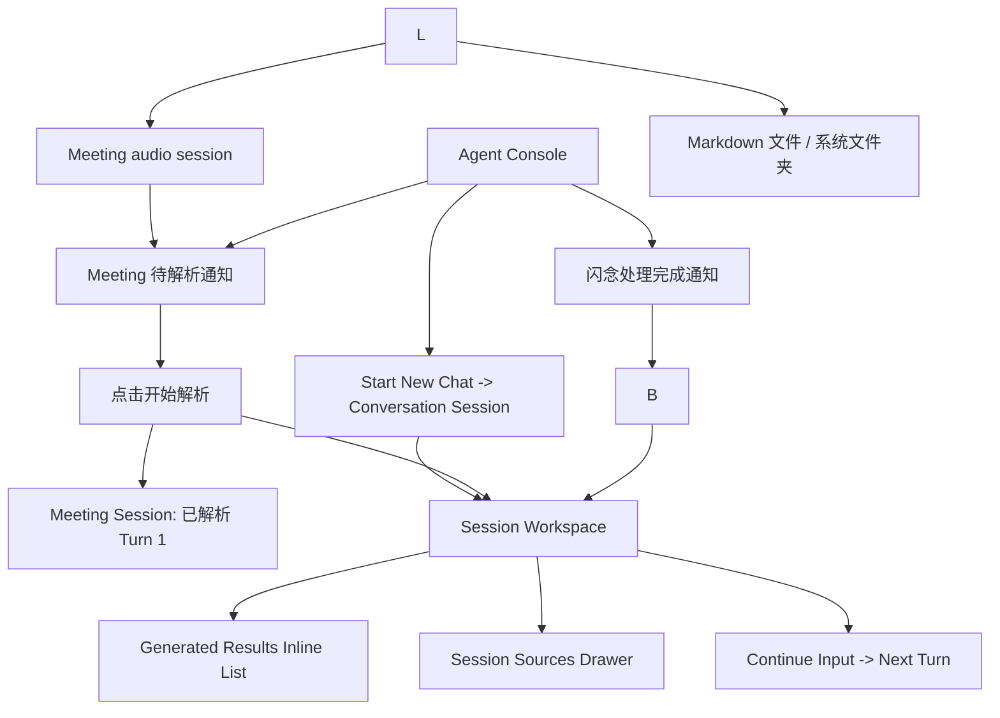
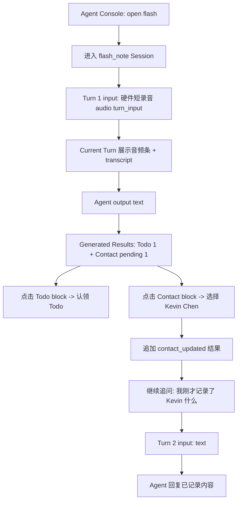
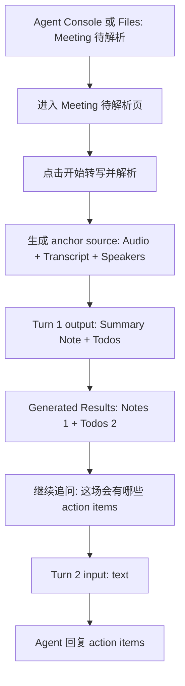
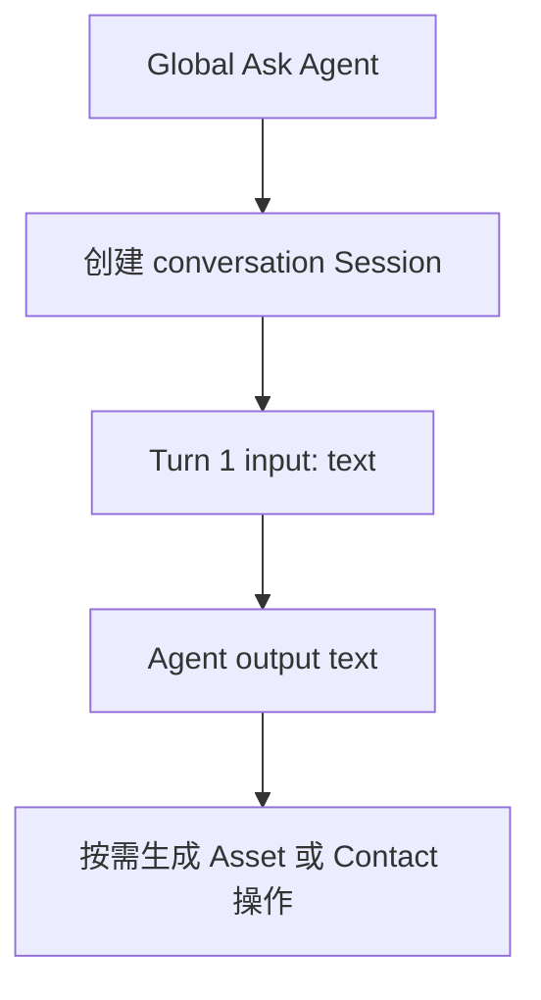

# PRD：Eureka 3.0 Agentic Flow 可交互 Demo

| 属性 | 内容 |
|---|---|
| 状态 | 草案 |
| 版本 | v0.1 |
| 目标 | 用一个可交互 demo 让技术同事和管理层理解 File / Session / Turn / Asset / Contact / Ask Agent 的完整链路。 |
| 关联文档 | [ASSET_AND_SESSION_ARCHITECTURE.md](./ASSET_AND_SESSION_ARCHITECTURE.md)、[FLASH_NOTE_SKILL_ARCHITECTURE.md](./FLASH_NOTE_SKILL_ARCHITECTURE.md)、[APP_PRD.md](./APP_PRD.md)、[HOME_LOGIC_SPEC.md](./HOME_LOGIC_SPEC.md) |

---

## 1. 目标与非目标

### 1.1 目标

| 目标 | 说明 |
|---|---|
| 串起主链路 | 展示硬件上传后，File 如何进入 Session，并通过 Agent 生成 Asset / Contact 操作结果。 |
| 解释 Session 工作台 | 展示 Current Turn、Session Sources、Generated Results、Continue Input 的关系。 |
| 对比三类 Session | 展示 `flash_note`、`meeting`、`conversation` 的差异与统一底座。 |
| 解释 Meeting 门禁 | Meeting 上传后不自动 ASR + AI 解析，用户进入详情后点击“开始解析”才触发首轮处理。 |
| 解释闪念流 | Flash Note 是每用户一个逻辑 Session，每次硬件短录音或文字追问都是新的 turn。 |
| 支持关系理解 | 通过手机 App 内的 source block、Generated Results 与详情页串起实体关系。 |

### 1.2 非目标

| 非目标 | 说明 |
|---|---|
| 不定义 Skill prompt | Skill 的详细触发词、prompt、schema 设计放到下一阶段。 |
| 不做完整 App UIUX | Demo 只表达逻辑和交互骨架，不作为最终 UI 设计稿。 |
| 不接真实后端 | 使用本地 mock 数据，不依赖接口、账号或硬件。 |
| 不覆盖所有异常 | 只覆盖会议待解析、Contact 多候选、Todo 认领等关键分支。 |
| 不做完整 CRUD | Asset / Contact 详情只做 demo 展开态，不实现真实编辑表单。 |

---

## 2. 核心模型

### 2.1 Session 工作台

Demo 中所有 Session 详情页使用同一套工作台语义：

| 区域 | 数据来源 | 规则 |
|---|---|---|
| Current Turn | `turns[current]` | 主内容只展示当前轮 input 和 output。 |
| Session Sources | `anchor_input` | 只展示 Session 级上下文锚点及其派生资料。 |
| Generated Results | `output.items[]` | 展示当前 Session 累计生成的 Note / Todo / Idea / Contact 操作。 |
| Continue Input | 新增 `turn_input` | 用户继续追问后生成下一轮 turn。 |

### 2.2 Input Role

| input_role | 是否进入 Session Sources | 说明 |
|---|---|---|
| `anchor_input` | 是 | 建立整个 Session 上下文的核心输入，例如 Meeting 首轮音频。 |
| `turn_input` | 否 | 某一轮用户输入，例如闪念短录音、文字追问、普通 Ask 语音转文字。闪念短录音虽然不进入 Session Sources，但需要在当前 Turn 内展示音频原内容和 ASR 转录文本。 |

对象详情页进入 Ask Agent 时，当前对象也会成为新 `conversation` Session 的 `anchor_input`。例如 note `.md`、`idea.MD`、Contact、普通 File 或手动创建的 Asset。用户选择建议问题或手动输入后，才生成第一轮 `turn_input`。

对象详情页本身不是 Ask Agent 页面。Demo 中点击 `idea.MD`、单条 note `.md` 或 Contact，应先打开详情页展示内容；详情页中的 `Ask Agent` 入口被点击后，才创建带对象 `anchor_input` 的 conversation。

`idea.MD` 是由多个 `idea` Asset 组成的聚合 Markdown。它进入 Ask Agent 后应展示为组合型 anchor source block，而不是只显示一个普通 Markdown 标签。点击该 block 后，Demo 展开所有组成 idea。

### 2.3 Session 类型

| session_type | 数量 | Source 特征 | Turn 特征 |
|---|---:|---|---|
| `flash_note` | 每用户 1 个逻辑 Session | 通常无 anchor source | 每轮可以是硬件短录音或文字追问；音频 turn 展示原始音频和转录文本 |
| `meeting` | N 个 | 首轮会议音频是 anchor source | 后续围绕会议追问 |
| `conversation` | N 个 | 普通 Ask 无 anchor；Object Detail Ask 有对象 anchor | 用户主动文字 / 语音对话 |

---

## 3. Demo 信息架构

---

## 4. 关键页面与状态

### 4.1 Agent Console + Files

| 区域 | 元素 | 说明 |
|---|---|
| Agent Console | Start a new chat | 创建普通 conversation Session。 |
| Agent Console | 闪念处理完成通知 | 点击进入对应 flash_note turn。 |
| Agent Console | Meeting 待解析 / 已解析通知 | 点击进入 Meeting 待解析页或 Workspace。 |
| Agent Console | Contact 待确认 | 点击进入确认面板。 |
| Files | Meeting audio session | 按时间排列，展示待解析 / 解析中 / 已解析状态。 |
| Files | Markdown 文件 | 全部文件中展示 meeting audio、note `.md`、idea.MD 等文件项。 |

规则：

1. Demo 不提供 Capture Hub，capture 发生在硬件端。
2. 首页不是完整 Session List，而是 Agent Console + Files。
3. Flash Note 不进入 Files 主列表，通过 Agent Console 的 `open flash` 或底部 `capture` 进入。
4. 普通 conversation 不进入 Files 主列表，只通过 Start a new chat 进入。
5. Meeting 待解析状态下，进入详情后需要用户手动触发解析。

### 4.2 Meeting 待解析页

| 元素 | 说明 |
|---|---|
| 原始音频信息 | 文件名、时长、上传时间。 |
| 状态 | `waiting_for_analysis`。 |
| 主 CTA | “开始转写并解析”。 |

点击 CTA 后：

1. 模拟 ASR；
2. 生成 transcript / speakers；
3. 创建 Turn 1；
4. 生成 Summary Note 和 Todo；
5. 状态变为 `done`。

### 4.3 Session Workspace

| 区域 | 说明 |
|---|---|
| Header | 显示 session_type、状态、当前 turn 序号。 |
| Generated Results | 常驻展示累计结果，例如 `Notes 1`、`Todos 3`、`Contacts 1`。 |
| Current Turn | 展示当前轮 input 与 Agent text output；Flash Note 的 audio turn 需要展示音频条和 transcript。 |
| Session Sources | 只展示 anchor source；Meeting 展示 Audio / Transcript / Speakers / Attachments，Flash Note 默认无 source。 |
| Continue Input | 输入下一轮文字；demo 中可用预设问题快速触发。 |

规则：

1. 轮次切换使用垂直时间流：上一轮 / 当前轮 / 下一轮。
2. 单轮 Agent text 可以在当前 turn 内滚动。
3. Generated Results 是 Session 级累计，不随 turn 切换消失。
4. Generated Results block 是类型聚合入口，点击后在同一屏展开列表。
5. 列表 item 需要标注来自哪个 turn。

### 4.4 Generated Results Inline List

| block | 展开后 |
|---|---|
| `Notes N` | Note 列表，每条显示 title、summary、source_turn_id。 |
| `Todos N` | Todo 列表，每条显示 title、due_at、status、source_turn_id。 |
| `Ideas N` | Idea 列表，每条显示 content、tags、source_turn_id。 |
| `Contacts N` | Contact 操作列表，显示 updated / pending 状态。 |

规则：

1. 列表在 Session Workspace 内展开，不切换到独立第三屏。
2. 点击 note item 可进入该 note `.md` 阅读页。
3. 点击 `idea.MD` 可进入汇总 Markdown 阅读页。
4. 在 note `.md` 或 `idea.MD` 中点击 Ask，创建新的 `conversation` Session，并将当前 Markdown 作为 `anchor_input`。
5. 在 existing Session 的 Continue Input 中追问时，只追加 `turn_input`，沿用原 Session 的 anchor。
6. Object Detail Ask 的首屏只展示 anchor source、建议问题和输入框；Generated Results 初始为空。
7. `idea.MD` 的 anchor source block 显示包含的 idea 数量，点击后展开全部 idea Asset。

### 4.5 Session Sources Drawer

| session_type | 展示内容 |
|---|---|
| `meeting` | Audio、Transcript、Speakers、Attachments。 |
| `flash_note` | 默认无 anchor source；每轮录音只在对应 Current Turn 中展示，包含原始音频信息和 ASR 转录文本。 |
| `conversation` | 默认无 anchor source；未来文件分析场景可展示上传文件。 |

---

## 5. 主流程

### 5.1 Flash Note 流程

### 5.2 Meeting 流程

### 5.3 Conversation 流程

---

## 6. Mock 数据

### 6.1 Flash Note

| 字段 | 值 |
|---|---|
| transcript | 今晚 5 点开会，另外 Kevin 喜欢喝拿铁 |
| audio | 硬件短录音，00:18，作为 `audio turn_input` 展示在 Turn 内 |
| Todo | 今晚 5 点开会 |
| Contact candidates | Kevin Chen / Acme Corp；Kevin Wang / Beta Inc |
| Follow-up | 我刚才记录了 Kevin 什么？ |

### 6.2 Meeting

| 字段 | 值 |
|---|---|
| title | Product Design Sync |
| audio duration | 23:14 |
| speakers | Speaker 1、Speaker 2 |
| Summary Note | 本次会议讨论了首页入口、Agent Session 工作台、Todo 认领机制 |
| Todos | 整理 demo spec；确认 Kevin 的跟进事项 |
| Follow-up | 这场会有哪些 action items？ |

---

## 7. Demo 交互要求

| 交互 | 结果 |
|---|---|
| 点击 Agent Console 的 open flash | 进入已解析的 flash_note 工作台。 |
| 点击 Meeting audio session | 若待解析，进入待解析页。 |
| 点击 Start a new chat | 创建 conversation Session。 |
| 点击“开始转写并解析” | Meeting 生成 Turn 1、sources、summary note 和 todos。 |
| 点击 Generated Results block | 在同一屏展开对应类型列表。 |
| 点击列表 item | Note 进入 `.md` 阅读页；其他 Asset / Contact 在同一手机窗口内展开详情或确认面板。 |
| 点击详情页的 Ask Agent | 创建带当前对象 `anchor_input` 的 conversation，首屏展示建议问题。 |
| 点击 `idea.MD` 的 anchor source block | 展开该 Markdown 包含的所有 idea Asset。 |
| 点击 Contact pending | 展示候选联系人列表。 |
| 选择 Kevin Chen | 追加 `contact_updated` 结果，并更新 Generated Results。 |
| 点击继续追问预设问题 | 生成下一轮 turn。 |
| 切换上一轮 / 下一轮 | Current Turn 更新，Generated Results 保持累计。 |

---

## 8. 状态与规则

| 对象 | 状态 | 规则 |
|---|---|---|
| Meeting Session | `waiting_for_analysis` | 只展示 file 信息和开始解析 CTA。 |
| Meeting Session | `processing` | 展示模拟处理状态，不允许重复点击解析。 |
| Meeting Session | `done` | 展示 Session Workspace。 |
| Todo | `pending_confirmation` | 出现在 Generated Results，可被认领。 |
| Todo | `pending` | 用户认领后进入正式状态。 |
| Contact 操作 | `contact_update_pending` | 多候选时必须用户确认。 |
| Contact 操作 | `contact_updated` | 用户确认后追加更新结果。 |

---

## 9. 验收标准

- [ ] Demo 不出现 Capture Hub，首页入口为 Agent Console + Files。
- [ ] Agent Console 提供 Start a new chat。
- [ ] Files 中 Flash Note 作为单例入口置顶展示。
- [ ] 普通 conversation Session 不进入 Files 主列表。
- [ ] Flash Note Session 首次进入时已经有 Turn 1 和解析结果。
- [ ] Meeting Session 首次进入时为待解析状态，点击后才生成 Turn 1。
- [ ] Session Workspace 主内容一次只聚焦一个 Current Turn。
- [ ] Generated Results 在切换 turn 后仍常驻且累计。
- [ ] Meeting 的 Session Sources 展示 Audio / Transcript / Speakers / Attachments。
- [ ] Flash Note 默认不展示 Session Sources；录音 input 只在对应 turn 中展示。
- [ ] Flash Note 的 audio turn 同时展示原始音频信息和 ASR 转录文本。
- [ ] Generated Results block 在同一屏展开列表，列表 item 标注 source turn。
- [ ] Object Detail Ask 会创建新的 `conversation` Session，并把当前对象作为 `anchor_input`。
- [ ] Existing Session 的 Continue Input 只追加新的 `turn_input`，不创建新 Session。
- [ ] Contact 多候选必须通过用户选择后才变为 updated。
- [ ] Demo 只使用一个手机 App 窗口，不再展示独立 Data Inspector。
- [ ] Demo 能完整演示 Flash Note、Meeting、Conversation 三条 Session 类型。

---

## 10. 修订记录

| 版本 | 日期 | 说明 |
|---|---|---|
| v0.1 | 2026-05-07 | 初版，定义 Agentic Flow 可交互 demo 的目标、模型、流程和验收标准。 |

