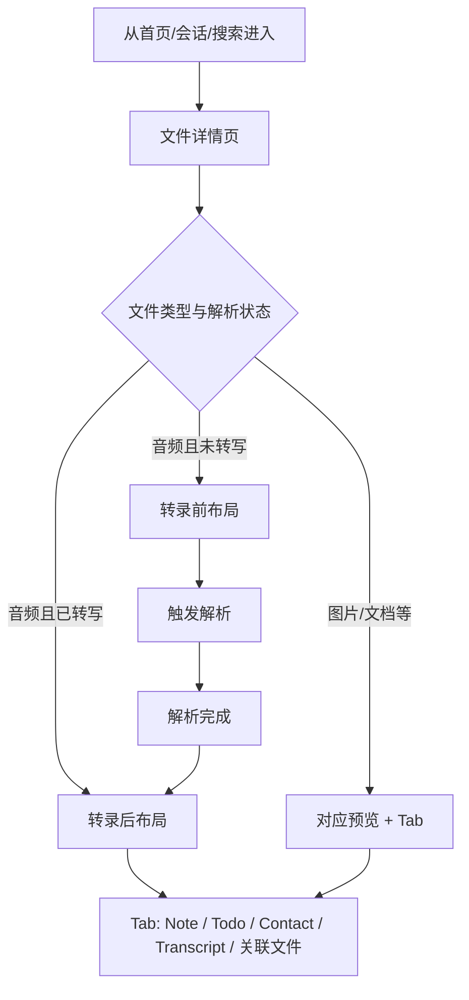
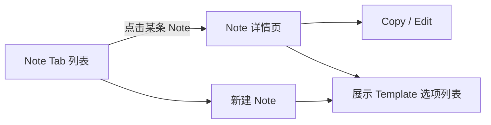
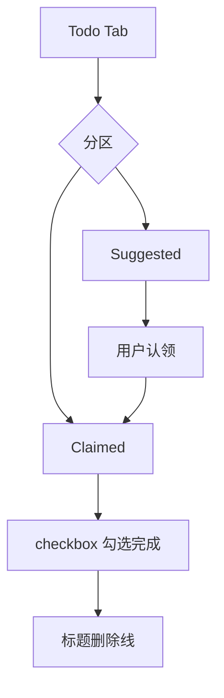
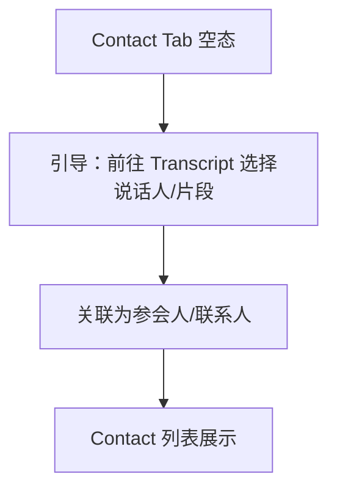

# PRD：文件详情

| 属性 | 内容 |
|------|------|
| 状态 | 草案 |
| 版本 | v0.2 |
| 目标 | 定义「文件详情页」的信息架构、转录前后展示规则，以及 Note / Todo / Contact / 关联文件 的交互与数据规则，作为实现与验收规格。 |
| 关联文档 | [PRD 编写规格](../../PRD_AUTHORING_SPEC.md)、[HOME_LOGIC_SPEC](./HOME_LOGIC_SPEC.md)、[DEMO_SPEC](./DEMO_SPEC.md)（若存在） |

---

## 1. 目标与非目标

### 1.1 目标

- 统一「文件详情」的主路径：进入详情 → 查看元信息与主内容区 → 通过 Tab 访问 Note / Todo / Contact / 关联文件等子信息。
- 对**音频类文件**，明确**转录完成前**与**转录完成后**的页面结构、可用操作与 Tab 显隐规则。
- **Note**：支持从列表进入**独立 Note 详情**；保留 Copy / Edit；界面提供 **Template 选项**供选择（不在本 PRD 展开模板匹配与生成逻辑）。
- **Todo**：列表区分 **Suggested**（系统/助手建议）与 **Claimed**（用户认领后归入个人待办）；**不维护 assignee 字段**；认领后即视为当前用户个人事项。
- **Contact**：默认空列表，通过文案引导用户从 **Transcript（转写）** 关联参会人。
- **关联文件**：同一列表内**混合展示**多种文件类型（音频、图片、文档等），不强制按类型分栏。

### 1.2 非目标

- 不定义上传管线、存储后端、ASR 供应商选型与计费。
- 不定义 Template 的后台配置与生成算法（本 PRD 仅要求界面**展示可选 Template 项**）。
- 不定义 Todo 在多用户间的指派与权限（认领后即为个人列表，无责任人展示）。

---

## 2. 核心模型 / 信息架构

### 2.1 页面结构

| 区域 | 说明 |
|------|------|
| 顶栏 | 返回、标题、更多（重命名、删除等按产品策略） |
| 文件头卡 | 文件名、状态（待解析 / 解析中 / 已解析）、时长或页数等元信息；主操作（如「开始分析」「重新分析」） |
| 主内容区 | 音频为播放器 + 波形/进度；图片为预览；文档为正文预览等 |
| Tab 区 | Note、Todo、Contact、Transcript（音频且已转写后）、关联文件等 |
| 底部全局入口 | 若产品保留 Ask / 全局加号，与本 PRD 的门禁规则对齐即可 |

### 2.2 核心实体

| 实体 | 说明 |
|------|------|
| 文件（File） | 一次用户上传或系统导入的资产，含 `type`、`parseStatus`、关联的转写/摘要等 |
| 转写（Transcript） | 音频解析产物，含分段、说话人（若 ASR 支持）、时间戳 |
| Note | 依附于文件的笔记；可选用 Template（界面展示选项即可） |
| Todo | 依附于文件的行动项；状态分为 **Suggested** / **Claimed**；勾选完成态后标题以**删除线**展示 |
| Contact | 与会议/文件关联的联系人，可由 Transcript 关联产生 |
| 关联文件 | 与当前文件存在业务关联的其它文件（同会议、同项目、手动关联等） |

---

## 3. 用户流程

### 3.1 主路径（进入文件详情）

### 3.2 Note：列表 → 独立详情

### 3.3 Todo：Suggested → Claimed

### 3.4 Contact：从 Transcript 关联

---

## 4. 交互与展示规则

### 4.1 音频：转录**前**的展示逻辑

| 元素 | 规则 |
|------|------|
| 标题与状态 | 展示文件名或默认名；状态为「待解析」或「解析中」 |
| 播放器 | 可播放原始音频；进度条可用；**不展示**可点击跳转句级的转写正文（尚无 Transcript） |
| Transcript Tab | **隐藏**或置灰并说明「解析完成后可用」；二选一由设计统一，本 PRD 推荐：**隐藏**直至有转写数据 |
| Note / Todo | **可展示**：允许用户在解析前手工记录与整理待办（若产品禁止，则改为隐藏并写入门禁表） |
| Contact | **空态** + 引导文案（见 **§7**），解析前不可从转写关联时可提示「解析完成后可从转写关联」 |
| 主 CTA | 突出「开始分析 / 查看解析进度」；解析中展示进度与可取消策略（若有） |
| 关联文件 | **可展示**：混合列表与转录状态无关 |

### 4.2 音频：转录**后**的展示逻辑

| 元素 | 规则 |
|------|------|
| 状态 | 「已解析」；展示解析时间或版本号（若有多版本） |
| Transcript Tab | **显示**；列表或分段视图；支持说话人标签、时间戳、搜索与高亮 |
| 播放器与转写联动 | 点击转写句seek；播放进度高亮当前句（若技术可实现） |
| Note / Todo | 全功能；允许插入转写引用或时间戳链接（若产品规划） |
| Contact | 空态仍可出现；已有关联则列表展示 |
| 主 CTA | 转为「重新分析」「导出」等次要操作，避免与已解析主浏览冲突 |

### 4.3 非音频文件（图片 / 文档等）

| 元素 | 规则 |
|------|------|
| 解析前 | 主内容区为预览占位或静态预览；状态与 CTA 与音频「解析前」一致 |
| 解析后 | 展示提取摘要、关键信息块、OCR 文本等（以产品定义为准）；**不展示** Transcript Tab，除非该类型也产生「类转写」时间轴（若存在则单独命名，避免与音频 Transcript 混淆） |

---

## 5. Note Tab

### 5.1 独立查看入口（强制）

- Note Tab 内每条 Note 必须具备**独立进入 Note 详情**的入口（整卡点击或显式「查看」操作）。
- Note 详情为**独立页面或全屏层**（与列表二级面板二选一，须全局统一），详情内展示完整正文、元信息（创建时间、作者等）。

### 5.2 Copy / Edit

| 能力 | 规则 |
|------|------|
| Copy | 支持一键复制正文（或产品定义的复制粒度） |
| Edit | 进入编辑态；保存后回写列表摘要 |

### 5.3 Template 选项

- 在新建 / 编辑 Note 的界面中**展示 Template 选项列表**（名称或缩略信息即可），供用户点选；**不在本 PRD 赘述**匹配规则、字段映射或自动生成流程。

---

## 6. Todo Tab

### 6.1 列表分区

| 分区 | 定义 | 展示与交互 |
|------|------|------------|
| **Suggested** | 系统或助手建议的待办，用户尚未认领 | 独立分组标题；提供「认领」或等价操作，认领后条目移入 **Claimed** |
| **Claimed** | 用户已认领的待办 | 独立分组标题；**不展示责任人 / assignee**（默认即为当前用户个人列表） |

### 6.2 单行结构（Suggested 与 Claimed 一致）

| 元素 | 规则 |
|------|------|
| 时间 | 展示该条目的时间信息（如建议时间、截止时间，具体字段由实现定义） |
| Checkbox | 用于切换「未完成 / 已完成」 |
| 标题 | 主文案一行展示 |
| 已完成 | Checkbox 勾选为完成后，**标题使用删除线（横杠划掉）**样式 |

### 6.3 其它规则

- **不**在本 PRD 要求维护「指派给他人」或 assignee 展示；认领仅表示该条进入用户个人的 **Claimed** 列表。

---

## 7. Contact Tab

| 规则 | 说明 |
|------|------|
| 默认数据 | **默认为空列表** |
| 空态文案 | 明确提示：可通过 **Transcript（转写）** 将说话人或片段**关联为参会人/联系人** |
| 入口 | 提供跳转至 Transcript Tab 或内联打开转写选择器（与导航架构一致即可） |
| 已有数据 | 列表展示姓名、公司、角色等；支持取消关联 |

---

## 8. 关联文件

| 规则 | 说明 |
|------|------|
| 混合排列 | 同一列表内展示多种 `file.type`（音频、图片、文档、视频等） |
| 排序默认 | **按关联时间倒序**（最近关联在前）；若产品需要「同类型聚合」，以**可选视图切换**提供，不作为默认唯一形态 |
| 单行信息 | 类型图标或标签、文件名、关键元信息（时长/页数/状态）、点击进入对应文件详情 |
| 操作 | 支持添加关联、移除关联（权限另述） |

---

## 9. 状态与规则（门禁汇总）

| 能力 | 转录前（音频） | 转录后（音频） | 非音频未解析 | 非音频已解析 |
|------|----------------|----------------|--------------|--------------|
| Transcript Tab | 隐藏 | 显示 | 不适用或隐藏 | 不适用或替代 Tab |
| Contact 从转写关联 | 不可用或引导等待 | 可用 | 按类型决定 | 按类型决定 |
| Note 独立详情 | 可用 | 可用 | 可用 | 可用 |
| Todo（Suggested / Claimed） | 可用 | 可用 | 可用 | 可用 |
| 关联文件混合列表 | 可用 | 可用 | 可用 | 可用 |

---

## 10. 异常处理

| 场景 | 策略 | 用户可见表现 |
|------|------|----------------|
| 解析失败 | 状态置为失败；允许重试 | 明确错误原因类文案 +「重试」 |
| 解析中断网 | 本地队列或失败提示 | Toast + 保留「继续解析」 |
| 关联文件已删除 | 列表标记失效 | 灰显 +「源文件不可用」 |

---

## 11. 验收标准

1. 音频文件在**无转写数据**时，页面符合 **4.1** 表格；**有转写数据**后，符合 **4.2** 表格，且 Transcript Tab 可见并可浏览。
2. Note Tab 中任意一条 Note 均可进入**独立 Note 详情页/层**，且详情内具备 **Copy** 与 **Edit** 入口。
3. 新建或编辑 Note 时，界面**展示 Template 选项列表**并可点选（不要求在本需求内定义选后后台行为）。
4. Todo Tab 同时展示 **Suggested** 与 **Claimed** 分组；认领后条目从 Suggested 移至 Claimed；**不出现** assignee / 责任人字段。
5. 每条 Todo 展示 **时间、checkbox、标题**；勾选完成后**标题带删除线**。
6. Contact Tab 在无数据时展示**空态**与**从 Transcript 关联**的引导；关联成功后列表展示联系人信息。
7. 关联文件区域在包含至少两种文件类型时，仍为**单一列表混合展示**，且每条展示类型区分与正确跳转。

---

## 12. 修订记录

| 版本 | 日期 | 说明 |
|------|------|------|
| v0.1 | 2026-05-10 | 初稿：流程、转录前后、Note/Todo/Contact/关联文件规则与验收条目 |
| v0.2 | 2026-05-10 | Template 仅保留「选项展示」；Todo 改为 Suggested/Claimed、无 assignee、单行时间+checkbox+标题、完成删除线 |
