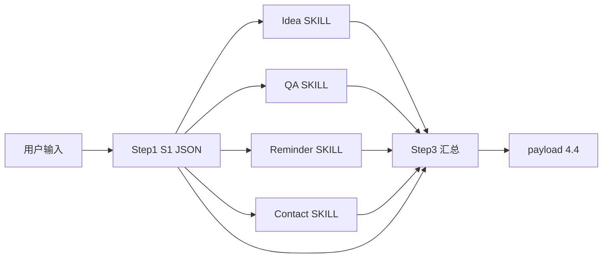

# 闪念流水线 — 文档说明（合并版）

本文档合并说明目录内各 **提示词 / SKILL** 的职责与衔接关系。**执行细节以对应源文件正文为准**。

## 总览

### 推荐阅读顺序

1. `step1 prompt.md` — 意图拆分与 `S1` 契约  
2. `step2 *. SKILL.md` — 各子 SKILL（可按业务选读）  
3. `step3 rules.md` — 汇总与对外 `payload`、**按用户语言的 `summary`**、Card→API 映射  

### 源文件索引

| 源文件 |
|--------|
| `step1 prompt.md` |
| `step3 rules.md` |
| `step2 QA SKILL.md` |
| `step2 Reminder SKILL.md` |
| `step2 contact SKILL.md` |
| `step2 idea SKILL.md` |

### 数据流简图



---

## 一、`step1 prompt.md`（Step 1 — 意图拆分）

### 文档定位

- **角色**：流水线 **Step 1 — 主 SKILL（意图拆分）**
- **YAML**：`intent_type: main_split`，`invoke_key: main`

### 要解决什么问题

在用户单次自然语言输入中，完成 **意图识别 + 文本切分**，输出可被程序消费的 **`S1` JSON**：标明是否包含 Idea、AI 直接回答、待办、联系人、暂不支持的片段，并给出每段的 **原文 `source_text`** 与 **路由开关**，供编排层 **并行** 调用后续子 SKILL。

### 硬性边界（模型必须遵守）

| 允许 | 禁止 |
|------|------|
| 分类与切分、输出结构化 JSON | 调用 MCP/其它工具、联网 |
| 保留用户原文子串 | 编造具体时间、姓名、电话等用户未出口的信息 |
| 标注 unsupported 类别 | 在本阶段执行落库、创建待办、保存联系人、生成问答正文 |

### 流水线中的位置

```
用户输入 → Step 1 → S1(JSON) → Step 2 并行（idea / qa / todo / contact）→ Step 3 汇总
```

- **`routing`**：与各类 `has` 对齐，决定调用哪些子 SKILL。
- **`unsupported`**：只进入 Step 3 的列表，**无独立 Step 2 SKILL**。
- **顺序契约**：`todo.items`、`contact.items`、`ai_direct_answer.items` 的 **条数与顺序** 必须与对应子 SKILL 输出 **一一对齐**。

### 意图类型一览

| 键 | 含义 |
|----|------|
| `idea` | 灵感/随笔类记录（与「明确待办」冲突时待办优先） |
| `ai_direct_answer` | 需要模型直接回答（含需搜索类），模糊提问也保留原文 |
| `todo` | 待办/提醒/日程（增改查） |
| `contact` | 联系人（增改查） |
| `unsupported` | 产品当前不支持的能力（黑名单以业务为准） |

### 输出 JSON 要点

- **`schema_version`**：`4.4`；**`stage`**：`step1_intent_split`。
- **`user_text`**：与用户输入一致。
- **`routing`**：`invoke_idea_skill` / `invoke_qa_skill` / `invoke_todo_skill` / `invoke_contact_skill`。
- **各类块**：`has` + `items[{ seq, source_text }]`；`todo`/`contact` 另有 **`raw_bundle_text`**（同类片段轻量拼接）。
- **`unsupported.items`**：含 **`unsupported_category`**（如 accounting / expense / order / unknown 等枚举约定）。
- **`notes.warnings`**：可选告警数组。
- **输出形态**：仅 **一个合法 JSON 对象**，无 Markdown 围栏、无 JSON 外文字。

### 与其它文档的关系

| 文档 | 关系 |
|------|------|
| `step2 *. SKILL.md` | Step 1 输出作为各子 SKILL 的输入契约（见各文件「〇、流水线编排对接」） |
| `step3 rules.md` | 使用 `S1` 填充 `payload.user_text`、`has_*`、`*_raw_content`、`unsupported_list` 等 |

### 维护时注意

- 扩展 **unsupported** 类别时，同步更新枚举说明及后端/Step 3 展示文案。
- 若编排层改为「交错输出 todo/contact 结果」，需在 Step 3 约定全局序号（当前 Step 3 默认为 **先 todo 后 contact**）。

---

## 二、`step3 rules.md`（Step 3 — 结果汇总）

### 文档定位

- **角色**：**Step 3 — 结果汇总 / 对外 Payload 规范**
- **YAML**：`intent_type: aggregate`，`invoke_key: aggregate`

### 要解决什么问题

把 **Step 1（`S1`）** 与各 **Step 2 子 SKILL 输出（`R_*`）** 合并为 **单一对外响应**：顶层含 `schema_version`、`model`、`request_id`、`record_id`、`summary`、`payload`，其中 **`payload` 键齐全**、结构与业务参考示例（`schema_version: "4.4"`）一致。

汇总逻辑可由 **模型** 或 **后端代码** 实现；源文件定义 **字段含义与填充规则**。

### 输入符号（文中约定）

| 符号 | 含义 |
|------|------|
| `S1` | Step 1 意图拆分 JSON |
| `R_idea` | Idea 子 SKILL 输出 |
| `R_qa` | QA 子 SKILL 输出 |
| `R_todo` | Reminder（待办）子 SKILL 输出，与 `S1.todo.items` **等长、同序** |
| `R_contact` | Contact 子 SKILL 输出，与 `S1.contact.items` **等长、同序** |

未路由的子 SKILL 按规则填 `false` / `null` / `[]`。

**同步规则**：`supported_command_results` 每条 `source_text` **必须以 `S1` 为准**，禁止用改写句替换。

**用户语言（汇总文案）**：顶层 **`summary`**，以及 Step 3 **新生成或改写** 的说明性字符串（如失败提示模板），须与 **用户所用语言** 一致；不得默认全程固定某一种语言而忽略输入语言。细则见下文 **`summary` 与用户语言**。

### `payload` 核心键（须齐全）

`user_text`、`has_ai_answer`、`ai_question`、`ai_answer`、`has_idea`、`idea_content`、`idea_save_success`、`idea_saved_content`、`has_unsupported`、`unsupported_list`、`has_todo`、`todo_raw_content`、`has_contact`、`contact_raw_content`、`supported_command_results`。

无内容时用 `null` / `false` / `[]`，**不得省略键名**。

### 关键规则摘要

**AI 直接回答**：`has_ai_answer` 与 `S1.ai_direct_answer.has` 一致；`ai_question` / `ai_answer` 在 false 时为 null；为 true 时从 `S1` 拼问题、从 `R_qa` 取答案（数组用 `\n` 拼接）；失败态仍需可读说明。

**Idea**：`idea_content` 来自 `S1.idea.items`；`idea_saved_content` **优先** MCP/工具返回，否则按源文件 **第七节** 从 Card 兜底。

**`supported_command_results`**：每条对应一条待办或联系人指令；`source_text` **必须与 `S1` 对应条一致**；默认顺序 **先全部 todo，再全部 contact**；`operate_type` 由 Card `action` 映射为增/改/查。

**第七节（Card → API）**：Todo / Contact / Idea / QA 到 `saved_content`、`idea_saved_content` 的字段映射见源文件；**`source_text` 一律以 `S1` 为准**。

### `summary` 与用户语言（对应 `step3 rules.md` 第四节）

| 要点 | 说明 |
|------|------|
| **语言判定顺序** | ① 编排层传入 `user_locale` / `language` / `Accept-Language` 等 → 优先采用；② 否则根据 `user_text` 推断主要书写语言；③ 混合语种以占比更高为准，仍不明则用 **产品默认语言**（未配置时默认简体中文）。 |
| **`summary` 形态** | `\n` 分段；待办/联系人成功统计 → Idea → 不支持 → 失败摘要；各模块 **话术须为目标语言**，不得始终套用中文固定句（除非用户语言为中文）。 |
| **语种统一** | 同一段 `summary` 内避免多语种混杂（专有名词、用户原文引用除外）；引用 `unsupported_list`、`source_text` 时 **保持用户原文**，不翻译。 |
| **结构化字段** | `payload` 键名、`operate_type`（增/改/查）等 **以接口契约为准**，与用户语言无关（除非产品另行本地化枚举）。 |
| **`fail_reason`** | 透传子 SKILL `error_msg` 时可保持原样；若在 Step 3 **改写或拼接** 模板，须与 **`summary` 所用语言一致**。 |

### 发布前校验（摘录）

除「键齐全、`command_*` 正确、`raw_bundle_text` 对齐」外，须校验：**`summary` 及 Step 3 改写说明是否与用户语言 / `user_locale` 一致**，且同一段无多余语种混杂（完整清单见 `step3 rules.md` 第六节）。

### 维护时注意

- 修改接口字段名或嵌套时，同步更新源文件 **第二节全量键**、**第七节映射表**及示例对照。
- 扩展 **多语言文案模板** 或 **默认语言** 时，同步 Step 3 第四节与编排层 `user_locale` 约定。

---

## 三、`step2 QA SKILL.md`（Step 2 — 问答）

### 文档定位

- **YAML**：`intent_type: qa`，`invoke_key: qa`（`flash_thought_v2.enabled` 以源文件为准）

### 要解决什么问题

处理用户 **需要直接得到回答** 的片段：内置知识或 **`web_search`**；**不写卡、不落库**，输出 **`R_qa`**，供 Step 3 写入 `has_ai_answer`、`ai_question`、`ai_answer`。

### 流水线对接（源文件「〇」节）

| 项目 | 约定 |
|------|------|
| **触发** | `S1.routing.invoke_qa_skill === true` |
| **输入** | `S1.ai_direct_answer.items[]` 各条 `source_text`（按 `seq`）；可附 `user_text` 消歧；**勿**把待办/联系人/idea 当问答处理 |
| **输出** | 单问答可为 **对象**；多问答应为 **数组**，长度等于 `items.length`，顺序与 `seq` 一致 |
| **下游** | `step3 rules.md` 第三节 **3.2**、第七节 **7.5** |

### 正文结构（概述）

触发场景与过滤、工具、`web_search`、强制输出（`status`/`answer`/`sources`/`errors`）、内部自检、异常策略、示例等 — 见源文件。

### 维护时注意

- 多段问答 **数组顺序** 须与 `ai_direct_answer.items` **一致**。
- 编排层可统一为「仅数组输出」，减少单对象/数组分支。

---

## 四、`step2 Reminder SKILL.md`（Step 2 — 待办）

### 文档定位

- **YAML**：`intent_type: todo`，`invoke_key: todo`（业务名 Flash Todo）

### 要解决什么问题

**待办/提醒/日程** 新增、修改、查询；MCP 落库或查询；输出 **待办 Card**；供 Step 3 写入 `supported_command_results`（`command_type: "todo"`）。

### 流水线对接（源文件「〇」节）

| 项目 | 约定 |
|------|------|
| **触发** | `S1.routing.invoke_todo_skill === true` |
| **输入** | 一次处理 **全部** `S1.todo.items`；第 `k` 条对应 `items[k-1].source_text` |
| **输出** | **数组** 长度等于 `items.length`；单对象建议编排层转为数组再进 Step 3 |
| **错误文案** | `error_msg` 利于汇总（如 `缺失字段: dueAt`）→ `fail_reason` |
| **下游** | `has_todo`、`todo_raw_content` 来自 `S1`；`saved_content.reminder` 见 `step3 rules.md` **第七节** |

### 维护时注意

- **`meetingId` 与 `data_id`** 约束变更时同步工具说明与测试。
- Card `display.due_at` 与 API `dueAt` 的转换在 Step 3 / 适配层完成。

---

## 五、`step2 contact SKILL.md`（Step 2 — 联系人）

### 文档定位

- **YAML**：`intent_type: contact`，`invoke_key: contact`

### 要解决什么问题

联系人 **新增、修改、查询**；MCP 写入或查询；输出 **联系人 Card**；Step 3 写入 `supported_command_results`（`command_type: "contact"`）。

### 流水线对接（源文件「〇」节）

| 项目 | 约定 |
|------|------|
| **触发** | `S1.routing.invoke_contact_skill === true` |
| **输入** | 覆盖 **全部** `S1.contact.items`；第 `k` 条对应 `items[k-1].source_text` |
| **输出** | **数组**，长度等于 `items.length` |
| **下游** | `has_contact`、`contact_raw_content` 来自 `S1`；`saved_content.contact` 见 `step3 rules.md` **第七节** |

### 维护时注意

- API 侧 **`firstName`/`lastName`/`phones[]`** 与 Card **`display.name`/`phone`** 的映射由 **产品/后端** 约定；汇总层避免臆造拆分。
- **`meetingId`** 与 Todo 类似，工具变更时同步文档。

---

## 六、`step2 idea SKILL.md`（Step 2 — Idea）

### 文档定位

- **YAML**：`intent_type: idea`，`invoke_key: idea`

### 要解决什么问题

灵感/随笔 **记录与查询**；MCP 批量创建或查询；输出 **Idea Card**；Step 3 映射 `has_idea`、`idea_content`、`idea_save_success`、`idea_saved_content`。

### 流水线对接（源文件「〇」节）

| 项目 | 约定 |
|------|------|
| **触发** | `S1.routing.invoke_idea_skill === true` |
| **输入** | `S1.idea.items[]` 各条 `source_text`；**勿**处理待办/联系人/问答 |
| **输出** | 多条为 Card **数组**；单条建议统一为数组 |
| **下游** | `idea_saved_content` **优先** MCP 返回；Card 兜底见 `step3 rules.md` **第七节 7.4** |

### 维护时注意

- 批量创建须 **覆盖每一条** batch；`meetingId` 全量等于 **data_id**。
- `idea_saved_content`（`note`、`create_time`、`timezone`）通常来自 **落库接口**，与 Card 可能不一致，由 Step 3 兜底。

---

*文档版本：与目录内 `step1` / `step2` / `step3` 源文件配套；修订时请同步更新本节与源文件。*
